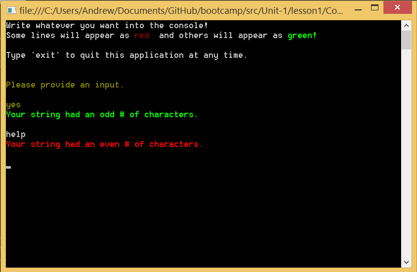

# Lesson 1.1: Actors and the `ActorSystem`
Here we go! Welcome to lesson 1.

In this lesson, you will make your first actors and be introduced to the fundamentals of [Akka.NET](http://getakka.net/).

## Key concepts / background
In this first lesson, you will learn the basics by creating a console app with your first actor system and simple actors within it.

We will be creating two actors, one to read from the console, and one to write to it after doing some basic processing.

### What is an actor?
An "actor" is analogous to an object from the object-oriented programming programming paradigm - it can encapsulate some state, and some processing. Actors don't do much by themselves - they exist in an "actor system" which allows actors to create other actors, and communicate with each other using "messages".

If you program in an OOP-first language like C#, it's useful to consider the actor as just an extension of the object system, and use familiar programming concepts like getting references to other actors and making method calls to send messages between actors.

In F#, however, the primary mechanism for thinking about code is with functions and algebraic data types, so Akka.Net has some specific support for F# contained in the Akka.FSharp assembly, so make sure you reference it if you're going with F# idioms in your code.

(Note that you can program the traditional object-style actors in F# as well, due to the fact that F# is multi-paradigm - but this tutorial will discuss idiomatic F# style)

**Further reading: [What is an Akka.NET Actor](http://petabridge.com/blog/akkadotnet-what-is-an-actor/)?**

**Further reading about F#:[F# API Support in Akka.NET](https://github.com/akkadotnet/akka.net/tree/dev/src/core/Akka.FSharp)**

So in F#, Akka.NET actors are nothing more than functions. 

Because the actor system can be distributed over multiple machines in a cluster, we have to define these functions in a way that is both idiomatic and type-safe; and able to be shipped to the remote machine and compiled on demand. We do that using [F# quotations](http://msdn.microsoft.com/en-us/library/dd233212.aspx) - and we'll talk in detail about that later.

### How are actors defined?

Since we're using a functional paradigm, we can think of an actor function as something that processes a message. Such a function would have a signature like

```
// 'M is the type of the message
'M -> unit
```

An actor can also be a function that sends a message to another actor. Such a function would have the signature

```
// 'M is the type of the message
Actor<'M> -> 'M -> unit
```

And that's actually all we care about when we write our application - all the rest is plumbing...

Akka.FSharp gives us a couple of helpers to take these functions and inject them into an Actor System so that we can start interacting with them. We'll talk about how to create the actor system in a bit - you just need to be aware of the ``spawn``, ``actorOf`` and ``actorOf2`` functions provided by Akka.FSharp.  

```
// for the message-processor kind of actor
spawn actor_system "name" (actorOf (fn : 'M -> unit))

// for the message-sender kind of actor
spawn actor_system "name" (actorOf2 (fn : Actor<'M> -> 'M -> unit))
```


### How do actors communicate?
Actors communicate by sending messages to each other. Just like everything in F#, messages are immutable, strongly-typed values. For our first lesson, we are going to just send immutable strings around as messages.

The other really important thing to remember is that all these functions communicate asynchronously. There's a bunch of messaging logic under the hood that hides all of that from you, so basically you just write code that *looks* like you're calling a function, but you're actually doing a lot more!

For the moment, just think of the ``<!`` operator as the way to send a message.

```
let message = "This is some text"

someActor <! message
```

### What is an `ActorSystem`?
An `ActorSystem` is a reference to the underlying system and Akka.NET framework. All actors live within the context of this actor system. You'll need to create your first actors from the context of this `ActorSystem`.

By the way, the `ActorSystem` is a heavy object: create only one per application.

Aaaaaaand... go! That's enough conceptual stuff for now, so dive right in and make your first actors.

## Exercise
Let's dive in!

> Note: Within the sample code there are sections clearly marked `"YOU NEED TO FILL IN HERE"` - find those regions of code and begin filling them in with the appropriate functionality in order to complete your goals.

### Launch the fill-in-the-blank sample
Go to the [DoThis](../DoThis/) folder and open [WinTail](../DoThis/WinTail.sln) in Visual Studio. The solution consists of a simple console application and only one Visual Studio project file.

You will use this solution file through all of Unit 1.

### Install the latest Akka.NET NuGet package
In the Package Manager Console, type the following command:

```
Install-Package Akka
Install-Package Akka.FSharp
```

This will install the latest Akka.NET binaries, which you will need in order to compile this sample.

```
// in Program.fs

open System
open Akka.FSharp
open Akka.FSharp.Spawn
open Akka.Actor

[<EntryPoint>]
let main argv = 
	// this is how we create an actor system
    let myActorSystem = System.create "MyActorSystem" (Configuration.load ())
    
    // now let's spawn an actor that simply processes a message...
    let consoleWriterActor = spawn myActorSystem "consoleWriterActor" (actorOf Actors.consoleWriterActor)
    
    // ...and one that sends a message to the other actor
    let consoleReaderActor = spawn myActorSystem "consoleReaderActor" (actorOf2 (Actors.consoleReaderActor consoleWriterActor))
    
    // let's tell the second actor to get started
    consoleReaderActor <! "start"
    
    // wait for the system to terminate - this will happen when the actors finish their work
    myActorSystem.AwaitTermination ()
    
    // return '0' from main
    0

```

### Getting all Functional

Open the "Actors.fs" file and take a look at the two actor functions there

The simpler function is the one that simply processes a message by writing it to the console:

```
let consoleWriterActor message = ...

// this has the signature of : 'M -> unit
```

This function can be consumed by ``actorOf`` directly in order to ``spawn`` an actor.

The more complex function is one that is capable of sending a message to an actor

```
let consoleReaderActor (consoleWriter: ActorRef) (mailbox: Actor<_>) message = ...

// this has the signature of : ActorRef -> Actor<'M> -> 'M -> unit
```

So we can bind the consoleWriter actor to the first parameter and get ourselves a function which can be consumed by ``actorOf2``. 

### Have ConsoleReaderActor Send a Message to ConsoleWriterActor
Time to put your first actors to work!

You will need to do the following:

1. Have ConsoleReaderActor send a message to ConsoleWriterActor containing the content that it just read from the console.

	```
	consoleWriter <! line;
	```

2. Have ConsoleReaderActor send a message to itself after sending a message to ConsoleWriterActor. This is what keeps the read loop going.

	```
	mailbox.Self <! ContinueCommand // ContinueCommand is the 'continue' string literal
	```

### Step 5: Build and Run!
Once you've made your edits, press `F5` to compile and run the sample in Visual Studio.

You should see something like this, when it is working correctly:



### Once you're done
Compare your code to the code in the [Completed](Completed/) folder to see what the instructors included in their samples.

## Great job! Onto Lesson 2!
Awesome work! Well done on completing your first lesson.

**Let's move onto [Lesson 2 - Defining and Handling Different Types of Messages](../lesson2).**
