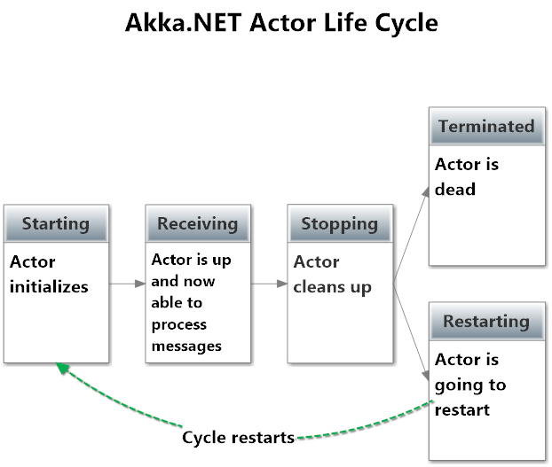

# Lesson 1.6: The Actor Lifecycle
Wow! Look at you--made it all the way to the end of Unit 1! Congratulations. Seriously. We appreciate and commend you on your dedication to learning and growing as a developer.

This last lesson will wrap up our "fundamentals series" on working with actors, and it ends with a critical concept: actor life cycle.

## Key concepts / background
### What is the actor life cycle?
Actors have a well-defined life cycle. Actors are created and started, and then they spend most of their lives receiving messages. In the event that you no longer need an actor, you can terminate or "stop" an actor.

### What are the stages of the actor life cycle?
There are 5 stages of the actor life cycle in Akka.NET:

1. `Starting`
2. `Receiving`
3. `Stopping`
4. `Terminated`, or
5. `Restarting`



Let's take them in turn.

#### `Starting`
The actor is waking up! This is the initial state of the actor, when it is being initialized by the `ActorSystem`.

#### `Receiving`
The actor is now available to process messages. Its `Mailbox` (more on that later) will begin delivering messages into the `OnReceive` method of the actor for processing.

#### `Stopping`
During this phase, the actor is cleaning up its state. What happens during this phase depends on whether the actor is being terminated, or restarted.

If the actor is being restarted, it's common to save state or messages during this phase to be processed once the actor is back in its Receiving state after the restart.

If the actor is being terminated, all the messages in its `Mailbox` will be sent to the `DeadLetters` mailbox of the `ActorSystem`. `DeadLetters` is a store of undeliverable messages, usually undeliverable because an actor is dead.

#### `Terminated`
The actor is dead. Any messages sent to its former `IActorRef` will now go to `DeadLetters` instead. The actor cannot be restarted, but a new actor can be created at its former address (which will have a new `IActorRef` but an identical `ActorPath`).

#### `Restarting`
The actor is about to restart and go back into a `Starting` state.

### Life cycle hook methods
So, how can you link into the actor life cycle? Here are the 4 places you can hook in.

#### `PreStart`
`PreStart` logic gets run before the actor can begin receiving messages and is a good place to put initialization logic. Gets called during restarts too.

#### `PreRestart`
If your actor accidentally fails (i.e. throws an unhandled Exception) the actor's parent will restart the actor. `PreRestart` is where you can hook in to do cleanup before the actor restarts, or to save the current message for reprocessing later.

#### `PostStop`
`PostStop` is called once the actor has stopped and is no longer receiving messages. This is a good place to include clean-up logic. PostStop also gets called during `PreRestart`, but you can override `PreRestart` and simply not call `base.PreRestart` if you want to avoid this behavior during restarts.

`DeathWatch` is also when an actor notifies any other actors that have subscribed to be alerted when it terminates. `DeathWatch` is just a pub/sub system built into framework for any actor to be alerted to the termination of any other actor.

#### `PostRestart`
`PostRestart` is called during restarts after PreRestart but before PreStart. This is a good place to do any additional reporting or diagnosis on the error that caused the actor to crash, beyond what Akka.NET already does for you.

Here's where the hook methods fit into the stages of the life cycle:


### How do I hook into the life cycle?
To hook in, you use the spawnOvrd helper and just pass in the override for the functions you want to hook into, like this:

```fsharp
let preStart = Some(fun () -> Console.WriteLine "preStart Called" |> ignore)
let mySampleActor = spawnOvrd system "actor" (actorOf sampleActor) <| {defOvrd with PreStart = preStart}
```

Note: If you just want to use the PreStart and PostStop events, you don't need to use `spawnOvrd`. You can just use the actor computation expression

```fsharp
  let sampleActor (mailbox:Actor<_>) =
        // this section works like pre-start
        printf "pre-start"  

        // this registers a function to be called on PostStop
        mailbox.Defer (fun () -> printf "post-stop")

        let rec loop () =
            actor {
                let! msg = mailbox.Receive ()
                // do some work
                return! loop ()
            }
        loop ()

let aref = spawn system "actor" (sampleActor)
```        

### Which are the most commonly used life cycle methods?
#### `PreStart`
`PreStart` is far and away the most common hook method used. It is used to set up initial state for the actor and run any custom initialization logic your actor needs.

#### `PostStop`
The second most common place to hook into the life cycle is in `PostStop`, to do custom cleanup logic. For example, you may want to make sure your actor releases file system handles or any other resources it is consuming from the system before it terminates.

#### `PreRestart`
`PreRestart` is in a distant third to the above methods, but you will occasionally use it. What you use it for is highly dependent on what the actor does, but one common case is to stash a message or otherwise take steps to get it back for reprocessing once the actor restarts.

### How does this relate to supervision?
In the event that an actor accidentally crashes (i.e. throws an unhandled Exception,) the actor's supervisor will automatically restart the actor's lifecycle from scratch - without losing any of the remaining messages still in the actor's mailbox.

As we covered in lesson 4 on the actor hierarchy/supervision, what occurs in the case of an unhandled error is determined by the `SupervisionDirective` of the parent. That parent can instruct the child to terminate, restart, or ignore the error and pick up where it left off. The default is to restart, so that any bad state is blown away and the actor starts clean. Restarts are cheap.

## Exercise
This final exercise is very short, as our system is already complete. We're just going to use it to optimize the shutdown of `tailActor`.

### Let's clean up and take good care of our `FileSystem` resources
`tailActor` instances are each storing OS handles in `fileStreamReader` and `observer`.

Let's use `Defer` to make sure those handles are cleaned up and we are releasing all our resources back to the OS.

Add this to `TailActor`:

```fsharp
//Ensure cleanup at end of actor lifecycle
mailbox.Defer <| fun () ->
    (observer :> IDisposable).Dispose()
    (fileStreamReader :> IDisposable).Dispose()
    (fileStream :> IDisposable).Dispose()
```

### Phase 4: Build and Run!
That's it! Hit `F5` to run the solution and it should work exactly the same as before, albeit a little more optimized. :)

### Once you're done
Compare your code to the solution in the [Completed](Completed/) folder to see what the instructors included in their samples.

## Great job!
### WOW! YOU WIN! Phenomenal work finishing Unit 1.

**Ready for more? [Start Unit 2 now](../../../Unit-2 "Akka.NET Bootcamp Unit 2").**

## Any questions?
**Don't be afraid to ask questions** :).

Come ask any questions you have, big or small, [in this ongoing Bootcamp chat with the Petabridge & Akka.NET teams](https://gitter.im/petabridge/akka-bootcamp).

### Problems with the code?
If there is a problem with the code running, or something else that needs to be fixed in this lesson, please [create an issue](https://github.com/petabridge/akka-bootcamp/issues) and we'll get right on it. This will benefit everyone going through Bootcamp.
