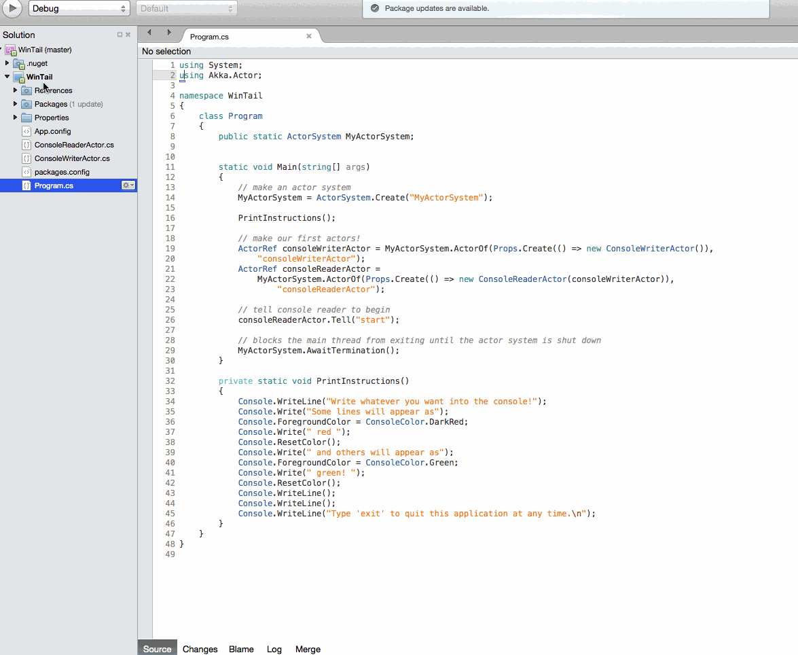

# Akka.NET Bootcamp - Unit 1: Beginning Akka.NET

In Unit 1, we will learn the fundamentals of how the actor model and Akka.NET work.

## Concepts you'll learn

*NIX systems have the `tail` command built-in to monitor changes to a file (such as tailing log files), whereas Windows does not. We will recreate `tail` for Windows, and use the process to learn the fundamentals.

In Unit 1 you will learn the following:

1. How to create your own `ActorSystem` and actors;
2. How to send messages actors and how to handle different types of messages;
3. How to use `Props` and `IActorRef`s to build loosely coupled systems.
4. How to use actor paths, addresses, and `ActorSelection` to send messages to actors.
5. How to create child actors and actor hierarchies, and how to supervise children with `SupervisionStrategy`.
6. How to use the Actor lifecycle to control actor startup, shutdown, and restart behavior.

## Using Xamarin?
Since Unit 1 relies heavily on the console, you'll need to make a small tweaks before beginning. You need to set up your `WinTail` project file (not the solution) to use an **external console**.

To set this up:

1. Click on the `WinTail` project (not the solution)
2. Navigate to `Project > WinTail Options` in the menu
3. Inside `WinTail Options`, navigate to `Run > General`
4. Select `Run on external console`
5. Click `OK`

Here is a demonstration of how to set it up:

## Table of Contents

1. **[Lesson 1 - Actors and the `ActorSystem`](lesson1/README.md)**
2. **[Lesson 2 - Defining and Handling Messages](lesson2/README.md)**
3. **[Lesson 3: Using `Props` and `IActorRef`s](lesson3/README.md)**
4. **[Lesson 4: Child Actors, Hierarchies, and Supervision](lesson4/README.md)**
5. **[Lesson 5: Looking up actors by address with `ActorSelection`](lesson5/README.md)**
6. **[Lesson 6: The Actor Lifecycle](lesson6/README.md)**

## Get Started

To get started, [go to the /DoThis/ folder](DoThis/) and open `WinTail.sln`.

And then go to [Lesson 1](lesson1/README.md).