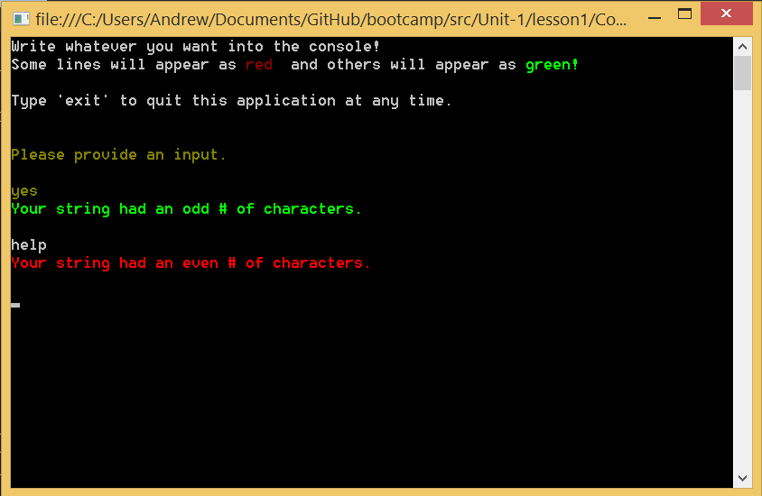

# Lesson 1.1: Actors and the `ActorSystem`
# Урок 1.1: Акторы и `ActorSystem`

Here we go! Welcome to lesson 1.
С почином! Добро пожаловать на урок №1.

In this lesson, you will make your first actors and be introduced to the fundamentals of [Akka.NET](http://getakka.net/).
На этом уроке вы сможете создать ваших первых акторов и познакомитесь с основами [Akka.NET](http://getakka.net/).

## Key concepts / background
## Ключевые идеи / общая информация

In this first lesson, you will learn the basics by creating a console app with your first actor system and simple actors within it.
Во время этого урока вы получите практический опыт работы с акторами, в консопльном приложение. Для этого вы создадине систему акторов и несолько акторов в рамках этой системы. 

We will be creating two actors, one to read from the console, and one to write to it after doing some basic processing.
Мы напишем двух акторов, один з которых будет читать из консоли, а другой писать в консоль после небольшой обработки данных.

### What is an actor?
### Что такое актор?

An "actor" is really just an analog for a human participant in a system. It's an entity, an object, that can do things and communicate.
"Актор" это просто аналог человека, выполняющего какую-то роль в системе. Этот человек является сущностью, объектом, и может проводить какие-то действия и общаться с другими людьми.

> We're going to assume that you're familiar with object-oriented programming (OOP). The actor model is very similar to object-oriented programming (OOP) - just like how everything is an object in OOP, in the actor model ***everything is an actor***.
> Мы предполагаем, что вам знакомы идеи объектно ориентированного программирования (ООП).  Модель акторов очень похожа на объектно ориентированную модель - в рамках ООП все является объектами, в рамках модели акторов ***все является актором***.


Repeat this train of thought to yourself: everything is an actor. Everything is an actor. Everything is an actor! Think of designing your system like a hierarchy of people, with tasks being split up and delegated until they become small enough to be handled concisely by one actor.

Повторяйте про себя: все является актором. Все является актором. Все является актором! Представьте вашу систему как иерархию людей, в которой задачи разбиваются на части и делегируются до тех пор, пока не станут достаточно маленьким для того, чтобы быть качественно выоплненными даже одним актором.

For now, we suggest you think of it like this: in OOP, you try to give every object a single, well-defined purpose, right? Well, the actor model is no different, except now the objects that you give a clear purpose to just happen to be actors.


На данный момент мы подоздерваем что вы думаете примерно так : в рамках ООП вы стараетесь дать каждому объекту простую и четко определенную цель существования. В принципе, система акторов ничем не отличается, за исключением того, что четкая цель теперь в зоне ответственности актором.

**Further reading: [What is an Akka.NET Actor](http://petabridge.com/blog/akkadotnet-what-is-an-actor/)?**
**Дополнительный материал: [Что такое актор в рамках Akka.NET](http://petabridge.com/blog/akkadotnet-what-is-an-actor/)?**


### How do actors communicate?
### How do actors communicate?
Как акторы общаются?

Actors communicate with each other just as humans do, by exchanging messages. These messages are just plain old C# classes.
Акторы общаются друг с другом точно так же, как и люди - обмениваясь сообщения. А сообщения - это старые добрые классы C#.

```csharp
//this is a message!
public class SomeMessage{
	public int SomeValue {get; set}
}
```

```csharp
//это сообщение !
public class SomeMessage{
	public int SomeValue {get; set}
}
```

We go into messages in detail in the next lesson, so don't worry about it for now. All you need to know is that you send messages by `Tell()`ing them to another actor.
Более детально мы разберем сообщения на следующем уроке, не волнуйтесь на этот счет. Все что вам надо сейчас знать, это то, что сообщения можно отправить другому актору при помощи метода `Tell()`

```csharp
//send a string to an actor
someActorRef.Tell("this is a message too!");
```
```csharp
//посылаем сообщение другому актору
someActorRef.Tell("и это тоже сообщение!");
```

### What can an actor do?
### Что акторы могут делать?

Anything you can code. Really :)
Все что вы запрограммируюете. Серьезно :)

You code actors to handle messages they receive, and actors can do whatever you need them to in order to handle a message. Talk to a database, write to a file, change an internal variable, or anything else you might need.
Вы создаете акторов, заставляете их обрабатывать сообщения, которые они получают, и акторы могут сделать все что угодно для того, тчобы обработать сообщение. Делать запросы к базе данных, писать в файл, изменять внутренние переменные, или любые другие вещи, которые могут вам понадобиться.


In addition to processing a message it receives, an actor can:
Помимо обработки сообщений, актор может:

1. Create other actors
1. Создавать других акторов

1. Send messages to other actors (such as the `Sender` of the current message)
2. Посылать сообщения другим акторам (например отправителю текущего сообщения, используя свойство `Sender`)

1. Change its own behavior and process the next message it receives differently
3. Менять свое поведение и обрабатывать следующее полученное сообщение по-другому

Actors are inherently asynchronous (more on this in a future lesson), and there is nothing about the [Actor Model](https://en.wikipedia.org/wiki/Actor_model) that says which of the above an actor must do, or the order it has to do them in. It's up to you.

Акторы жестоко асинхронны.
### What kinds of actors are there?
All types of actors inherit from `UntypedActor`, but don't worry about that now. We'll cover different actor types later.

In Unit 1 all of your actors will inherit from [`UntypedActor`](http://getakka.net/docs/Working%20with%20actors#untypedactor-api "Akka.NET - UntypedActor API").

### How do you make an actor?
There are 2 key things to know about creating an actor:

1. All actors are created within a certain context. That is, they are "actor of" a context.
1. Actors need `Props` to be created. A `Props` object is just an object that encapsulates the formula for making a given kind of actor.

We'll be going into `Props` in depth in lesson 3, so for now don't worry about it much. We've provided the `Props` for you in the code, so you just have to figure out how to use `Props` to make an actor.

The hint we'll give you is that your first actors will be created within the context of your actor system itself. See the exercise instructions for more.

### What is an `ActorSystem`?
An `ActorSystem` is a reference to the underlying system and Akka.NET framework. All actors live within the context of this actor system. You'll need to create your first actors from the context of this `ActorSystem`.

By the way, the `ActorSystem` is a heavy object: create only one per application.

Aaaaaaand... go! That's enough conceptual stuff for now, so dive right in and make your first actors.

## Exercise
Let's dive in!

> Note: Within the sample code there are sections clearly marked `"YOU NEED TO FILL IN HERE"` - find those regions of code and begin filling them in with the appropriate functionality in order to complete your goals.

### Launch the fill-in-the-blank sample
Go to the [DoThis](../DoThis/) folder and open [WinTail](../DoThis/WinTail.sln) in Visual Studio. The solution consists of a simple console application and only one Visual Studio project file.

You will use this solution file through all of Unit 1.

### Install the latest Akka.NET NuGet package
In the Package Manager Console, type the following command:

```
Install-Package Akka
```

This will install the latest Akka.NET binaries, which you will need in order to compile this sample.

Then you'll need to add the `using` namespace to the top of `Program.cs`:


```csharp
// in Program.cs
using Akka.Actor;
```

### Make your first `ActorSystem`
Go to `Program.cs` and add this to create your first actor system:

```csharp
MyActorSystem = ActorSystem.Create("MyActorSystem");
```
>
> **NOTE:** When creating `Props`, `ActorSystem`, or `ActorRef` you will very rarely see the `new` keyword. These objects must be created through the factory methods built into Akka.NET. If you're using `new` you might be making a mistake.

### Make ConsoleReaderActor & ConsoleWriterActor
The actor classes themselves are already defined, but you will have to make your first actors.

Again, in `Program.cs`, add this just below where you made your `ActorSystem`:

```csharp
var consoleWriterActor = MyActorSystem.ActorOf(Props.Create(() => new ConsoleWriterActor()));
var consoleReaderActor = MyActorSystem.ActorOf(Props.Create(() => new ConsoleReaderActor(consoleWriterActor)));
```

We will get into the details of `Props` and `ActorRef`s in lesson 3, so don't worry about them much for now. Just know that this is how you make an actor.

### Have ConsoleReaderActor Send a Message to ConsoleWriterActor
Time to put your first actors to work!

You will need to do the following:

1. ConsoleReaderActor is set up to read from the console. Have it send a message to ConsoleWriterActor containing the content that it just read.

	```csharp
	// in ConsoleReaderActor.cs
	_consoleWriterActor.Tell(read);
	```

2. Have ConsoleReaderActor send a message to itself after sending a message to ConsoleWriterActor. This is what keeps the read loop going.

	```csharp
	// in ConsoleReaderActor.cs
	Self.Tell("continue");
	```
3. Send an initial message to ConsoleReaderActor in order to get it to start reading from the console.

	```csharp
	// in Program.cs
	consoleReaderActor.Tell("start");
	```

### Step 5: Build and Run!
Once you've made your edits, press `F5` to compile and run the sample in Visual Studio.

You should see something like this, when it is working correctly:



### Once you're done
Compare your code to the code in the [Completed](Completed/) folder to see what the instructors included in their samples.

## Great job! Onto Lesson 2!
Awesome work! Well done on completing your first lesson.

**Let's move onto [Lesson 2 - Defining and Handling Different Types of Messages](../lesson2).**

## Any questions?
**Don't be afraid to ask questions** :).

Come ask any questions you have, big or small, [in this ongoing Bootcamp chat with the Petabridge & Akka.NET teams](https://gitter.im/petabridge/akka-bootcamp).

### Problems with the code?
If there is a problem with the code running, or something else that needs to be fixed in this lesson, please [create an issue](https://github.com/petabridge/akka-bootcamp/issues) and we'll get right on it. This will benefit everyone going through Bootcamp.
