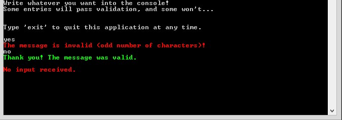

# Lesson 1.2: Defining and Handling Messages
In this lesson, you will make your own message types and learn how to control processing flow within your actors based on your custom messages. Doing so will teach you the fundamentals of communicating in a message- and event-driven manner within your actor system.

This lesson picks up right where Lesson 1 left off, and continues extending our budding systems of console actors. In addition to defining our own messages, we'll also add some simple validation for the input we enter and take action based on the results of that validation.

## Key concepts / background
### What is a message?
Any POCO can be a message. A message can be a `string`, a value like `int`, a type, an object that implements an interface... whatever you want.

That being said, the recommended approach is to make your own custom messages into semantically named classes, and to encapsulate any state you want inside those classes (e.g. store a `Reason` inside a `ValidationFailed` class... hint, hint...).

### How do I send an actor a message?
As you saw in the first lesson, you `Tell()` the actor the message.

### How do I handle a message?
This is entirely up to you, and doesn't really have much to do with Akka.NET. You can handle (or not handle) a message as you choose within an actor.

### What happens if my actor receives a message it doesn't know how to handle?
Actors ignore messages they don't know how to handle. Whether or not this ignored message is logged as such depends on the type of actor.

With an `UntypedActor`, unhandled messages are not logged as unhandled unless you manually mark them as such, like so:

```csharp

class MyActor : UntypedActor
{
    protected override void OnReceive(object message)
    {
         if (message is Messages.InputError)
        {
            var msg = message as Messages.InputError;
            Console.ForegroundColor = ConsoleColor.Red;
            Console.WriteLine(msg.Reason);
        }
        else
        {
            Unhandled(message);
        }
    }
}
```

However, in a `ReceiveActor`—which we cover in Unit 2—unhandled messages are automatically sent to `Unhandled` so the logging is done for you.

### How do my actors respond to messages?
This is up to you - you can respond by simply processing the message, replying to the `Sender`, forwarding the message onto another actor, or doing nothing at all.

> **NOTE:** Whenever your actor receives a message, it will always have the sender of the current message available via the `Sender` property inside your actor.

## Exercise
In this exercise, we will introduce some basic validation into our system. We will then use custom message types to signal the results of that validation back to the user.

### Phase 1: Define your own message types
#### Add a new class called `Messages` and the corresponding file, `Messages.cs`.
This is the class we'll use to define system-level messages that we can use to signal events. The pattern we'll be using is to turn events into messages. That is, when an event occurs, we will send an appropriate message class to the actor(s) that need to know about it, and then listen for / respond to that message as needed in the receiving actors.

#### Add regions for each message type
Add three regions for different types of messages to the file. Next we'll be creating our own message classes that we'll use to signify events.

```csharp
// in Messages.cs
#region Neutral/system messages
#endregion

#region Success messages
#endregion

#region Error messages
#endregion
```

In these regions we will define custom message types to signal these situations:
	- user provided blank input
	- user provided invalid input
	- user provided valid input


#### Make `ContinueProcessing` message
Define a marker message class in the `Neutral/system messages` region that we'll use to signal to continue processing (the "blank input" case):

```csharp
// in Messages.cs
#region Neutral/system messages
/// <summary>
/// Marker class to continue processing.
/// </summary>
public class ContinueProcessing { }
#endregion
```

#### Make `InputSuccess` message
Define an `InputSuccess` class in the `Success messages` region. We'll use this to signal that the user's input was good and passed validation (the "valid input" case):

```csharp
#region Success messages
// in Messages.cs
/// <summary>
/// Base class for signalling that user input was valid.
/// </summary>
public class InputSuccess
{
    public InputSuccess(string reason)
    {
        Reason = reason;
    }

    public string Reason { get; private set; }
}
#endregion
```

#### Make `InputError` messages
Define the following `InputError` classes in the `Error messages` region. We'll use these messages to signal invalid input occurring (the "invalid input" cases):

```csharp
// in Messages.cs
#region Error messages
/// <summary>
/// Base class for signalling that user input was invalid.
/// </summary>
public class InputError
{
    public InputError(string reason)
    {
        Reason = reason;
    }

    public string Reason { get; private set; }
}

/// <summary>
/// User provided blank input.
/// </summary>
public class NullInputError : InputError
{
    public NullInputError(string reason) : base(reason) { }
}

/// <summary>
/// User provided invalid input (currently, input w/ odd # chars)
/// </summary>
public class ValidationError : InputError
{
    public ValidationError(string reason) : base(reason) { }
}
#endregion
```


> **NOTE:** You can compare your final `Messages.cs` to [Messages.cs](Completed/Messages.cs/) to make sure you're set up right before we go on.

### Phase 2: Turn events into messages and send them
Great! Now that we've got messages classes set up to wrap our events, let's use them in `ConsoleReaderActor` and `ConsoleWriterActor`.

#### Update `ConsoleReaderActor`
Add the following internal message type to `ConsoleReaderActor`:
```csharp
// in ConsoleReaderActor
public const string StartCommand = "start";
```

Update the `Main` method to use `ConsoleReaderActor.StartCommand`:

Replace this:

```csharp
// in Program.cs
// tell console reader to begin
consoleReaderActor.Tell("start");
```

with this:

```csharp
// in Program.cs
// tell console reader to begin
consoleReaderActor.Tell(ConsoleReaderActor.StartCommand);
```

Replace the `OnReceive` method of `ConsoleReaderActor` as follows. Notice that we're now listening for our custom `InputError` messages, and taking action when we get an error.

```csharp
// in ConsoleReaderActor
protected override void OnReceive(object message)
{
    if (message.Equals(StartCommand))
    {
        DoPrintInstructions();
    }
    else if (message is Messages.InputError)
    {
        _consoleWriterActor.Tell(message as Messages.InputError);
    }

    GetAndValidateInput();
}
```

While we're at it, let's add `DoPrintInstructions()`, `GetAndValidateInput()`, `IsValid()` to `ConsoleReaderActor`. These are internal methods that our `ConsoleReaderActor` will use to get input from the console and determine if it is valid. (Currently, "valid" just means that the input had an even number of characters. It's an arbitrary placeholder.)

```csharp
// in ConsoleReaderActor, after OnReceive()
#region Internal methods
private void DoPrintInstructions()
{
    Console.WriteLine("Write whatever you want into the console!");
    Console.WriteLine("Some entries will pass validation, and some won't...\n\n");
    Console.WriteLine("Type 'exit' to quit this application at any time.\n");
}

/// <summary>
/// Reads input from console, validates it, then signals appropriate response
/// (continue processing, error, success, etc.).
/// </summary>
private void GetAndValidateInput()
{
    var message = Console.ReadLine();
    if (string.IsNullOrEmpty(message))
    {
        // signal that the user needs to supply an input, as previously
        // received input was blank
        Self.Tell(new Messages.NullInputError("No input received."));
    }
    else if (String.Equals(message, ExitCommand, StringComparison.OrdinalIgnoreCase))
    {
        // shut down the entire actor system (allows the process to exit)
        Context.System.Terminate();
    }
    else
    {
        var valid = IsValid(message);
        if (valid)
        {
            _consoleWriterActor.Tell(new Messages.InputSuccess("Thank you!
             Message was valid."));

            // continue reading messages from console
            Self.Tell(new Messages.ContinueProcessing());
        }
        else
        {
        	Self.Tell(new Messages.ValidationError("Invalid: input had
            odd number of characters."));
        }
    }
}

/// <summary>
/// Validates <see cref="message"/>.
/// Currently says messages are valid if contain even number of characters.
/// </summary>
/// <param name="message"></param>
/// <returns></returns>
private static bool IsValid(string message)
{
    var valid = message.Length % 2 == 0;
    return valid;
}
#endregion
```

#### Update `Program`
First, remove the definition and call to `PrintInstructions()` from `Program.cs`.

Now that `ConsoleReaderActor` has its own well-defined `StartCommand`, let's go ahead and use that instead of hardcoding the string "start" into the message.

As a quick checkpoint, your `Main()` should now look like this:
```csharp
static void Main(string[] args)
{
    // initialize MyActorSystem
    MyActorSystem = ActorSystem.Create("MyActorSystem");

    var consoleWriterActor = MyActorSystem.ActorOf(Props.Create(() =>
    new ConsoleWriterActor()));
    var consoleReaderActor = MyActorSystem.ActorOf(Props.Create(() =>
    new ConsoleReaderActor(consoleWriterActor)));

    // tell console reader to begin
    consoleReaderActor.Tell(ConsoleReaderActor.StartCommand);

    // blocks the main thread from exiting until the actor system is shut down
    MyActorSystem.WhenTerminated.Wait();
}
```

Not much has changed here, just a bit of cleanup.

#### Update `ConsoleWriterActor`
Now, let's get `ConsoleWriterActor` to handle these new types of messages.

Change the `OnReceive` method of `ConsoleWriterActor` as follows:

```csharp
// in ConsoleWriterActor.cs
protected override void OnReceive(object message)
{
    if (message is Messages.InputError)
    {
        var msg = message as Messages.InputError;
        Console.ForegroundColor = ConsoleColor.Red;
        Console.WriteLine(msg.Reason);
    }
    else if (message is Messages.InputSuccess)
    {
        var msg = message as Messages.InputSuccess;
        Console.ForegroundColor = ConsoleColor.Green;
        Console.WriteLine(msg.Reason);
    }
    else
    {
        Console.WriteLine(message);
    }

    Console.ResetColor();
}
```

As you can see here, we are making `ConsoleWriterActor` pattern match against the type of message it receives, and take different actions according to what type of message it receives.

### Phase 3: Build and run!
You should now have everything you need in place to be able to build and run. Give it a try!

If everything is working as it should, you should see an output like this:


### Once you're done
Compare your code to the solution in the [Completed](Completed/) folder to see what the instructors included in their samples.

##  Great job! Onto Lesson 3!
Awesome work! Well done on completing this lesson.

**Let's move onto [Lesson 3 - `Props` and `IActorRef`s](../lesson3/README.md).**

## Any questions?

Come ask any questions you have, big or small, [in this ongoing Bootcamp chat with the Petabridge & Akka.NET teams](https://gitter.im/petabridge/akka-bootcamp).

### Problems with the code?
If there is a problem with the code running, or something else that needs to be fixed in this lesson, please [create an issue](https://github.com/petabridge/akka-bootcamp/issues) and we'll get right on it. This will benefit everyone going through Bootcamp.
