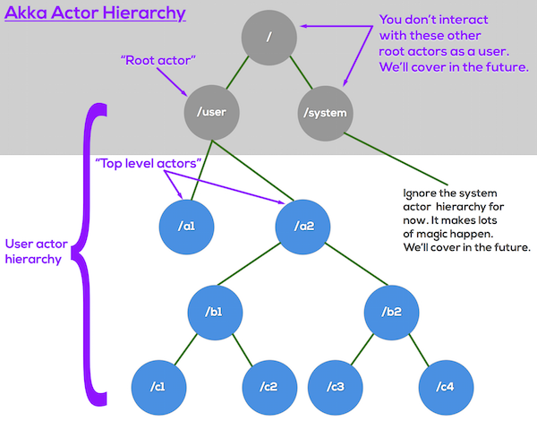
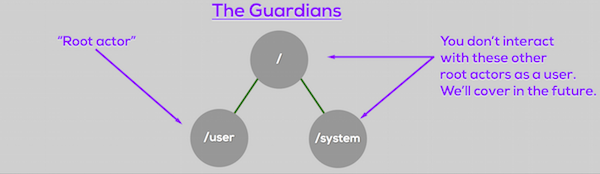
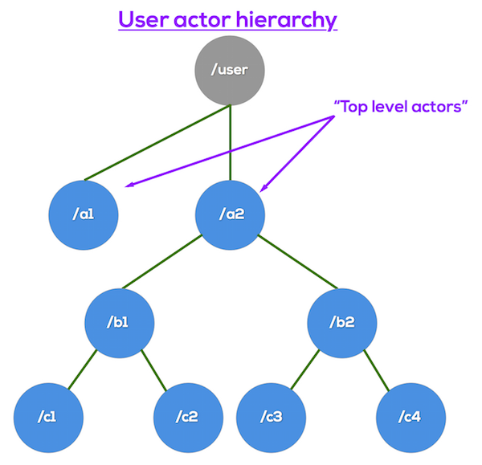
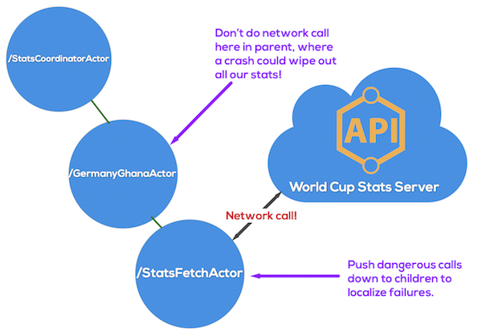
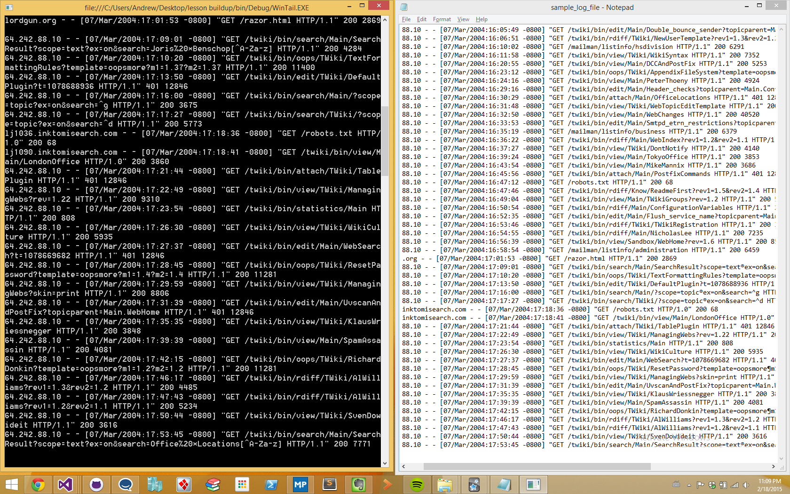
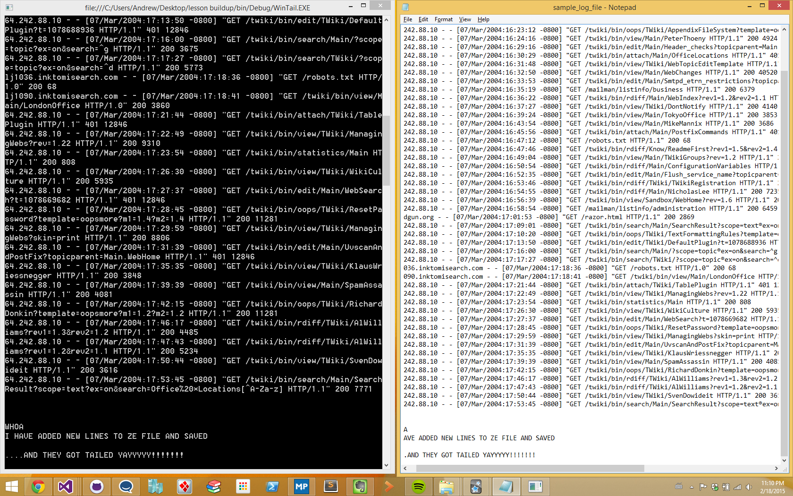

# Lesson 1.4: Child Actors, Actor Hierarchies, and Supervision
This lesson will make a big jump forward in both the capabilities of our codebase, and in your understanding of how the actor model works.

This lesson is our most challenging one yet, so let's get right to it!

## Key concepts / background
Before we get into the details of the actor hierarchy itself, let's stop and ask: why do we need a hierarchy at all?

There are two key reasons actors exist in a hierarchy:

1. To atomize work and turn massive amounts of data into manageable chunks
1. To contain errors and make the system resilient

### Hierarchies atomize work
Having a hierarchy helps our system to break down work into smaller and smaller pieces, and to allow for different skill specializations at different levels of the hierarchy.

A common way this is realized in an actor systems is that large data streams get atomized, broken down over and over again until they are small and can easily be dealt with by a small code footprint.

Let's take Twitter as an example (users of JVM Akka). Using Akka, Twitter is able to break up their massive ingestion of data into small, manageable streams of information that they can react to. For instance - Twitter can break up their giant firehose of tweets into individual streams for the timeline of each user currently on the site, and they can use Akka to push messages that have arrived for that user into their stream via websocket / etc.

What's the pattern? Take a lot of work. Break it down recursively until it is easily dealt with. Respond as needed.

### Hierarchies enable resilient systems
A hierarchy allows for different levels of risk and specialization to exist that could not otherwise.

Think of how an army works. An army has a general setting strategy and overseeing everything, but she is usually not going to be on the front line of the battle where there is the most risk. However, she has wide leverage and guides everything. At the same time, there are lower-ranking soldiers who are on the front lines, doing risky operations and carrying out the orders that they receive.

This is exactly how an actor system operates.

Higher-level actors are more supervisional in nature, and this allows the actor system to push risk down and to the edges. By pushing risky operations to the edges of the hierarchy, the system can isolate risk and recover from errors without the whole system crashing.

Both of these concepts are important, but for the rest of this lesson we'll put our emphasis on how actor systems use hierarchies to be resilient.

How is this achieved? **Supervision.**

### What is supervision? Why should I care?
Supervision is the basic concept that allows your actor system to quickly isolate and recover from failures.

Every actor has another actor that supervises it, and helps it recover when errors occur. This is true from the top all the way to the bottom of the hierarchy.

This supervision ensures that when part of your application encounters an unexpected failure (unhandled exception, network timeout, etc.), that failure will be contained to only the affected part of your actor hierarchy.

All other actors will keep on working as though nothing happened. We call this "failure isolation" or "containment."

How is this accomplished? Let's find out&hellip;

### Actor Hierarchies
First, a key point: Every actor has a parent, and some actors have children. Parents supervise their children.

Since parents supervise their children, this means that ***every actor has a supervisor, and every actor can also BE a supervisor.***

Within your actor system, actors are arranged into a hierarchy. This means there are "top level" actors, which essentially report directly to the `ActorSystem` itself, and there are "child" actors, which report to other actors.

The overall hierarchy looks like this (we'll go through piece by piece in a moment):



### What are the levels of the hierarchy?
#### The base of it all: The "Guardians"
The "guardians" are the root actors of the entire system.

I'm referring to these three actors at the very top of the hierarchy:


##### The `/` actor

The `/` actor is the base actor of the entire actor system, and may also be referred to as "The Root Guardian." This actor supervises the `/system` and `/user` actors (the other "Guardians").

All actors require another actor as their parent, except this one. This actor is also sometimes called the "bubble-walker" since it is "out of the bubble" of the normal actor system. For now, don't worry about this actor.

##### The `/system` actor

The `/system` actor may also be referred to as "The System Guardian". The main job of this actor is to ensure that the system shuts down in an orderly manner, and to maintain/supervise other system actors which implement framework level features and utilities (logging, etc). We'll discuss the system guardian and the system actor hierarchy in a future post.

##### The `/user` actor

This is where the party starts! And this is where you'll be spending all your time as a developer.

The `/user` actor may also be referred to as "The Guardian Actor". But from a user perspective, `/user` is the root of your actor system and is usually just called the "root actor."

> Generally, "root actor" refers to the `/user` actor.

As a user, you don't really need to worry too much about the Guardians. We just have to make sure that we use supervision properly under `/user` so that no exception can bubble up to the Guardians and crash the whole system.


#### The `/user` actor hierarchy
This is the meat and potatoes of the actor hierarchy: all of the actors you define in your applications.


> The direct children of the `/user` actor are called "top level actors."

Actors are always created as a child of some other actor.

Whenever you make an actor directly from the context of the actor system itself, that new actor is a top level actor, like so:

```csharp
// create the top level actors from above diagram
IActorRef a1 = MyActorSystem.ActorOf(Props.Create<BasicActor>(), "a1");
IActorRef a2 = MyActorSystem.ActorOf(Props.Create<BasicActor>(), "a2");
```

Now, let's make child actors for `a2` by creating them inside the context of `a2`, our parent-to-be:

```csharp
// create the children of actor a2
// this is inside actor a2
IActorRef b1 = Context.ActorOf(Props.Create<BasicActor>(), "b1");
IActorRef b2 = Context.ActorOf(Props.Create<BasicActor>(), "b2");
```

#### Actor path == actor position in hierarchy
Every actor has an address. To send a message from one actor to another, you just have to know it's address (AKA its "ActorPath"). This is what a full actor address looks like:


> *The "Path" portion of an actor address is just a description of where that actor is in your actor hierarchy. Each level of the hierarchy is separated by a single slash ('/').*

For example, if we were running on `localhost`, the full address of actor `b2` would be `akka.tcp://MyActorSystem@localhost:9001/user/a2/b2`.

One question that comes up a lot is, "Do my actor classes have to live at a certain point in the hierarchy?" For example, if I have an actor class, `FooActor`—can I only deploy that actor as a child of `BarActor` on the hierarchy? Or can I deploy it anywhere?

The answer is **any actor may be placed anywhere in your actor hierarchy**.

> *Any actor may be placed anywhere in your actor hierarchy.*

Okay, now that we've got this hierarchy business down, let's do something interesting with it. Like supervising!

### How supervision works in the actor hierarchy
Now that you know how actors are organized, know this: actors supervise their children. *But, they only supervise the level that is immediately below them in the hierarchy (actors do not supervise their grandchildren, great-grandchildren, etc).*

> Actors only supervise their children, the level immediately below them in the hierarchy.

#### When does supervision come into play? Errors!
When things go wrong, that's when! Whenever a child actor has an unhandled exception and is crashing, it reaches out to its parent for help and to tell it what to do.

Specifically, the child will send its parent a message that is of the `Failure` class. Then it's up to the parent to decide what to do.

#### How can the parent resolve the error?
There are two factors that determine how a failure is resolved:

1. How the child failed (what type of `Exception` did the child include in its `Failure` message to its parent.)
1. What Directive the parent actor executes in response to a child `Failure`. This is determined by the parent's `SupervisionStrategy`.

##### Here's the sequence of events when an error occurs:

1. Unhandled exception occurs in child actor (`c1`), which is supervised by its parent (`b1`).
2. `c1` suspends operations.
3. The system sends a `Failure` message from `c1` to `b1`, with the `Exception` that was raised.
4. `b1` issues a directive to `c1` telling it what to do.
5. Life goes on, and the affected part of the system heals itself without burning down the whole house. Kittens and unicorns, handing out free ice cream and coffee to be enjoyed while relaxing on a pillowy rainbow. Yay!


##### Supervision directives
When it receives an error from its child, a parent can take one of the following actions ("directives"). The supervision strategy maps different exception types to these directives, allowing you to handle different types of errors as appropriate.

Types of supervision directives (i.e. what decisions a supervisor can make):

- **Restart** the child (default): this is the common case, and the default.
- **Stop** the child: this permanently terminates the child actor.
- **Escalate** the error (and stop itself): this is the parent saying "I don't know what to do! I'm gonna stop everything and ask MY parent!"
- **Resume** processing (ignores the error): you generally won't use this. Ignore it for now.

> *The critical thing to know here is that ***whatever action is taken on a parent propagates to its children***. If a parent is halted, all its children halt. If it is restarted, all its children restart.*

##### Supervision strategies
There are two built-in supervision strategies:

1. One-For-One Strategy (default)
2. All-For-One Strategy

 The basic difference between these is how widespread the effects of the error-resolution directive will be.

**One-For-One** says that that the directive issued by the parent only applies to the failing child actor. It has no effect on the siblings of the failing child. This is the default strategy if you don't specify one. (You can also define your own custom supervision strategy.)

**All-For-One** says that that the directive issued by the parent applies to the failing child actor AND all of its siblings.

The other important choice you make in a supervision strategy is how many times a child can fail within a given period of time before it is shut down (e.g. "no more than 10 errors within 60 seconds, or you're shut down").

Here's an example supervision strategy:

```csharp
public class MyActor : UntypedActor
{
    // if any child of MyActor throws an exception, apply the rules below
    // e.g. Restart the child, if 10 exceptions occur in 30 seconds or
    // less, then stop the actor
    protected override SupervisorStrategy SupervisorStrategy()
    {
        return new OneForOneStrategy(// or AllForOneStrategy
            maxNrOfRetries: 10,
            withinTimeRange: TimeSpan.FromSeconds(30),
            localOnlyDecider: x =>
            {
                // Maybe ArithmeticException is not application critical
                // so we just ignore the error and keep going.
                if (x is ArithmeticException) return Directive.Resume;

                // Error that we have no idea what to do with
                else if (x is InsanelyBadException) return Directive.Escalate;

                // Error that we can't recover from, stop the failing child
                else if (x is NotSupportedException) return Directive.Stop;

                // otherwise restart the failing child
                else return Directive.Restart;
            });
    }

    ...
}
```

### What's the point? Containment.
The whole point of supervision strategies and directives is to contain failure within the system and self-heal, so the whole system doesn't crash. How do we do this?

We push potentially-dangerous operations from a parent to a child, whose only job is to carry out the dangerous task.

For example, let's say we're running a stats system during the World Cup, that keeps scores and player statistics from a bunch of games in the World Cup.

Now, being the World Cup, there could be huge demand on that API and it could get throttled, start rate-limiting, or just plain crash (no offense FIFA, I love you guys and the Cup). We'll use the epic Germany-Ghana match as an example.

But our scorekeeper has to periodically update its data as the game progresses. Let's assume it has to call to an external API maintained by FIFA to get the data it needs.

***This network call is dangerous!*** If the request raises an error, it will crash the actor that started the call. So how do we protect ourselves?

We keep the stats in a parent actor, and push that nasty network call down into a child actor. That way, if the child crashes, it doesn't affect the parent, which is holding on to all the important data. By doing this, we are **localizing the failure** and keeping it from spreading throughout the system.

Here's an example of how we could structure the actor hierarchy to safely accomplish the goal:



Recall that we could have many clones of this exact structure working in parallel, with one clone per game we are tracking. **And we wouldn't have to write any new code to scale it out!** Beautiful.

> You may also hear people use the term "error kernel," which refers to how much of the system is affected by the failure. You may also hear "error kernel pattern," which is just fancy shorthand for the approach I just explained where we push dangerous behavior to child actors to isolate/protect the parent.

## Exercise
To start off, we need to do some upgrading of our system. We are going to add in the components which will enable our actor system to actually monitor a file for changes. We have most of the classes we need, but there are a few pieces of utility code that we need to add: the `TailCoordinatorActor`, `TailActor`, and the `FileObserver`. 

The goal of this exercise is to show you how to make a parent/child actor relationship.

### Phase 1: Make your first parent/child actors!
We're ready to create our actor classes that will form a parent/child relationship.

Recall that in the hierarchy we're going for, there is a `TailCoordinatorActor` that coordinates child actors to actually monitor and tail files. For now it will only supervise one child, `TailActor`, but in the future it can easily expand to have many children, each observing/tailing a different file.

#### Add `TailCoordinatorActor`
Create a new class called `TailCoordinatorActor` in a file of the same name.

Add the following code, which defines our coordinator actor (which will soon be our first parent actor).

```csharp
// TailCoordinatorActor.cs
using System;
using Akka.Actor;

namespace WinTail
{
    public class TailCoordinatorActor : UntypedActor
    {
        #region Message types
        
        /// <summary>
        /// Start tailing the file at user-specified path.
        /// </summary>
        public class StartTail
        {
            public StartTail(string filePath, IActorRef reporterActor)
            {
                FilePath = filePath;
                ReporterActor = reporterActor;
            }

            public string FilePath { get; private set; }

            public IActorRef ReporterActor { get; private set; }
        }

        /// <summary>
        /// Stop tailing the file at user-specified path.
        /// </summary>
        public class StopTail
        {
            public StopTail(string filePath)
            {
                FilePath = filePath;
            }

            public string FilePath { get; private set; }
        }
        
        #endregion

        protected override void OnReceive(object message)
        {
            if (message is StartTail)
            {
                var msg = message as StartTail;
                // YOU NEED TO FILL IN HERE
            }
        }
    }
}
```


#### Add `TailActor`
Now, add a class called `TailActor` in its own file. This actor is the actor that is actually responsible for tailing a given file. `TailActor` will be created and supervised by `TailCoordinatorActor` in a moment.

For now, add the following code in `TailActor.cs`:

```csharp
// TailActor.cs
using System.IO;
using System.Text;
using Akka.Actor;

namespace WinTail
{
    /// <summary>
    /// Monitors the file at <see cref="_filePath"/> for changes and sends
    /// file updates to console.
    /// </summary>
    public class TailActor : UntypedActor
    {
        #region Message types

        /// <summary>
        /// Signal that the file has changed, and we need to 
        /// read the next line of the file.
        /// </summary>
        public class FileWrite
        {
            public FileWrite(string fileName)
            {
                FileName = fileName;
            }

            public string FileName { get; private set; }
        }

        /// <summary>
        /// Signal that the OS had an error accessing the file.
        /// </summary>
        public class FileError
        {
            public FileError(string fileName, string reason)
            {
                FileName = fileName;
                Reason = reason;
            }

            public string FileName { get; private set; }

            public string Reason { get; private set; }
        }

        /// <summary>
        /// Signal to read the initial contents of the file at actor startup.
        /// </summary>
        public class InitialRead
        {
            public InitialRead(string fileName, string text)
            {
                FileName = fileName;
                Text = text;
            }

            public string FileName { get; private set; }
            public string Text { get; private set; }
        }

        #endregion

        private readonly string _filePath;
        private readonly IActorRef _reporterActor;
        private readonly FileObserver _observer;
        private readonly Stream _fileStream;
        private readonly StreamReader _fileStreamReader;

        public TailActor(IActorRef reporterActor, string filePath)
        {
            _reporterActor = reporterActor;
            _filePath = filePath;

            // start watching file for changes
            _observer = new FileObserver(Self, Path.GetFullPath(_filePath));
            _observer.Start();

            // open the file stream with shared read/write permissions
            // (so file can be written to while open)
            _fileStream = new FileStream(Path.GetFullPath(_filePath),
                FileMode.Open, FileAccess.Read, FileShare.ReadWrite);
            _fileStreamReader = new StreamReader(_fileStream, Encoding.UTF8);

            // read the initial contents of the file and send it to console as first msg
            var text = _fileStreamReader.ReadToEnd();
            Self.Tell(new InitialRead(_filePath, text));
        }

        protected override void OnReceive(object message)
        {
            if (message is FileWrite)
            {
                // move file cursor forward
                // pull results from cursor to end of file and write to output
                // (this is assuming a log file type format that is append-only)
                var text = _fileStreamReader.ReadToEnd();
                if (!string.IsNullOrEmpty(text))
                {
                    _reporterActor.Tell(text);
                }

            }
            else if (message is FileError)
            {
                var fe = message as FileError;
                _reporterActor.Tell(string.Format("Tail error: {0}", fe.Reason));
            }
            else if (message is InitialRead)
            {
                var ir = message as InitialRead;
                _reporterActor.Tell(ir.Text);
            }
        }
    }
}
```

#### Add `TailActor` as a child of `TailCoordinatorActor`
Quick review: `TailActor` is to be a child of `TailCoordinatorActor` and will therefore be supervised by `TailCoordinatorActor`.

This also means that `TailActor` must be created in the context of `TailCoordinatorActor`.

Go to `TailCoordinatorActor.cs` and replace `OnReceive()` with the following code to create your first child actor!

```csharp
// TailCoordinatorActor.OnReceive
protected override void OnReceive(object message)
{
    if (message is StartTail)
    {
        var msg = message as StartTail;
		// here we are creating our first parent/child relationship!
		// the TailActor instance created here is a child
		// of this instance of TailCoordinatorActor
        Context.ActorOf(Props.Create(
          () => new TailActor(msg.ReporterActor, msg.FilePath)));
    }
}
```

### ***BAM!***
You have just established your first parent/child actor relationship!

### Phase 2: A quick bit of prep
#### Replace `ValidationActor` with `FileValidatorActor`
Since we're shifting to actually looking at files now, go ahead and replace `ValidationActor` with `FileValidatorActor`.

Add a new class, `FileValidatorActor`, with [this code](Completed/FileValidatorActor.cs):

```csharp
// FileValidatorActor.cs
using System.IO;
using Akka.Actor;

namespace WinTail
{
    /// <summary>
    /// Actor that validates user input and signals result to others.
    /// </summary>
    public class FileValidatorActor : UntypedActor
    {
        private readonly IActorRef _consoleWriterActor;
        private readonly IActorRef _tailCoordinatorActor;

        public FileValidatorActor(IActorRef consoleWriterActor,
            IActorRef tailCoordinatorActor)
        {
            _consoleWriterActor = consoleWriterActor;
            _tailCoordinatorActor = tailCoordinatorActor;
        }

        protected override void OnReceive(object message)
        {
            var msg = message as string;
            if (string.IsNullOrEmpty(msg))
            {
                // signal that the user needs to supply an input
                _consoleWriterActor.Tell(new Messages.NullInputError("Input was blank.
                Please try again.\n"));

                // tell sender to continue doing its thing (whatever that may be,
                // this actor doesn't care)
                Sender.Tell(new Messages.ContinueProcessing());
            }
            else
            {
                var valid = IsFileUri(msg);
                if (valid)
                {
                    // signal successful input
                    _consoleWriterActor.Tell(new Messages.InputSuccess(
                        string.Format("Starting processing for {0}", msg)));

                    // start coordinator
                    _tailCoordinatorActor.Tell(new TailCoordinatorActor.StartTail(msg,
                        _consoleWriterActor));
                }
                else
                {
                    // signal that input was bad
                    _consoleWriterActor.Tell(new Messages.ValidationError(
                        string.Format("{0} is not an existing URI on disk.", msg)));

                    // tell sender to continue doing its thing (whatever that
                    // may be, this actor doesn't care)
                    Sender.Tell(new Messages.ContinueProcessing());
                }
            }
        }

        /// <summary>
        /// Checks if file exists at path provided by user.
        /// </summary>
        /// <param name="path"></param>
        /// <returns></returns>
        private static bool IsFileUri(string path)
        {
            return File.Exists(path);
        }
    }
}
```

#### Create `IActorRef` for `TailCoordinatorActor`
In `Main()`, create a new `IActorRef` for `TailCoordinatorActor` and then pass it into `fileValidatorActorProps`, like so:

```csharp
// Program.Main
// make tailCoordinatorActor
Props tailCoordinatorProps = Props.Create(() => new TailCoordinatorActor());
IActorRef tailCoordinatorActor = MyActorSystem.ActorOf(tailCoordinatorProps,
    "tailCoordinatorActor");

// pass tailCoordinatorActor to fileValidatorActorProps (just adding one extra arg)
Props fileValidatorActorProps = Props.Create(() =>
new FileValidatorActor(consoleWriterActor, tailCoordinatorActor));
IActorRef validationActor = MyActorSystem.ActorOf(fileValidatorActorProps,
    "validationActor");
```

#### Update `DoPrintInstructions`
Just making a slight tweak to our instructions here, since we'll be using a text file on disk going forward instead of prompting the user for input.

Update `DoPrintInstructions()` to this:

```csharp
// ConsoleReaderActor.cs
private void DoPrintInstructions()
{
    Console.WriteLine("Please provide the URI of a log file on disk.\n");
}
```

#### Add `FileObserver`
This is a utility class that we're providing for you to use. It does the low-level work of actually watching a file for changes.

Create a new class called `FileObserver` and type in the code for [FileObserver.cs](Completed/FileObserver.cs). If you're running this on Mono, note the extra environment variable that has to be uncommented in the `Start()` method:

```csharp
// FileObserver.cs
using System;
using System.IO;
using Akka.Actor;

namespace WinTail
{
    /// <summary>
    /// Turns <see cref="FileSystemWatcher"/> events about a specific file into
    /// messages for <see cref="TailActor"/>.
    /// </summary>
    public class FileObserver : IDisposable
    {
        private readonly IActorRef _tailActor;
        private readonly string _absoluteFilePath;
        private FileSystemWatcher _watcher;
        private readonly string _fileDir;
        private readonly string _fileNameOnly;

        public FileObserver(IActorRef tailActor, string absoluteFilePath)
        {
            _tailActor = tailActor;
            _absoluteFilePath = absoluteFilePath;
            _fileDir = Path.GetDirectoryName(absoluteFilePath);
            _fileNameOnly = Path.GetFileName(absoluteFilePath);
        }

        /// <summary>
        /// Begin monitoring file.
        /// </summary>
        public void Start()
        {
            // Need this for Mono 3.12.0 workaround
            // uncomment next line if you're running on Mono!
            // Environment.SetEnvironmentVariable("MONO_MANAGED_WATCHER", "enabled");

            // make watcher to observe our specific file
            _watcher = new FileSystemWatcher(_fileDir, _fileNameOnly);

            // watch our file for changes to the file name,
            // or new messages being written to file
            _watcher.NotifyFilter = NotifyFilters.FileName | NotifyFilters.LastWrite;

            // assign callbacks for event types
            _watcher.Changed += OnFileChanged;
            _watcher.Error += OnFileError;

            // start watching
            _watcher.EnableRaisingEvents = true;
        }

        /// <summary>
        /// Stop monitoring file.
        /// </summary>
        public void Dispose()
        {
            _watcher.Dispose();
        }

        /// <summary>
        /// Callback for <see cref="FileSystemWatcher"/> file error events.
        /// </summary>
        /// <param name="sender"></param>
        /// <param name="e"></param>
        void OnFileError(object sender, ErrorEventArgs e)
        {
            _tailActor.Tell(new TailActor.FileError(_fileNameOnly,
                e.GetException().Message),
                ActorRefs.NoSender);
        }

        /// <summary>
        /// Callback for <see cref="FileSystemWatcher"/> file change events.
        /// </summary>
        /// <param name="sender"></param>
        /// <param name="e"></param>
        void OnFileChanged(object sender, FileSystemEventArgs e)
        {
            if (e.ChangeType == WatcherChangeTypes.Changed)
            {
                // here we use a special ActorRefs.NoSender
                // since this event can happen many times,
                // this is a little microoptimization
                _tailActor.Tell(new TailActor.FileWrite(e.Name), ActorRefs.NoSender);
            }
        }
    }
}
```


### Phase 3: Implement a `SupervisorStrategy`
Now it's time to add a supervision strategy to your new parent, `TailCoordinatorActor`.

The default `SupervisorStrategy` is a One-For-One strategy ([docs](http://getakka.net/docs/Supervision#one-for-one-strategy-vs-all-for-one-strategy)) w/ a Restart directive ([docs](http://getakka.net/docs/Supervision#what-restarting-means)).

Add this code to the bottom of `TailCoordinatorActor`:

```csharp
// TailCoordinatorActor.cs
protected override SupervisorStrategy SupervisorStrategy()
{
    return new OneForOneStrategy (
        10, // maxNumberOfRetries
        TimeSpan.FromSeconds(30), // withinTimeRange
        x => // localOnlyDecider
        {
            //Maybe we consider ArithmeticException to not be application critical
            //so we just ignore the error and keep going.
            if (x is ArithmeticException) return Directive.Resume;

            //Error that we cannot recover from, stop the failing actor
            else if (x is NotSupportedException) return Directive.Stop;

            //In all other cases, just restart the failing actor
            else return Directive.Restart;
        });
}
```

### Phase 4: Build and Run!
Awesome! It's time to fire this baby up and see it in action.

#### Get a text file you can tail
We recommend a log file like [this sample one](DoThis/sample_log_file.txt), but you can also just make a plain text file and fill it with whatever you want.

Open the text file up and put it on one side of your screen.

#### Fire it up
##### Check the starting output
Run the application and you should see a console window open up and print out the starting contents of your log file. The starting state should look like this if you're using the sample log file we provided:


**Leave both the console and the file open, and then...**

##### Add text and see if the `tail` works!
Add some lines of text to the text file, save it, and watch it show up in the `tail`!

It should look something like this:


Congrats! YOU HAVE JUST MADE A PORT OF `tail` IN .NET!

### Once you're done
Compare your code to the solution in the [Completed](Completed/) folder to see what the instructors included in their samples.

## Great job! Onto Lesson 5!
Awesome work! Well done on completing this lesson, we know it was a bear! It was a big jump forward for our system and in your understanding.

Here is a high-level overview of our working system!


**Let's move onto [Lesson 5 - Looking up Actors by Address with `ActorSelection`](../lesson5/README.md).**

---
## Supervision FAQ
### How long do child actors have to wait for their supervisor?
This is a common question we get: What if there are a bunch of messages already in the supervisor's mailbox waiting to be processed when a child reports an error? Won't the crashing child actor have to wait until those are processed until it gets a response?

Actually, no. When an actor reports an error to its supervisor, it is sent as a special type of "system message." *System messages jump to the front of the supervisor's mailbox and are processed before the supervisor returns to its normal processing.*

> *System messages jump to the front of the supervisor's mailbox and are processed before the supervisor returns to its normal processing.*

Parents come with a default SupervisorStrategy object (or you can provide a custom one) that makes decisions on how to handle failures with their child actors.

### But what happens to the current message when an actor fails?
The current message being processed by an actor when it is halted (regardless of whether the failure happened to it or its parent) can be saved and re-processed after restarting. There are several ways to do this. The most common approach used is during `preRestart()`, the actor can stash the message (if it has a stash) or it can send the message to another actor that will send it back once restarted. (Note: If the actor has a stash, it will automatically unstash the message once it successfully restarts.)


## Any questions?

Come ask any questions you have, big or small, [in this ongoing Bootcamp chat with the Petabridge & Akka.NET teams](https://gitter.im/petabridge/akka-bootcamp).

### Problems with the code?
If there is a problem with the code running, or something else that needs to be fixed in this lesson, please [create an issue](https://github.com/petabridge/akka-bootcamp/issues) and we'll get right on it. This will benefit everyone going through Bootcamp.
