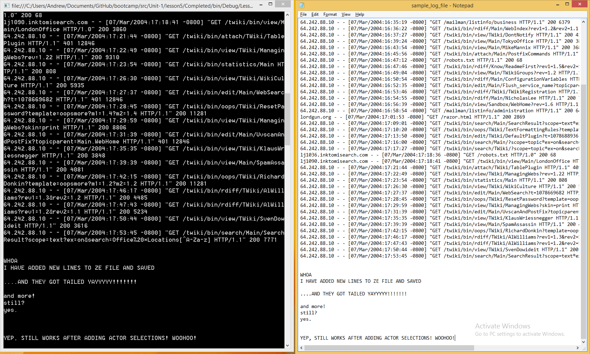

# Lesson 1.5: Looking up Actors by Address with `ActorSelection`
Welcome to lesson 5! Wow, we've come a long way together. First, just **take a quick moment to appreciate that, and give yourself credit for investing your time and energy into your craft**.

Mmm, that was nice.

Okay, let's get on with it!

In this lesson, we're going to learn how to decouple our actors from each other a bit and a new way of communicating between actors: [`ActorSelection`](http://api.getakka.net/docs/stable/html/CC0731A6.htm "Akka.NET Stable API Docs - ActorSelection class"). This lesson is shorter than the previous ones, now that we've laid down a solid conceptual foundation.

## Key concepts / background
`ActorSelection` is a natural extension of actor hierarchies, which we covered in the last lesson. Now that we understand that actors live in hierarchies, it begs the question: now that actors aren't all on the same level, does this change the way they communicate?

We know that we need a handle to an actor in order to send it a message and get it to do work. But now we have actors all over the place in this hierarchy, and don't always have a direct link (`IActorRef`) to the actor(s) we want to send messages to.

*So how do we send a message to an actor somewhere else in the hierarchy, that we don't have a stored `IActorRef` for? What then?*

Enter `ActorSelection`.

### What is `ActorSelection`?
`ActorSelection` is nothing more than using an `ActorPath` to get a handle to an actor or actors so you can send them a message, without having to store their actual `IActorRef`s.

Instead of getting a handle to an actor by creating or passing around its `IActorRef`, you're "looking up" a handle to the actor by its `ActorPath` (recall that the `ActorPath` is the address for an actor's position in the system hierarchy). It's kind of like looking someone up on Skype by their email when you don't already have their username.

However, be aware that while `ActorSelection` is how you look up an `IActorRef`, it's not inherently a 1-1 lookup to a single actor.

Technically, the `ActorSelection` object you get when you do a lookup does not point to a specific `IActorRef`. It's actually a handle that internally points to every `IActorRef` that matches the expression you looked up. Wildcards are supported in this expression, so it's an expression that selects 0+ actors. (More on this later.)

An `ActorSelection` will also match two different `IActorRef`s with the same name if the first one dies and is replaced by another (not restarted, in which case it would be the same `IActorRef`).

#### Is it an object? A process? Both?
We think of `ActorSelection` as both a process and an object: the process of looking actor(s) up by `ActorPath`, and the object returned from that lookup, which allows us to send messages to the actor(s) matched by the expression we looked up.

### Why should I care about `ActorSelection`?
Always a great question, glad you asked! There are a number of benefits that `ActorSelection` gives you.

#### Location transparency
What [location transparency](http://getakka.net/docs/concepts/location-transparency) actually means is that whenever you send a message to an actor, you don't need to know where they are within an actor system, which might span hundreds of computers. You don't care if your actors are all in one process or spread across 100 machines around the world. You just have to know that actors' address (its `ActorPath`).

Think of it like calling someone's cell phone number - you don't need to know that your friend Bob is in Seattle, Washington, USA in order to place a call to them. You just need to dial Bob's cell phone number and your cellular network provider will take care of the rest.

The location transparency (enabled by `ActorSelection`) is essential for creating scalable systems that can handle high-availability requirements. We'll go into this more in Units 2 & 3.

#### Loose coupling
Since you don't have to constantly be holding on to `IActorRef`s to store and pass around, your actors don't get tightly coupled to each other. Just like in object-oriented programming, this is a Very Good Thing. It means the components of your system stay loose and easily adaptable / reusable. It lowers the cost of maintaining your codebase.

#### Dynamic behavior
Dynamic behavior is an advanced concept that we dive into in the beginning of Unit 2, but for now just be aware that the behavior of a given actor can be very flexible. This lets actors easily represent things like Finite State Machines so a small code footprint can easily handle complex situations.

Where does `ActorSelection` come into play on this? Well, if you want to have a very dynamic and adaptable system, there are probably going to be lots of actors coming and going from the hierarchy and trying to store / pass around handles to all of them would be a real pain. `ActorSelection` lets you easily just send messages to well known addresses of the key actor(s) you need to communicate with, and not worry about getting/passing/storing handles to the things you need.

You also can build extremely dynamic actors where not even the `ActorPath` needed to do an `ActorSelection` is hardcoded, but can instead be represented by a message that is passed into your actor.

#### Flexible communication patterns == adaptable system
Let's run w/ this idea of adaptability, because it's important for your happiness as a developer, the resilience of your system, and the speed at which your organization can move.

Since you don't have to couple everything together to make it work, this will speed up your development cycles. You can introduce new actors and entirely new sections into the actor hierarchy without having to go back and change everything you've already written. Your system has a much more flexible communication structure that can expand and accommodate new actors (and requirements) easily.

#### In a nutshell: `ActorSelection` makes your system much more adaptable to change and also enables it to be more powerful.

### Okay, got it. So when do I actually use `ActorSelection`?
#### Talking to top-level actors
The most common case we're aware of for using `ActorSelection` is to send messages to top-level actors with well known names.

For example, let's imagine you have a top level actor that handles all authentication for your system. Other actors can send a message to that actor to find out if a user is authenticated or has permission to carry out a certain operation. Let's call this actor `AuthenticationActor`.

Since this is a top-level actor, we now know thanks to our knowledge of hierarchies that its `ActorPath` is going to be `/user/AuthenticationActor`. Using this well-known address, **ANY** actor in the entire system can easily talk to it without needing to previously have its `IActorRef`, as in this example:

```csharp
// send username to AuthenticationActor for authentication
// this is an "absolute" actor selection, since it starts at top-level /user/
Context.ActorSelection("akka://MyActorSystem/user/AuthenticationActor").Tell(username);
```

> NOTE: `ActorSelection`s can be either absolute or relative. An absolute `ActorSelection` includes the root `/user/` actor in the path. However, an `ActorSelection` could also be relative, such as `Context.ActorSelection("../validationActor")`.

#### Doing elastic processing of large data streams
A very common extension of the well-known actor pattern is talking to routers ([docs](http://getakka.net/wiki/Routing)). Routers are a more advanced topic we go in-depth on in unit 2.

As a quick example, imagine that you had a system that needed to process a large data stream in real time. Let's say for fun that you had a very popular consumer app that had peak usage once or twice a day, like a social app that people love to use on their breaks at work. Each user is generating a flurry of activity that has to be processed and rolled up in realtime. For the sake of this example, imagine that you had an actor running per user tracking the user's activity, and feeding that data to other parts of the system.

(*Remember: actors are cheap! It's totally reasonable from an overhead POV to create actors for every user. Last we checked, Akka.NET could run between 2.5-3 million actors per gig of RAM.*)

There's a lot of data coming in, and you want to make sure the system stays responsive under high loads. What do you do? One good option is to create a router (or job coordinator, as some call it) and have that coordinator manage a pool of workers that do the processing. This pool of workers can then elastically expand/contract to meet the changing processing demands of the system on the fly.

As all these per-user actors are being created and shutting down when users leave the app, how do you consistently feed the data to the right place? You send the data to the `ActorSelection`s for all the coordinators you need to hand off processing to.

#### When not just replying
A very commonly used `IActorRef` is `Sender`, which is the `IActorRef` made available to every actor context and is a handle to the sender of the message currently being processed. In an earlier lesson, we used this inside `FileValidatorActor`'s `OnReceive` method to easily send a confirmation message back to the sender of the message that was being validated by `FileValidatorActor`.

But what if, as part of processing a message, you need to send a message to another actor who is not the `Sender` of your current message? `ActorSelection` FTW.

#### Reporting to multiple endpoints at once
Another common case is that you may have some piece of information you want to report to multiple other actors, that perhaps each run a stats service. Using `ActorSelection`, you could send the same piece of data as a message to all of those services at once, if they shared a similar well-known naming scheme. This is one good use case for a wildcard `ActorSelection`.

### Caution: Don't pass `ActorSelection`s around
We encourage you NOT to pass around `ActorSelection`s as pararmeters, the way you do `IActorRef`s. The reason for this is that `ActorSelection`s can be relative instead of absolute, in which case it wouldn't produce the intended effects when passed to an actor with a different location in the hierarchy.

### How do I make an `ActorSelection`?
Very simple: `var selection = Context.ActorSelection("/path/to/actorName")`

> NOTE: **the path to an actor includes the name you assign to an actor when you instantiate it, NOT its class name. If you don't assign a name to an actor when you create it, the system will auto-generate a unique name for you**. For example:

```csharp
class FooActor : UntypedActor {}
Props props = Props.Create<FooActor>();

// the ActorPath for myFooActor is "/user/barBazActor"
// NOT "/user/myFooActor" or "/user/FooActor"
IActorRef myFooActor = MyActorSystem.ActorOf(props, "barBazActor");

// if you don't specify a name on creation as below, the system will
// auto generate a name for you, so the actor path will
// be something like "/user/$a"
IActorRef myFooActor = MyActorSystem.ActorOf(props);
```

### Do I send a message differently to an `ActorSelection` vs an `IActorRef`?
Nope. You `Tell()` an `ActorSelection` a message just the same as an `IActorRef`:

```csharp
var selection = Context.ActorSelection("/path/to/actorName");
selection.Tell(message);
```

## Exercise
Alright, let's get to it. This exercise will be short. We are only making some small optimizations to our system.

### Phase 1: Decouple `ConsoleReaderActor` and `FileValidatorActor`
Right now, our `ConsoleReaderActor` needs to be given an `IActorRef` to be able to send the messages it reads from the console off for validation. In the current design, that's easy enough.

BUT, imagine that `ConsoleReaderActor` was far away in the hierarchy from where the `FileValidatorActor` instance was created (`Program.cs` currently). In this case, there is no clean/easy way to pass in the needed `IActorRef` to `ConsoleReaderActor` without also passing it through every intermediary first.

Without `ActorSelection`, you'd have to pass the necessary `IActorRef` through every object between where the handle is created and used. That is coupling more and more objects together--**yuck**!

Let's fix that by **removing the `validationActor` `IActorRef` that we're passing in**. The top of `ConsoleReaderActor` should now look like this:

```csharp
// ConsoleReaderActor.cs
// note: we don't even need our own constructor anymore!
public const string StartCommand = "start";
public const string ExitCommand = "exit";

protected override void OnReceive(object message)
{
    if (message.Equals(StartCommand))
    {
        DoPrintInstructions();
    }

    GetAndValidateInput();
}
```

Then, let's update the call for message validation inside `ConsoleReaderActor` so that the actor doesn't have to hold onto a specific `IActorRef` and can just forward the message read from the console onto an `ActorPath` where it knows validation occurs.

```csharp
// ConsoleReaderActor.GetAndValidateInput

// otherwise, just send the message off for validation
Context.ActorSelection("akka://MyActorSystem/user/validationActor").Tell(message);
```

Finally, let's update `consoleReaderProps` accordingly in `Program.cs` since its constructor no longer takes any arguments:
```csharp
// Program.Main
Props consoleReaderProps = Props.Create<ConsoleReaderActor>();
```

### Phase 2: Decouple `FileValidatorActor` and `TailCoordinatorActor`
Just as with `ConsoleReaderActor` and `FileValidatorActor`, the `FileValidatorActor` currently requires an `IActorRef` for the `TailCoordinatorActor` which it does not need. Let's fix that.

First, **remove the `tailCoordinatorActor` argument to the constructor of `FileValidatorActor` and remove the accompanying field on the class**. The top of `FileValidatorActor.cs` should now look like this:

```csharp
// FileValidatorActor.cs
// note that we're no longer storing _tailCoordinatorActor field
private readonly IActorRef _consoleWriterActor;

public FileValidatorActor(IActorRef consoleWriterActor)
{
    _consoleWriterActor = consoleWriterActor;
}
```

Then, let's use `ActorSelection` to communicate between `FileValidatorActor` and `TailCoordinatorActor`! Update `FileValidatorActor` like this:
```csharp
// FileValidatorActor.cs
// start coordinator
Context.ActorSelection("akka://MyActorSystem/user/tailCoordinatorActor").Tell(new TailCoordinatorActor.StartTail(msg, _consoleWriterActor));
```

And finally, let's update `fileValidatorProps` in `Program.cs` to reflect the different constructor arguments:

```csharp
// Program.Main
Props fileValidatorActorProps = Props.Create(() => new FileValidatorActor(consoleWriterActor));
```

### Phase 3: Build and Run!
Awesome! It's time to fire this baby up and see it in action.

Just as with the last lesson, you should be able to hit `F5` and run your log/text file and see additions to it appear in your console.



### Hey, wait, go back! What about that `consoleWriterActor` passed to `FileValidatorActor`? Wasn't that unnecessarily coupling actors?
Oh. You're good, you.

We assume you're talking about this `IActorRef` that is still getting passed into `FileValidatorActor`:

```csharp
// FileValidatorActor.cs
private readonly IActorRef _consoleWriterActor;

public FileValidatorActor(IActorRef consoleWriterActor)
{
    _consoleWriterActor = consoleWriterActor;
}
```

*This one is a little counter-intuitive*. Here's the deal.

In this case, we aren't using the handle for `consoleWriterActor` to talk directly to it. Instead we are putting that `IActorRef` inside a message that is getting sent somewhere else in the system for processing. When that message is received, the receiving actor will know everything it needs to in order to do its job.

This is actually a good design pattern in the actor model, because it makes the message being passed entirely self-contained and keeps the system as a whole flexible, even if this one actor (`FileValidatorActor`) needs an `IActorRef` passed in and is a little coupled.

Think about what is happening in the `TailCoordinatorActor` which is receiving this message: the job of the `TailCoordinatorActor` is to manage `TailActor`s which will actually observe and report file changes to... somewhere. We get to specify that somewhere up front.

`TailActor` should not have the reporting output location written directly into it. The reporting output location is a task-level detail that should be encapsulated as an instruction within the incoming message. In this case, that task is our custom `StartTail` message, which indeed contains the `IActorRef` for the previously mentioned `consoleWriterActor` as the `reporterActor`.

So, a little counter-intuitively, this pattern actually promotes loose coupling. You'll see it a lot as you go through Akka.NET, especially given the widespread use of the pattern of turning events into messages.

### Once you're done
Compare your code to the solution in the [Completed](Completed/) folder to see what the instructors included in their samples.

## Great job! Almost Done! Onto Lesson 6!
Awesome work! Well done on completing this lesson! We're on the home stretch of Unit 1, and you're doing awesome.


**Let's move onto [Lesson 6 - The Actor Lifecycle](../lesson6).**


## Any questions?
**Don't be afraid to ask questions** :).

Come ask any questions you have, big or small, [in this ongoing Bootcamp chat with the Petabridge & Akka.NET teams](https://gitter.im/petabridge/akka-bootcamp).

### Problems with the code?
If there is a problem with the code running, or something else that needs to be fixed in this lesson, please [create an issue](/issues) and we'll get right on it. This will benefit everyone going through Bootcamp.
