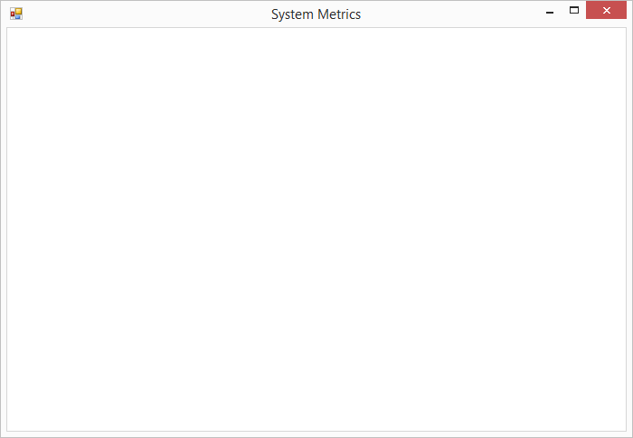
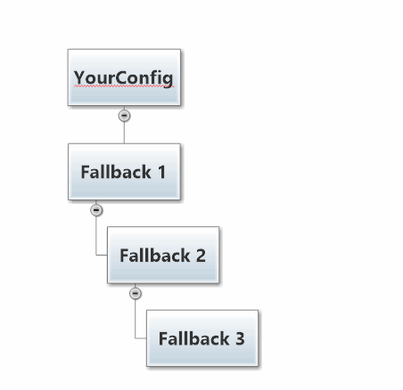
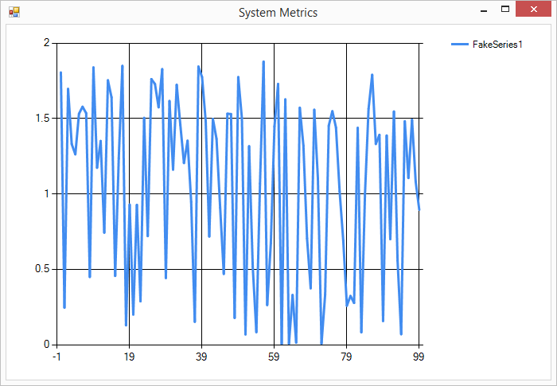

# Lesson 2.1: Using HOCON Configuration to Configure Akka.NET
We're going to be spending most of our time in Unit 2 working with the `ChartingActor`, an actor that is responsible for actually plotting all the data on this chart:


> NOTE: If you're following along using the eBook / .ePub, you won't see the animation. [Click here to see it](https://github.com/petabridge/akka-bootcamp/blob/master/src/Unit-2/lesson5/images/syncharting-complete-output.gif).

BUT, if you try to build and run `SystemCharting.sln` right now (in the [/DoThis/ folder](../DoThis/)) for Unit 2 right away, you'll see the following output:



Well, that's not very exciting. Aren't we supposed to be building a real-time data visualization application in Unit 2? What gives?

Oh wait, there's an exception in the **Debug** window. What does it say?

> [ERROR][2/24/2015 11-48-34 AM][Thread 0010][akka://ChartActors/user/charting] Cross-thread operation not valid: Control 'sysChart' accessed from a thread other than the thread it was created on.
Cause: System.InvalidOperationException: Cross-thread operation not valid: Control 'sysChart' accessed from a thread other than the thread it was created on.

### What's wrong here?
None of the events we want to chart are getting graphed. Hmm... sounds like our events aren't getting to the UI thread. We need to find some way to dispatch and synchronize events with the UI thread so that our chart is updated!

Does this mean we have to rewrite `ChartingActor` with some evil code to manually synchronize with the UI thread?

Nope! We can relax.

**We can solve this problem using [HOCON configuration in Akka.NET](https://getakka.net/articles/concepts/configuration.html#what-is-hocon) without updating any of the code that defines `ChartingActor`.**

But first, we need to understand `Dispatcher`s.

## Key Concepts / Background
### `Dispatcher`
#### What is a `Dispatcher`?
A `Dispatcher` is the piece of glue that pushes messages from your actor's mailbox into your actor instances themselves. That is, the `Dispatcher` is what pushes messages into the `OnReceive()` method of your actors. All actors which share a given `Dispatcher` also share that `Dispatcher`'s threads for parallel execution.

The default dispatcher in Akka.NET is the `ThreadPoolDispatcher`. As you can probably guess, this dispatcher runs all of our actors on top of the CLR `ThreadPool`.

#### What kinds of `Dispatcher`s are there?
There are several types of `Dispatcher`s we can use with our actors:

##### `SingleThreadDispatcher`
This `Dispatcher` runs multiple actors on a single thread.

##### `ThreadPoolDispatcher` (default)
This `Dispatcher` runs actors on top of the CLR `ThreadPool` for maximum concurrency.

##### `SynchronizedDispatcher`
This `Dispatcher` schedules all actor messages to be processed in the same synchronization context as the caller. 99% of the time, this is where you're going to run actors that need access to the UI thread, such as in client applications.

The `SynchronizedDispatcher` uses the *current* [SynchronizationContext](https://msdn.microsoft.com/en-us/magazine/gg598924.aspx) to schedule executions.

> **Note:** As a general rule, actors running in the `SynchronizedDispatcher` shouldn't do much work. Avoid doing any extra work that may be done by actors running in other pools.

In this lesson, we're going to use the `SynchronizedDispatcher` to ensure that the `ChartingActor` runs on the UI thread of our WinForms application. That way, the `ChartingActor` can update any UI element it wants without having to do any cross-thread marshalling - the actor's `Dispatcher` can automatically take care of that for us!

##### [`ForkJoinDispatcher`](http://api.getakka.net/docs/stable/html/F0DC1571.htm "Akka.NET Stable API Docs - ForkJoinDispatcher")
This `Dispatcher` runs actors on top of a dedicated group of threads, for tunable concurrency.

This is meant for actors that need their own dedicated threads in order to run (that need isolation guarantees). This is primarily used by `System` actors so you won't touch it much.

#### Is it a bad idea to run actors on the UI thread?
The short answer is "no".

Running actors on the UI thread is fine, as long as those actors don't perform any long-running operations such as disk or network I/O. In fact, *running actors on the UI thread is a smart thing to do for handling UI events and updates*.

Why? Because *running actors on the UI thread eliminates all of the normal synchronization worries* you'd otherwise have to do in a multi-threaded WPF or WinForms app.

> **Remember: [Akka.NET actors are lazy](http://petabridge.com/blog/akkadotnet-what-is-an-actor/)**. They don't do any work when they're not receiving messages. They don't consume resources when they're inactive.

#### How do `Dispatcher`s relate to our broken chart?
As we realized before, our chart isn't updating because the actor doing the graphing (`ChartingActor`) is not synchronizing its events with the UI thread.

To solve this problem, all we have to do is change the `ChartingActor` to use the `CurrentSynchronizationContextDispatcher`, and it will automatically run on the UI thread for us!

BUT: we want to do this without touching our actual actor code. How can we deploy the `ChartingActor` so that it uses the `CurrentSynchronizationContextDispatcher` without modifying the actor itself?

Time to meet HOCON.

### HOCON
Akka.NET leverages a configuration format, called HOCON, to allow you to configure your Akka.NET applications with whatever level of granularity you want.

#### What is HOCON?
[HOCON (Human-Optimized Config Object Notation)](https://getakka.net/articles/concepts/configuration.html#what-is-hocon) is a flexible and extensible configuration format. It will allow you to configure everything from Akka.NET's `IActorRefProvider` implementation, logging, network transports, and more commonly - how individual actors are deployed.

Values returned by HOCON are strongly typed (i.e. you can fetch out an `int`, a `Timespan`, etc).

#### What can I do with HOCON?
HOCON allows you to embed easily-readable configuration inside of the otherwise hard-to-read XML in App.config and Web.config.  HOCON also lets you query configs by their section paths, and those sections are exposed strongly typed and parsed values you can use inside your applications.

HOCON also lets you nest and/or chain sections of configuration, creating layers of granularity and providing you a semantically namespaced config.

#### What is HOCON usually used for?
HOCON is commonly used for tuning logging settings, enabling special modules (such as `Akka.Remote`), or configuring deployments such as the `Dispatcher` for our `ChartingActor` in this lesson.

For example, let's configure an `ActorSystem` with HOCON:

```csharp
var config = ConfigurationFactory.ParseString(@"
akka.remote.helios.tcp {
              transport-class =
           ""Akka.Remote.Transport.Helios.HeliosTcpTransport, Akka.Remote""
              transport-protocol = tcp
              port = 8091
              hostname = ""127.0.0.1""
          }");

var system = ActorSystem.Create("MyActorSystem", config);
```

As you can see in that example, a HOCON `Config` object can be parsed from a `string` using the `ConfigurationFactory.ParseString` method. Once you have a `Config` object, you can then pass this to your `ActorSystem` inside the `ActorSystem.Create` method.

> NOTE: In this example we configured a specific network transport for use with `Akka.Remote`, a concept that goes well beyond what's covered in Unit 2. Don't worry about the specifics for now.

#### "Deployment"? What's that?
Deployment is a vague concept, but it's closely tied to HOCON. An actor is "deployed" when it is instantiated and put into service within the `ActorSystem` somewhere.

When an actor is instantiated within the `ActorSystem` it can be deployed in one of two places: inside the local process or in another process (this is what `Akka.Remote` does.)

When an actor is deployed by the `ActorSystem`, it has a range of configuration settings. These settings control a wide range of behavior options for the actor, such as: is this actor going to be a router? What `Dispatcher` will it use? What type of mailbox will it have? (More on these concepts in later lessons.)

We haven't gone over what all these options mean, but *the key thing to know for now is that the settings used by the `ActorSystem` to deploy an actor into service can be set within HOCON.*

***This also means that you can change the behavior of actors dramatically (by changing these settings) without having to actually touch the actor code itself.***

Flexible config FTW!

#### HOCON can be used inside `App.config` and `Web.config`
Parsing HOCON from a `string` is handy for small configuration sections, but what if you want to be able to take advantage of [Configuration Transforms for `App.config` and `Web.config`](https://msdn.microsoft.com/en-us/library/dd465326.aspx) and all of the other nice tools we have in the `System.Configuration` namespace?

As it turns out, you can use HOCON inside these configuration files too!

Here's an example of using HOCON inside `App.config`:

```xml
<?xml version="1.0" encoding="utf-8" ?>
<configuration>
  <configSections>
    <section name="akka"
             type="Akka.Configuration.Hocon.AkkaConfigurationSection, Akka" />
  </configSections>

  <akka>
    <hocon>
      <![CDATA[
          akka {
            # here we are configuring log levels
            log-config-on-start = off
            stdout-loglevel = INFO
            loglevel = ERROR
            # this config section will be referenced as akka.actor
            actor {
              provider = "Akka.Remote.RemoteActorRefProvider, Akka.Remote"
              debug {
                  receive = on
                  autoreceive = on
                  lifecycle = on
                  event-stream = on
                  unhandled = on
              }
            }
            # here we're configuring the Akka.Remote module
            remote {
              helios.tcp {
                  transport-class =
            "Akka.Remote.Transport.Helios.HeliosTcpTransport, Akka.Remote"
                  #applied-adapters = []
                  transport-protocol = tcp
                  port = 8091
                  hostname = "127.0.0.1"
              }
            log-remote-lifecycle-events = INFO
          }
      ]]>
    </hocon>
  </akka>
</configuration>
```

And then we can load this configuration section into our `ActorSystem` via the following code:

```csharp
var system = ActorSystem.Create("Mysystem");
// Loads section.AkkaConfig from App or Web.config automatically
// FYI, section.AkkaConfig is built into Akka.NET for you
```

#### HOCON Configuration Supports Fallbacks
Although this isn't a concept we leverage explicitly in Unit 2, it's a powerful trait of the `Config` class that comes in handy in lots of production use cases.

HOCON supports the concept of "fallback" configurations - it's easiest to explain this concept visually.


> NOTE: If you're following along using the eBook / .ePub, you won't see the animation. [Click here to see it](https://github.com/petabridge/akka-bootcamp/raw/master/src/Unit-2/lesson1/images/hocon-config-normally.gif).

To create something that looks like the diagram above, we have to create a `Config` object that has three fallbacks chained behind it using syntax like this:

```csharp
var f0 = ConfigurationFactory.ParseString("a = bar");
var f1 = ConfigurationFactory.ParseString("b = biz");
var f2 = ConfigurationFactory.ParseString("c = baz");
var f3 = ConfigurationFactory.ParseString("a = foo");

var yourConfig = f0.WithFallback(f1)
				   .WithFallback(f2)
				   .WithFallback(f3);
```

If we request a value for a HOCON object with key "a", using the following code:

```csharp
var a = yourConfig.GetString("a");
```

Then the internal HOCON engine will match the first HOCON file that contains a definition for key `a`. In this case, that is `f0`, which returns the value "bar".

####  Why wasn't "foo" returned as the value for "a"?
The reason is because HOCON only searches through fallback `Config` objects if a match is NOT found earlier in the `Config` chain. If the top-level `Config` object has a match for `a`, then the fallbacks won't be searched. In this case, a match for `a` was found in `f0` so the `a=foo` in `f3` was never reached.

#### What happens when there is a HOCON key miss?
What happens if we run the following code, given that `c` isn't defined in `f0` or `f1`?

```csharp
var c = yourConfig.GetString("c");
```


> NOTE: If you're following along using the eBook / .ePub, you won't see the animation. [Click here to see it](https://github.com/petabridge/akka-bootcamp/raw/master/src/Unit-2/lesson1/images/hocon-config-fallbacks.gif).

In this case `yourConfig` will fallback twice to `f2` and return "baz" as the value for key `c`.

Now that we understand HOCON, let's use it to fix the `Dispatcher` for `ChartingActor`!

## Exercise
We need to configure `ChartingActor` to use the `SynchronizedDispatcher` in order to make our charting work correctly on the UI thread.

### Add Akka.NET Config Section to `App.config`
The first thing you need to do is declare the `AkkaConfigurationSection` at the top of your `App.config`:

```xml
<!-- in App.config file -->
<!-- add this right after the opening <configuration> tag -->
<configSections>
 <section name="akka" type="Akka.Configuration.Hocon.AkkaConfigurationSection, Akka" />
</configSections>
```

Next, add the content of the `AkkaConfigurationSection` to `App.config`:

```xml
<!-- in App.config file -->
<!-- add this anywhere after <configSections> -->
<akka>
  <hocon>
    <![CDATA[
        akka {
          actor {
            deployment {
              # this nested section will be accessed by akka.actor.deployment
              # used to configure our ChartingActor
              /charting {
				 # causes ChartingActor to run on the UI thread for WinForms
                dispatcher = akka.actor.synchronized-dispatcher
              }
            }
          }
        }
    ]]>
  </hocon>
</akka>
```


We should point out that `akka.actor.synchronized-dispatcher` is the shorthand name built into Akka.NET's default configuration for the `CurrentSynchronizationContextDispatcher`. So you don't need to use a fully-qualified type name.

You might have also noticed that the configuration section that pertains to the `ChartingActor` was declared as `/charting` - **this is because actor deployment is done by the path and name of the actor, not the actor's type**.

Here's how we create the `ChartingActor` inside `Main.cs`:

```csharp
 _chartActor = Program.ChartActors.ActorOf(Props.Create(() =>
  new ChartingActor(sysChart)), "charting");
```

When we call `ActorSystem.ActorOf` the `ActorOf` method will automatically look for any deployments declared in the `akka.actor.deployment` configuration section that correspond to the path of this actor. In this case, the path of this actor is `/user/charting`, which corresponds to the `akka.actor.deployment` values for `/charting` in the config section above.

> As the Akka.NET end-user, you can only specify deployment settings for actors created inside the `/user/` hierarchy. Because of this, you don't need to specify `/user` when you declare your deployment settings - **it's implicit**.
>
> By extension, you also cannot specify how to deploy the `/system` actors. This is up to the `ActorSystem`.

And... we're finished!

### Once you're done
Build and run `SystemCharting.sln` and you should see the following:



Compare your code to the code in the [/Completed/ folder](Completed/) to compare your final output to what the instructors produced.

## Great job!
Nice work on completing your first lesson in Unit 2! We covered a lot of concepts and hopefully you're going to walk away from this with an appreciation for just how powerful Akka.NET's configuration model truly is.

**Let's move onto [Lesson 2 - Using `ReceiveActor` for Smarter Message Handling](../lesson2/README.md).**

## Further reading
As you probably guessed while reading the HOCON configs above, any line with `#` at the front of it is treated as a comment in HOCON. [Learn more about HOCON syntax here](https://getakka.net/articles/concepts/configuration.html#what-is-hocon).

## Any questions?

Come ask any questions you have, big or small, [in this ongoing Bootcamp chat with the Petabridge & Akka.NET teams](https://gitter.im/petabridge/akka-bootcamp).

### Problems with the code?
If there is a problem with the code running, or something else that needs to be fixed in this lesson, please [create an issue](https://github.com/petabridge/akka-bootcamp/issues) and we'll get right on it. This will benefit everyone going through Bootcamp.
