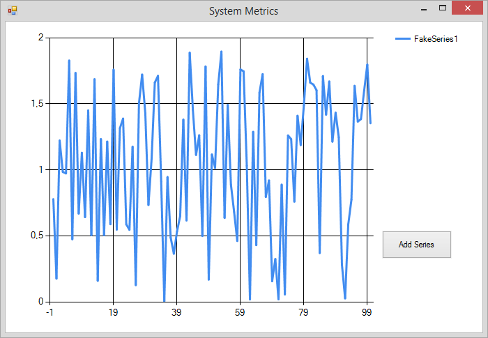

# Lesson 2.2: Using `ReceiveActor` for Smarter Message Handling

In this lesson we're going to introduce the concept of `ReceiveActor` ([docs](http://api.getakka.net/docs/stable/html/B124B2AF.htm "Akka.NET - ReceiveActor")).
This concept is mainly used in the **C#** API to deal more easily with sophisticated types of pattern matching and message handling in Akka.NET.
In F# however, the concept of `ReceiveActor` is not as important, pattern matching already being an inherent part of the language.

## Key Concepts / Background
### Pattern matching
Actors in Akka.NET depend heavily on the concept of pattern matching - being able to selectively handle messages based on their [.NET Type](https://msdn.microsoft.com/en-us/library/ms173104.aspx) and/or values.

In Unit 1, we learned how to use F#'s pattern matching to handle different types of messages within an actor:

```fsharp
let myActor (mailbox: Actor<_>) message =
    match message with
    | :? Foo as foo -> // do something with foo
    | :? Bar as bar -> // do something with bar
    | _ -> mailbox.Unhandled message // couldn't match this message
```

This method of pattern matching in Akka.NET works great for simple matches, but what if your matching needs were more complex?

Consider how you would handle these use cases with the `UntypedActor` we've seen so far:

1. Match `message` if it's a `string` and begins with "AkkaDotNet" or
2. Match `message` if it's of type `Foo` and `Foo.Count` is less than 4 and `Foo.Max` is greater than 10?

In C#, we would probably end up with something like this:

```csharp
protected override void OnReceive(object message)
{
    if(message is string && message.AsInstanceOf<string>().BeginsWith("AkkaDotNet"))
    {
        var str = message as string;
        // do some work with str...
    }
    else if(message is Foo &&
            message.AsInstanceOf<Foo>().Count < 4 &&
            message.AsInstanceOf<Foo>().Max > 10)
    {
        var foo = message as Foo;
        // do something with foo
    }
    // ... other matches ...
    else
    {
        // couldn't match this message
        Unhandled(message);
    }
}
```

#### *Yuck!* There *has* to be a better way of doing this, right?
Yes, there is! Enter the `ReceiveActor`.

### Introducing the `ReceiveActor`
The `ReceiveActor` was created specifically for the C# API of Akka.NET and is built on top of the `UntypedActor`.
It makes it easy to do sophisticated pattern matching and message handling.

You could implement a `ReceiveActor` in F# too if you wanted to, as shown below:

```fsharp
type Foo = { Count: int; Max: int }

type FooActor() as f =
    inherit ReceiveActor()
    do f.Receive<string>(
        (fun (str: string) -> str.StartsWith "AkkaDotNet"), // Message filter on String
        fun str -> printfn "Message processed: %s" str) // String handler

    do f.Receive<Foo>(
        (fun foo -> foo.Count < 4 && foo.Max > 10), // Message filter on Foo
        fun str -> printfn "Valid Foo: %A" str) // Foo handler
```

And here is a small test to make sure this works as expected:

```fsharp
let foo = system.ActorOf<FooActor> "foo"

foo <! "test" // Won't be handled
foo <! "AkkaDotNet test" // Will be handled, prints "Message processed: AkkaDotNet test"

foo <! { Count = 5; Max = 11 } // Won't be handled
foo <! { Count = 3; Max = 11 } // Will be handled, prints "Valid Foo: {Count = 3;  Max = 11;}"
```

As you can see, a `ReceiveActor` lets you easily add a layer of strongly typed, compile-time pattern matching to your actors via the **the `Receive<'T>` handler**.
You can easily match messages based on their type, and then use typed **predicates** to perform additional checks or validations and decide whether or not your actor can handle a specific message.

#### Are there different kinds of `Receive<'T>` handlers?
Yes, there are. Here are the different ways to use a `Receive<'T>` handler:

##### 1) `Receive(handler: Func<'T,bool>) : unit`
This executes the message handler only if the message is of type `'T`.

If the handler itself returns `true`, the next handlers registered for type `'T` won't be called. This allows to chain together several handlers for a same type.

For instance, the actor below:

```fsharp
type FooActor() as f =
    inherit ReceiveActor()

    do f.Receive<string>(fun str -> printfn "Will be called 1"; false)
    do f.Receive<string>(fun str -> printfn "Will be called 2"; true)
    do f.Receive<string>(fun str -> printfn "Won't be called!"; false)
```

will produce the following results:

```fsharp
foo <! "test"
// Will be called 1
// Will be called 2
```

##### 2) `Receive(?shouldHandle: Predicate<'T>, handler: Action<'T>) : unit`
This executes the message handler only if the message is of type `'T` **AND** the [predicate function](https://msdn.microsoft.com/en-us/library/bfcke1bz.aspx) returns true for this instance of `'T`.

This is also the overload that we've used in our first example above!

##### 3) `Receive(handler: Action<'T>, ?shouldHandle: Predicate<'T>) : unit`
Same as the previous, but with the parameters being in the opposite order.

##### 4) `Receive(messageType: Type, handler: Func<obj,bool>) : unit`
This is a concrete (no longer generic) version of the 1st overload above.

##### 5) `Receive(messageType: Type, ?shouldHandle: Predicate<obj>, handler: Action<obj>) : unit`
This is a concrete (no longer generic) version of the 2nd overload above.

##### 6) `Receive(messageType: Type, handler: Action<obj>, ?shouldHandle: Predicate<obj>) : unit`
This is a concrete (no longer generic) version of the 3rd overload above.

##### 7) `ReceiveAny(handler: Action<obj>) : unit`
This is a catch-all handler which accepts all `object` instances. This is usually used to handle any messages that aren't handled by a previous, more specific `Receive()` handler.

#### But wait, isn't there a more functional way of doing that in F#?!
There is indeed! As we mentioned at the beginning of this lesson, F# comes with powerful pattern matching out-of-the-box so you could re-write `FooActor` as follows instead:

```fsharp
let funcFooActor (mailbox: Actor<obj>) =
    let rec loop () = actor {
        let! message = mailbox.Receive ()

        match message with
        | :? String as str when str.StartsWith "AkkaDotNet" -> printfn "Message processed: %s" str
        | :? Foo as foo when foo.Count < 4 && foo.Max > 10 -> printfn "Valid Foo: %A" foo
        | _ -> mailbox.Unhandled message

        return! loop ()
    }
    loop ()
```

This looks much more like idiomatic F#! We can make good use of the `when` keyword to insert our predicate directly within the pattern matching expression.

But at the end of the day, the choice to use or not `ReceiveActor` is yours.

### The order in which you declare `Receive<'T>` handlers matters
What happens if we need to handle overlapping types of messages?

Consider the below messages: they start with the same substring, but assume they need to be handled differently.

1. `string` messages that begin with `AkkaDotNetSuccess`, AND
2. `string` messages that begin with `AkkaDotNet`?

What would happen if our `ReceiveActor` was written like this?

```fsharp
type FooActor() as f =
    inherit ReceiveActor()

    do f.Receive<string>(
        (fun (str: string) -> str.StartsWith "AkkaDotNet"), // Message filter on String
        fun str -> printfn "Message processed: %s" str)

    do f.Receive<string>(
        (fun (str: string) -> str.StartsWith "AkkaDotNetSuccess"), // 2nd Message filter on String
        fun str -> printfn "Success! Message processed: %s" str)
```

In this case is that the second handler associated with `str.StartsWith "AkkaDotNetSuccess"` will never be invoked. Why so?

***The order in which `Receive<'T>` handlers are declared matters!***

This is because **`ReceiveActor` will handle a message using the *first* matching handler, not the *best* matching handler** and it [evaluates its handlers for each message in the order in which they were declared](http://getakka.net/docs/ReceiveActor#handler-priority).

So, how to solve our problem above and make sure our "AkkaDotNetSuccess" handler is being triggered?

Simple: *we just need to make sure that the more specific handlers come first!*

```fsharp
type FooActor() as f =
    inherit ReceiveActor()
    
    do f.Receive<string>(
        (fun (str: string) -> str.StartsWith "AkkaDotNetSuccess"), // The most specific filter goes first 
        fun str -> printfn "Success! Message processed: %s" str)

    do f.Receive<string>(
        (fun (str: string) -> str.StartsWith "AkkaDotNet"), // The least specific filter goes last 
        fun str -> printfn "Message processed: %s" str)
```

### Where do I define message handlers in a `ReceiveActor`?
In **C#**, you would have to hook up `Receive` message handlers directly in the `ReceiveActor` constructor, or in a method called by that constructor.
in F# however, you can simply define handlers at the beginning of your actor function, using the `do` keyword, as shown above.

But enough said, it's time for practice already.

## Exercise
In this exercise we're going to add the ability to add multiple data series to our chart by a sending a new type of command to our `chartingActor`.

### Step 1 - Add an "Add Series" Button to the UI

The first thing we need to do is add a new button called "Add Series" to our form. Go to the `Form.fs` file and add the two new lines marked by the comments below:

```fsharp
[<AutoOpen>]
module Form =
    let sysChart = new Chart(Name = "sysChart", Text = "sysChart", Dock = DockStyle.Fill, Location = Point(0, 0), Size = Size(684, 446), TabIndex = 0)
    let form = new Form(Name = "Main", Visible = true, Text = "System Metrics", AutoScaleDimensions = SizeF(6.F, 13.F), AutoScaleMode = AutoScaleMode.Font, ClientSize = Size(684, 446))
    let chartArea1 = new ChartArea(Name = "ChartArea1")
    let legend1 = new Legend(Name = "Legend1")
    let series1 = new Series(Name = "Series1", ChartArea = "ChartArea1", Legend = "Legend1")

    // Add this line to create the 'Add Series' button
    let btnAddSeries = new Button(Name = "btnAddSeries", Text = "Add Series", Location = Point(540, 300), Size = Size(100, 40), TabIndex = 1, UseVisualStyleBackColor = true)

    sysChart.BeginInit ()
    form.SuspendLayout ()
    sysChart.ChartAreas.Add chartArea1
    sysChart.Legends.Add legend1
    sysChart.Series.Add series1

    // Add this line to add the 'Add Series' button to the form
    form.Controls.Add btnAddSeries
        
    form.Controls.Add sysChart
    sysChart.EndInit ()
    form.ResumeLayout false
```

You should end up with the following UI:



We also need to define a function to handle clicks on the button. Change the `load` function in `form.fs` to the following:

```fsharp
let load (myActorSystem:ActorSystem) =
    let chartActor = spawn myActorSystem "charting" (actorOf (Actors.chartingActor sysChart))
    let series = ChartDataHelper.randomSeries "FakeSeries1" None None
    chartActor <! InitializeChart(Map.ofList [(series.Name, series)])

    // The click handler for the 'Add Series' button
    btnAddSeries.Click.Add (fun _ -> ())

    form
```

The handler doesn't do anything yet! We will come back to it later in the lesson.

### Step 2 - Rename our `InitializeChart` type and add a new `AddSeries` case to it

Let's open `Actor.fs` and rename our `InitializeChart` discriminated union type to `ChartMessage`. Let's also add a new case to it, as shown below:

```fsharp
[<AutoOpen>]
module Messages =
    type ChartMessage =
        | InitializeChart of initialSeries: Map<string, Series>
        | AddSeries of series: Series // the new case added
```

### Step 3 - modify `chartingActor` so it handles the new `AddSeries` messages

Right now our `chartingActor` can't handle messages of type `AddSeries`. Let's fix that! 
We could do this the OO way and make the actor inherit from `ReceiveActor`, but as we are in F#, we'd rather stick with pattern matching.

As a reminder, `chartingActor` currently looks as follows: 

```fsharp
let chartingActor (chart: Chart) message =
    match message with
    | InitializeChart series ->
        chart.Series.Clear ()
        series |> Map.iter (fun k v ->
            v.Name <- k
            chart.Series.Add(v))
```

But we need to change it to this:

```fsharp

// Add this to the other open statements at the top of Actor.fs
open System

let chartingActor (chart: Chart) (mailbox: Actor<_>) =
    let rec charting (mapping: Map<string,Series>) = actor {
        let! message = mailbox.Receive ()

        match message with
        | InitializeChart series ->
            chart.Series.Clear ()
            series |> Map.iter (fun k v ->
                v.Name <- k
                chart.Series.Add v)
            return! charting series
        // The new AddSeries case is handled there!
        | AddSeries series when not <| String.IsNullOrEmpty series.Name && not <| (mapping |> Map.containsKey series.Name) ->
            let newMapping = mapping.Add (series.Name, series)
            chart.Series.Add series
            return! charting newMapping
    }
    charting Map.empty<string, Series>
```

#### *Wow!* That's a lot of changes!

But fear not, the logic is still pretty simple. We are now using our `actor` computation expression inside a recursive function called `charting` (remember, we did something similar in Unit 1 with our `tailActor`). The function takes a parameter called `mapping` that basically contains all the series currently displayed on the chart.

Every click on the `Add Series` button will cause a new series to be added to the `mapping`, provided the name of series is valid and that it does not exist in the collection yet:

```fsharp
// Check if the series can be added to the collection
| AddSeries series when not <| String.IsNullOrEmpty series.Name && not <| (mapping |> Map.containsKey series.Name)
```

As we changed the definition of the our `chartingActor`, we also need to update its instantiation in `form.fs`. Update the following line:

```fsharp
let chartActor = spawn myActorSystem "charting" (actorOf (Actors.chartingActor sysChart))
```

to this:

```fsharp
let chartActor = spawn myActorSystem "charting" (Actors.chartingActor sysChart)
```

And that's it, really! Now our `chartingActor` should be able to receive and process both types of messages easily.

### Step 4 - Implement the click handler for the `Add Series` button

We're almost there! Let's go back to the click handler we added for the button in Step 1.

In `form.fs`, add this code to the body of the click handler:

```fsharp
let load (myActorSystem:ActorSystem) =
    // other logic...

    // The click handler for the 'Add Series' button
    btnAddSeries.Click.Add (fun _ ->
        let newSeriesName = sprintf "FakeSeries %i" (sysChart.Series.Count + 1)
        let newSeries = ChartDataHelper.randomSeries newSeriesName None None
        chartActor <! AddSeries newSeries
    )

    form
```

And that should do it! We are just creating a new random series with a different name and sending it as a message to our `chartingActor` for every click on the button.

### Once you're done
Build and run `SystemCharting.sln` and you should see the following:


> NOTE: If you're following along using the eBook / .ePub, you won't see the animation. [Click here to see it](https://github.com/petabridge/akka-bootcamp/raw/master/src/Unit-2/lesson2/images/dothis-successful-run2.gif).

#### Beautiful, isn't it?

Compare your code to the code in the [/Completed/ folder](Completed/) to compare your final output to what the instructors produced.

## Great job!
Nice work, again. After having completed this lesson you should have a much better understanding on how to use pattern matching in Akka.NET:

- either by using a `ReceiveActor` (more fitted for C#, but also available in F# if you want to)
- or by using standard F# pattern matching

**Let's move onto [Lesson 3 - Using the `Scheduler` to Send Messages Later](../lesson3/README.md).**

## Any questions?

Come ask any questions you have, big or small, [in this ongoing Bootcamp chat with the Petabridge & Akka.NET teams](https://gitter.im/petabridge/akka-bootcamp).

### Problems with the code?
If there is a problem with the code running, or something else that needs to be fixed in this lesson, please [create an issue](https://github.com/petabridge/akka-bootcamp/issues) and we'll get right on it. This will benefit everyone going through Bootcamp.
