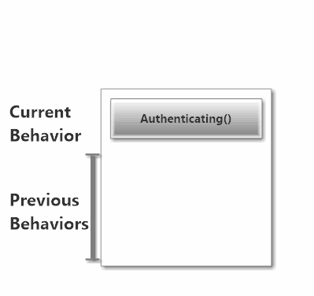

# Lesson 2.2: Switching Actor Behavior at Run-time with `Become` and `Unbecome`

In this lesson we're going to learn about one the really cool things actors can do - [change their behavior at run-time](http://getakka.net/wiki/Working%20with%20actors#hotswap "Akka.NET - Actor behavior hotswap")! Woah!

This capability allows you to do all sorts of cool stuff, like build [Finite State Machines](http://en.wikipedia.org/wiki/Finite-state_machine) or change how your actors handle messages based on other messages they've received!

## Key Concepts / background

Let's start with a real-world scenario for when you might want to change an actor's behavior...

### Real-World Scenario: Authentication

Imagine you're building a simple chat system using Akka.NET actors, and here's what your `UserActor` looks like - this is the actor that is responsible for all communication to and from a specific human user.

```csharp
public class UserActor : ReceiveActor{
	private readonly string _userId;
	private readonly string _chatRoomId;

	public UserActor(string userId, string chatRoomId){
		_userId = userId;
		_chatRoomId = chatRoomId;
		Receive<IncomingMessage>(inc => inc.ChatRoomId == _chatRoomId,
			inc => { 
				// print message for user
			});
		Receive<OutgoingMessage>(inc => inc.ChatRoomId == _chatRoomId,
			inc => { 
				// send message to chatroom				
			});
	}
}
```

So we have basic chat working - yay! But... There's nothing to guarantee that this user is who they say they are. 

How could we rewrite this actor to handle these same types of messages differently when:

* The user is **authenticating**;
* The user is **authenticated** (yay!); or
* The user **couldn't authenticate** (doh!) ?

Simple! We can use [switchable actor behaviors](http://getakka.net/wiki/Working%20with%20actors#hotswap "Akka.NET - switchable actor behavior") to do this!

### Switching Message-Handling Behaviors

Here's how we might implement switchable message behavior in our `UserActor` from the previous snippet:

```csharp
public class UserActor : ReceiveActor{
	private readonly string _userId;
	private readonly string _chatRoomId;

	public UserActor(string userId, string chatRoomId){
		_userId = userId;
		_chatRoomId = chatRoomId;
		
		//start with the Authenticating behavior
		Authenticating();
	}

	protected override void PreStart(){
		//start the authentication process for this user
		Context.ActorSelection("/user/authenticator/")
			.Tell(new AuthenticatePlease(_userId));
	}

	private void Authenticating(){
		Receive<AuthenticationSuccess>(auth => {
			Become(Authenticated); //switch behavior to Authenticated
		});
		Receive<AuthenticationFailure>(auth => {
			Become(Unauthenticated); //switch behavior to Unauthenticated
		});
		Receive<IncomingMessage>(inc => inc.ChatRoomId == _chatRoomId,
			inc => { 
				// can't accept message yet - not auth'd
			});
		Receive<OutgoingMessage>(inc => inc.ChatRoomId == _chatRoomId,
			inc => { 
				// can't send message yet - not auth'd			
			});
	}

	private void Unauthenticated(){
		//switch to Authenticating
		Receive<RetryAuthentication>(retry => Become(Authenticating));
		Receive<IncomingMessage>(inc => inc.ChatRoomId == _chatRoomId,
			inc => { 
				// have to reject message - auth failed
			});
		Receive<OutgoingMessage>(inc => inc.ChatRoomId == _chatRoomId,
			inc => { 
				// have to reject message - auth failed	
			});
	}

	private void Authenticated(){
		Receive<IncomingMessage>(inc => inc.ChatRoomId == _chatRoomId,
			inc => { 
				// print message for user
			});
		Receive<OutgoingMessage>(inc => inc.ChatRoomId == _chatRoomId,
			inc => { 
				// send message to chatroom				
			});
	}
}
```

Woah! What's all this stuff? We took the `Receive<T>` handlers we defined on our receive Actor and put them into three separate methods:

* `Authenticating()` - the default behavior we use for when the user is attempting to authenticate;
* `Authenticated()` - when the authentication operation is successful; and
* `Unauthenticated()` - when the authentication operation is **not** successful.

We called `Authenticating()` from the constructor, which meant that all of `UserActor`'s  `Receive<T>` handlers would be only defined by what's in the `Authenticating()` method.

However, whenever we receive a message of type `AuthenticationSuccess` or `AuthenticationFailure` we  use the `Become` method ([docs](http://getakka.net/wiki/ReceiveActor#become "Akka.NET - ReceiveActor Become")) to switch behaviors to `Authenicated` or `Unauthenticated` respectively. 

What's going on there?

### The Behavior Stack

Akka.NET actors have the concept of a "behavior stack":


Whichever method sits at the top of the behavior stack defines the actor's current behavior. 

> The current behavior of an actor dictates which `Receive` methods will be used to process any messages delivered to an actor.

Whenever we call `Become`, we tell the `ReceiveActor` to push a new behavior onto the stack:



And whenever we call `Unbecome`, we pop our current behavior off of the stack and replace it with the previous behavior from before:


> NOTE: By default, `Become` will delete the old behavior off of the stack - so the stack will never have more than one behavior in it at a time. This is because most Akka.NET users don't use `Unbecome`.
> 
> To preserve the previous behavior on the stack, call `Become(Method(), false)`

We can safely switch actor message-processing behavior because [Akka.NET actors only process one message at a time](http://petabridge.com/blog/akkadotnet-async-actors-using-pipeto/). So the new message processing behavior doesn't get applied until the next message arrives.

How deep can the behavior stack go? *Really* deep, but not to an unlimited extent. And each time your actor restarts the behavior stack is cleared and you start from scratch.

And what happens if you call `Unbecome` and there's nothing left in the behavior stack? The answer is: *nothing* - `Unbecome` is a safe method and won't do anything unless there's more than one behavior in the stack.

### Switchable Behaviors Also Work for `UntypedActor`

`Become` looks slightly different for `UntypedActor` instances:

```csharp
public class MyActor : UntypedActor{
	protected override void OnReceive(object message){
		if(message is SwitchMe){
			//preserve the previous behavior on the stack
			Context.Become(OtherBehavior, false);
		}
	}

	private void OtherBehavior(object message){
		if(message is SwitchMeBack){
			//switch back to previous behavior on the stack
			Context.Unbecome();
		}
	}
}
```

To switch behaviors in an `UntypedActor`, you have to use the following methods:

* `Context.Become(Receive rec, bool discardPrevious = true)` - pushes a new behavior on the stack or
* `Context.Unbecome()` - pops the current behavior and switches to the previous (if applicable.)

`Context.Become` takes a `Receive` delegate, which is really any method with the following signature:

```csharp
void MethodName(object someParameterName);
```

Aside from those syntactical differences, behavior switching works exactly the same way across both `UntypedActor` and `ReceiveActor`.

Now let's put behavior switching to work for us!

## Exercise

### Once you're done
Compare your code to the code in the /Completed/ folder to see what the instructors included in their samples.

## Great job!
Ready for more? Let's move onto the next lesson.
