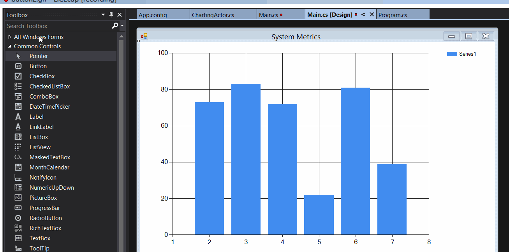
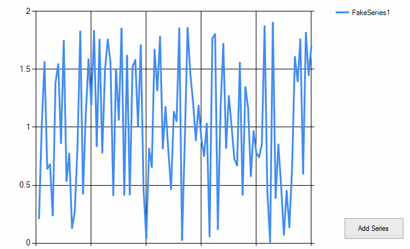

# Lesson 2.2: Using `ReceiveActor` for Smarter Message Handling

In the first unit, you learned how to use the `UntypedActor` ([docs](http://api.getakka.net/docs/stable/html/6300028C.htm "Akka.NET - UntypedActor")) to build your first actors and handle some simple message types.

In this lesson we're going to show you how to use the `ReceiveActor` ([docs](http://api.getakka.net/docs/stable/html/B124B2AF.htm "Akka.NET - ReceiveActor")) to easily handle more sophisticated types of pattern matching and message handling in Akka.NET.

## Key Concepts / Background
### Pattern matching
Actors in Akka.NET depend heavily on the concept of pattern matching - being able to selectively handle messages based on their [.NET Type](https://msdn.microsoft.com/en-us/library/ms173104.aspx) and/or values.

In the first module, you learned how to use the `UntypedActor` to handle and receive messages using blocks of code that looked a lot like this:

```csharp
protected override void OnReceive(object message){
	if(message is Foo) {
		var foo = message as Foo;
		// do something with foo
	}
	else if(message is Bar) {
		var bar = message as Bar;
		// do something with bar
	}
	//.... other matches
	else {
		// couldn't match this message
		Unhandled(message);
	}
}
```

This method of pattern matching in Akka.NET works great for simple matches, but what if your matching needs were more complex?

Consider how you would handle these use cases with the `UntypedActor` we've seen so far:

1. Match `message` if it's a `string` and begins with "AkkaDotNet" or
2. Match `message` if it's of type `Foo` and `Foo.Count` is less than 4 and `Foo.Max` is greater than 10?

Hmm... if we tried to do all of that inside an `UntypedActor` we'd end up with something like this:

```csharp
protected override void OnReceive(object message) {
	if(message is string
		&& message.AsInstanceOf<string>()
			.BeginsWith("AkkaDotNet")){
		var str = message as string;
		// do some work with str...
	}
	else if(message is Foo
			&& message.AsInstanceOf<Foo>().Count < 4
			&& message.AsInstanceOf<Foo>().Max > 10){
		var foo = message as Foo;
		// do something with foo
	}
	// ... other matches ...
	else {
		// couldn't match this message
		Unhandled(message);
	}
}
```

#### *Yuck!* There *has* to be a better way of doing this, right?
Yes, there is! Enter the `ReceiveActor`.

### Introducing the `ReceiveActor`
The `ReceiveActor` is built on top of the `UntypedActor` and makes it easy to do sophisticated pattern matching and message handling.

Here's what that ugly code sample from a few moments ago would look like, rewritten with a `ReceiveActor`:

```csharp
public class FooActor : ReceiveActor
{
    public FooActor()
    {
        Receive<string>(s => s.StartsWith("AkkaDotNet"), s =>
        {
            // handle string
        });

        Receive<Foo>(foo => foo.Count < 4 && foo.Max > 10, foo =>
        {
            // handle foo
        });
    }
}
```

#### *Much better*.

So, what's the secret sauce that helped us simplify and clean up all of that pattern matching code from earlier?

### The secret sauce of `ReceiveActor`
The secret sauce that cleans up all that pattern matching code is **the `Receive<T>` handler**.

```csharp
// this is what makes the ReceiveActor powerful!
Receive<T>(Predicate<T>, Action<T>);
```

A `ReceiveActor` lets you easily add a layer of strongly typed, compile-time pattern matching to your actors.

You can match messages easily based on type, and then use typed predicates to perform additional checks or validations when deciding whether or not your actor can handle a specific message.


#### Are there different kinds of `Receive<T>` handlers?
Yes, there are. Here are the different ways to use a `Receive<T>` handler:

##### 1) `Receive<T>(Action<T> handler)`
This executes the message handler only if the message is of type `T`.

##### 2) `Receive<T>(Predicate<T> pred, Action<T> handler)`
This executes the message handler only if the message is of type `T` **AND** the [predicate function](https://msdn.microsoft.com/en-us/library/bfcke1bz.aspx) returns true for this instance of `T`.

##### 3) `Receive<T>(Action<T> handler, Predicate<T> pred)`
Same as the previous.

##### 4) `Receive(Type type, Action<object> handler)`
This is a concrete version of the typed + predicate message handlers from before (no longer generic).

##### 5) `Receive(Type type, Action<object> handler, Predicate<object> pred)`
Same as the previous.

##### 6) `ReceiveAny()`
This is a catch-all handler which accepts all `object` instances. This is usually used to handle any messages that aren't handled by a previous, more specific `Receive()` handler.

### The order in which you declare `Receive<T>` handlers matters
What happens if we need to handle overlapping types of messages?

Consider the below messages: they start with the same substring, but assume they need to be handled differently.

1. `string` messages that begin with `AkkaDotNetSuccess`, AND
2. `string` messages that begin with `AkkaDotNet`?

What would happen if our `ReceiveActor` was written like this?

```csharp
public class StringActor : ReceiveActor
{
    public StringActor()
    {
        Receive<string>(s => s.StartsWith("AkkaDotNet"), s =>
        {
            // handle string
        });

        Receive<string>(s => s.StartsWith("AkkaDotNetSuccess"), s =>
        {
            // handle string
        });
    }
}
```

What happens in this case is that the second handler (for `s.StartsWith("AkkaDotNetSuccess")`) is never invoked. Why not?

***The order of the `Receive<T>` handlers matters!***

This is because **`ReceiveActor` will handle a message using the *first* matching handler, not the *best* matching handler** and it [evaluates its handlers for each message in the order in which they were declared](https://getakka.net/articles/actors/receive-actor-api.html#handler-priority).

So, how do we solve the above problem, where our handler for strings starting with "AkkaDotNetSuccess" is never triggered?

Simple: *we fix this problem by making sure that the more specific handlers come first*.

```csharp
public class StringActor : ReceiveActor
{
    public StringActor()
    {
		// Now works as expected
        Receive<string>(s => s.StartsWith("AkkaDotNetSuccess"), s =>
        {
            // handle string
        });

        Receive<string>(s => s.StartsWith("AkkaDotNet"), s =>
        {
            // handle string
        });
    }
}
```

### Where do I define message handlers in a `ReceiveActor`?
`ReceiveActor`s do not have an `OnReceive()` method.

Instead, you must hook up `Receive` message handlers directly in the `ReceiveActor` constructor, or in a method called to by that constructor.

Knowing this, we can put `ReceiveActor` to work for us.

## Exercise
In this exercise we're going to add the ability to add multiple data series to our chart, and we're going to modify the `ChartingActor` to handle commands to do this.

### Step 1 - Add an "Add Series" Button to the UI

First thing we're going to do is add a new button called "Add Series" to our form. Go to the **[Design]** view of `Main.cs` and drag a `Button` onto the UI from the Toolbox. Here's where we put the button:



Double click on the button in the **[Design]** view and Visual Studio will automatically add a click handler for you inside `Main.cs`. That generated handler should look like this:

```csharp
// automatically added inside Main.cs if you double click on button in designer
private void button1_Click(object sender, EventArgs e)
{

}
```

**Leave this blank for now**. We'll wire this button to our `ChartingActor` shortly.

### Step 2 - Add an `AddSeries` Message Type to the `ChartingActor`

Let's define a new message class for putting additional `Series` on the `Chart` managed by the `ChartingActor`. We'll create the `AddSeries` message type to signify that we want to add a new `Series`.

Add the following code to `ChartingActor.cs` inside the `Messages` region:

```csharp
// Actors/ChartingActor.cs, inside the #Messages region

/// <summary>
/// Add a new <see cref="Series"/> to the chart
/// </summary>
public class AddSeries
{
    public AddSeries(Series series)
    {
        Series = series;
    }

    public Series Series { get; private set; }
}
```

### Step 3 - Have `ChartingActor` Inherit from `ReceiveActor`
Now for the meaty part - changing the `ChartingActor` from an `UntypedActor` to a `ReceiveActor`.

Now, let's change the declaration for `ChartingActor`. Change this:

```csharp
// Actors/ChartingActor.cs
public class ChartingActor : UntypedActor
```

to this:

```csharp
// Actors/ChartingActor.cs
public class ChartingActor : ReceiveActor
```

#### Remove the `OnReceive` method from `ChartingActor`
Don't forget to **delete the current `OnReceive` method for the `ChartingActor`**. Now that `ChartingActor` is a `ReceiveActor`, it doesn't need an `OnReceive()` method.

### Step 4 - Define `Receive<T>` Handlers for `ChartingActor`

Right now our `ChartingActor` can't handle any messages that are sent to it - so let's fix that by defining some `Receive<T>` handlers for the types of messages we want to accept.

First things first, add the following method to the `Individual Message Type Handlers` region of the `ChartingActor`:

```csharp
// Actors/ChartingActor.cs in the ChartingActor class
// (Individual Message Type Handlers region)

private void HandleAddSeries(AddSeries series)
{
    if(!string.IsNullOrEmpty(series.Series.Name) &&
    !_seriesIndex.ContainsKey(series.Series.Name))
    {
        _seriesIndex.Add(series.Series.Name, series.Series);
        _chart.Series.Add(series.Series);
    }
}
```

And now let's modify the constructor of the `ChartingActor` to set a `Receive<T>` hook for `InitializeChart` and `AddSeries`.

```csharp
// Actors/ChartingActor.cs in the ChartingActor constructor

public ChartingActor(Chart chart, Dictionary<string, Series> seriesIndex)
{
    _chart = chart;
    _seriesIndex = seriesIndex;

    Receive<InitializeChart>(ic => HandleInitialize(ic));
    Receive<AddSeries>(addSeries => HandleAddSeries(addSeries));
}
```


> **NOTE**: The other constructor for `ChartingActor`, `ChartingActor(Chart chart)` doesn't need to be modified, as it calls `ChartingActor(Chart chart, Dictionary<string, Series> seriesIndex)` anyway.

And with that, our `ChartingActor` should now be able to receive and process both types of messages easily.

### Step 5 - Have the Button Clicked Handler for "Add Series" Button Send `ChartingActor` an `AddSeries` Message

Let's go back to the click handler we added for the button in Step 1.

In `Main.cs`, add this code to the body of the click handler:

```csharp
// Main.cs - class Main
private void button1_Click(object sender, EventArgs e)
{
    var series = ChartDataHelper.RandomSeries("FakeSeries" +
        _seriesCounter.GetAndIncrement());
    _chartActor.Tell(new ChartingActor.AddSeries(series));
}
```

And that should do it!

### Once you're done
Build and run `SystemCharting.sln` and you should see the following:



> NOTE: If you're following along using the eBook / .ePub, you won't see the animation. [Click here to see it](https://github.com/petabridge/akka-bootcamp/raw/master/src/Unit-2/lesson2/images/dothis-successful-run2.gif).

Compare your code to the code in the [/Completed/ folder](Completed/) to compare your final output to what the instructors produced.

## Great job!
Nice work, again. After having completed this lesson you should have a much better understanding of pattern matching in Akka.NET and an appreciation for how `ReceiveActor` is different than `UntypedActor`.

**Let's move onto [Lesson 3 - Using the `Scheduler` to Send Recurring Messages](../lesson3/README.md).**

## Any questions?

Come ask any questions you have, big or small, [in this ongoing Bootcamp chat with the Petabridge & Akka.NET teams](https://gitter.im/petabridge/akka-bootcamp).

### Problems with the code?
If there is a problem with the code running, or something else that needs to be fixed in this lesson, please [create an issue](https://github.com/petabridge/akka-bootcamp/issues) and we'll get right on it. This will benefit everyone going through Bootcamp.
