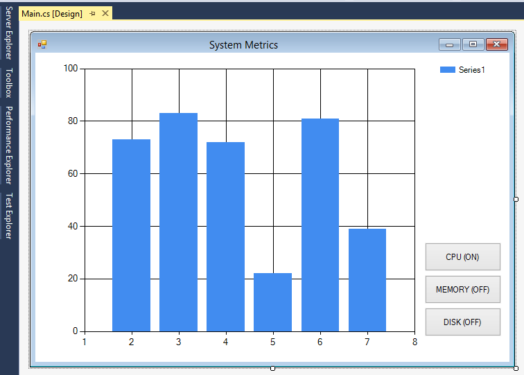
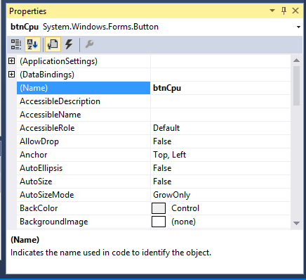
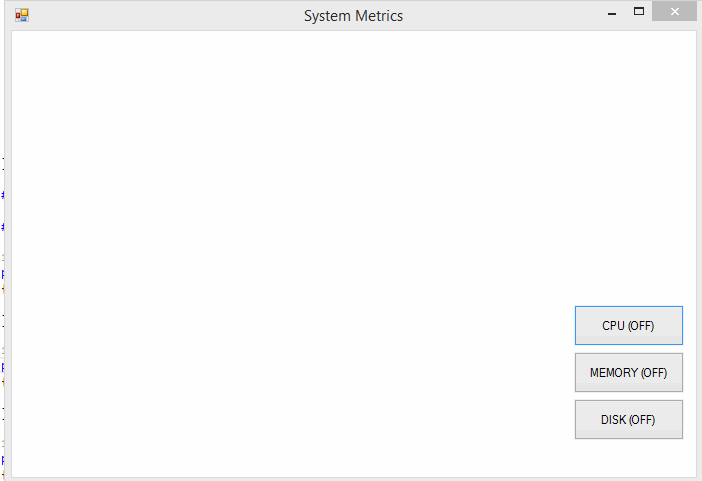
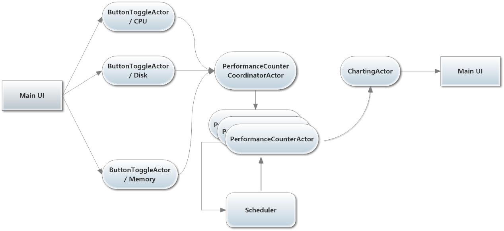

# Lesson 2.3: Using the `Scheduler` to Send Messages Later
Welcome to Lesson 2.3!

Where are we? At this point, we have our basic chart set up, along with our `ChartingActor`  which is supposed to be graphing system metrics. Except right now, `ChartingActor` isn't actually graphing anything! It's time to change that.

In this lesson, we'll be hooking up the various components of our system to make our Resource Monitor application actually chart system resource consumption! **This is a big lesson—it's the core of Unit 2—so get your coffee and get comfortable!**

To make our resource monitoring app work as intended, we need to wire up `ChartingActor` to the actual system [Performance Counters](https://msdn.microsoft.com/en-us/library/system.diagnostics.performancecounter.aspx "PerformanceCounter Class - C#") for the graph data. This needs to happen on an ongoing basis so that our chart regularly updates.

One of the most powerful capabilities Akka.NET exposes is the ability to schedule messages to be sent in the future, including regularly occurring messages. And it turns out, this is exactly the functionality we need to have `ChartingActor` regularly update our graphs.

In this lesson you'll learn two powerful Akka.NET concepts:

1. How to use the `Scheduler`, and
2. How to implement the [Publish-subscribe (pub-sub) pattern](http://en.wikipedia.org/wiki/Publish%E2%80%93subscribe_pattern) using actors. This is a powerful technique for creating reactive systems.

## Key Concepts / Background
How do you get an actor to do something in the future? And what if you want that actor to do something on a recurring basis in the future?

Perhaps you want an actor to periodically fetch information, or to occasionally ping another actor within the system for its status.

Akka.NET provides a mechanism for doing just this sort of thing. Meet your new best friend: the `Scheduler`.

### What is the `Scheduler`?
The `ActorSystem.Scheduler` ([docs](http://api.getakka.net/docs/stable/html/FB15E2E6.htm "Akka.NET Stable API Docs - IScheduler interface")) is a singleton within every `ActorSystem` that allows you to schedule messages to be sent to an actor in the future. The `Scheduler` can send both one-off and recurring messages.

### How do I use the `Scheduler`?
As we mentioned, you can schedule one-off or recurring messages to an actor.

You can also schedule an `Action` to occur in the future, instead of sending a message to an actor.

#### Access the `Scheduler` via the `ActorSystem`
`Scheduler` must be accessed through the `ActorSystem`, like so:

```csharp
// inside Main.cs we have direct handle to the ActorSystem
var system = ActorSystem.Create("MySystem");
system.Scheduler.ScheduleTellOnce(TimeSpan.FromMinutes(30),
				              someActor,
				              someMessage, ActorRefs.Nobody);

// but inside an actor, we access the ActorSystem via the ActorContext
Context.System.Scheduler.ScheduleTellOnce(TimeSpan.FromMinutes(30),
								             someActor,
								             someMessage, ActorRefs.Nobody);
```

#### Schedule one-off messages with `ScheduleTellOnce()`
Let's say we want to have one of our actors fetch the latest content from an RSS feed 30 minutes in the future. We can use [`IScheduler.ScheduleTellOnce()`](http://api.getakka.net/docs/stable/html/190E4EB.htm "Akka.NET Stable API Docs - IScheduler.ScheduleTellOnce method") to do that:

```csharp
var system = ActorSystem.Create("MySystem");
var someActor = system.ActorOf<SomeActor>("someActor");
var someMessage = new FetchFeed() {Url = ...};
// schedule the message
system
   .Scheduler
   .ScheduleTellOnce(TimeSpan.FromMinutes(30), // initial delay of 30 min
             someActor, someMessage, ActorRefs.Nobody);
```

Voila! `someActor` will receive `someMessage` in 30 minutes time.

#### Schedule recurring messages with `ScheduleTellRepeatedly()`
Now, **what if we want to schedule this message to be delivered once *every 30 minutes*?**

For this we can use the following [`IScheduler.ScheduleTellRepeatedly()`](http://api.getakka.net/docs/stable/html/A909C289.htm "Akka.NET Stable API Docs - IScheduler.ScheduleTellRepeatedly") overload.

```csharp
var system = ActorSystem.Create("MySystem");
var someActor = system.ActorOf<SomeActor>("someActor");
var someMessage = new FetchFeed() {Url = ...};
// schedule recurring message
system
   .Scheduler
   .ScheduleTellRepeatedly(TimeSpan.FromMinutes(30), // initial delay of 30 min
             TimeSpan.FromMinutes(30), // recur every 30 minutes
             someActor, someMessage, ActorRefs.Nobody);
```

That's it!

### How do I cancel a scheduled message?
What happens if we need to cancel a scheduled or recurring message? We use a [`ICancelable`](http://api.getakka.net/docs/stable/html/3FA8058E.htm "Akka.NET Stable API Docs - ICancelable interface"), which we can create using a [`Cancelable`](http://api.getakka.net/docs/stable/html/8869EC52.htm) instance.

First, the message must be scheduled so that it can be cancelled. If a message is cancelable, we then just have to call `Cancel()` on our handle to the `ICancelable` and it will not be delivered. For example:

```csharp
var system = ActorSystem.Create("MySystem");
var cancellation = new Cancelable(system.Scheduler);
var someActor = system.ActorOf<SomeActor>("someActor");
var someMessage = new FetchFeed() {Url = ...};

// first, set up the message so that it can be canceled
system
   .Scheduler
   .ScheduleTellRepeatedly(TimeSpan.FromMinutes(30), TimeSpan.FromMinutes(30)
                 someActor, someMessage, ActorRefs.Nobody,
  			     cancellation); // add cancellation support

// here we actually cancel the message and prevent it from being delivered
cancellation.Cancel();
```

####Alternative: get an `ICancelable` task using `ScheduleTellRepeatedlyCancelable`
One of the new `IScheduler` methods we introduced in Akka.NET v1.0 is the [`ScheduleTellRepeatedlyCancelable` extension method](http://api.getakka.net/docs/stable/html/9B66375D.htm "Akka.NET API Docs - SchedulerExtensions.ScheduleTellRepeatedlyCancelable extension method").This extension method inlines the process of creating an `ICancelable` instance for your recurring messages and simply returns an `ICancelable` for you.

```csharp
var system = ActorSystem.Create("MySystem");
var someActor = system.ActorOf<SomeActor>("someActor");
var someMessage = new FetchFeed() {Url = ...};

// cancellable recurring message send created automatically
var cancellation =  system
   .Scheduler
   .ScheduleTellRepeatedlyCancelable(TimeSpan.FromMinutes(30), 
                 TimeSpan.FromMinutes(30)
                 someActor, 
                 someMessage, 
                 ActorRefs.Nobody);

// here we actually cancel the message and prevent it from being delivered
cancellation.Cancel();
```
This is a more concise alternative to the previous example, and we recommend using it going forward even though we won't be using it in this bootcamp.

### How precise is the timing of scheduled messages?
***Scheduled messages are more than precise enough for all the use cases we've come across.***

That said, there are two situations of imprecision that we're aware of:

1. Scheduled messages are scheduled onto the CLR threadpool and use `Task.Delay` under the hood. If there is a high load on the CLR threadpool, the task might finish a little later than planned. There is no guarantee that the task will execute at EXACTLY the millisecond you expect.
2. If your scheduling requirements demand precision below 15 milliseconds then the `Scheduler` is not precise enough for you. Nor is any typical operating system such as Windows, OSX, or Linux. This is because ~15ms is the interval in which Windows and other general OSes update their system clock ("clock resolution"), so these OSs can't support any timing more precise than their own system clocks.

### What are the various overloads of `Schedule` and `ScheduleOnce`?
Here are all the overload options you have for scheduling a message.

#### Overloads of `ScheduleTellRepeatedly`
These are the various API calls you can make to schedule recurring messages.

[Refer to the `IScheduler` API documentation](http://api.getakka.net/docs/stable/html/FB15E2E6.htm "Akka.NET Stable API Documentation - IScheduler Interface").

#### Overloads of `ScheduleTellOnce`
These are the various API calls you can make to schedule one-off messages.

[Refer to the `IScheduler` API documentation](http://api.getakka.net/docs/stable/html/FB15E2E6.htm "Akka.NET Stable API Documentation - IScheduler Interface").

### How do I do Pub/Sub with Akka.NET Actors?
It's actually very simple. Many people expect this to be very complicated and are suspicious that there isn't more code involved. Rest assured, there's nothing magic about pub/sub with Akka.NET actors. It can literally be as simple as this:

```csharp
public class PubActor : ReceiveActor
{
  // HashSet automatically eliminates duplicates
  private HashSet<IActorRef> _subscribers;

  PubActor()
  {
    _subscribers = new HashSet<IActorRef>();

    Receive<Subscribe>(sub =>
    {
      _subscribers.Add(sub.IActorRef);
    });

    Receive<MessageSubscribersWant>(message =>
    {
      // notify each subscriber
      foreach (var sub in _subscribers)
      {
        sub.Tell(message);
      }
    });

    Receive<Unsubscribe>(unsub =>
    {
      _subscribers.Remove(unsub.IActorRef);
    });
  }
}
```

Pub/sub is trivial to implement in Akka.NET and it's a pattern you can feel comfortable using regularly when you have scenarios that align well with it.

Now that you're familiar with how the `Scheduler` works, lets put it to use and make our charting UI reactive!

## Exercise
**HEADS UP:** This section is where 90% of the work happens in all of Unit 2. We're going to add a few new actors who are responsible for setting up pub/sub relationships with the `ChartingActor` in order to graph `PerformanceCounter` data at regular intervals.

### Step 1 - Delete the "Add Series" Button and Click Handler from Lesson 2

We're not going to need it. **Delete the "Add Series" button** from the **[Design]** view of `Main.cs` and remove the click handler:

```csharp
// Main.cs - Main
// DELETE THIS:
private void button1_Click(object sender, EventArgs e)
{
    var series = ChartDataHelper.RandomSeries("FakeSeries" +
        _seriesCounter.GetAndIncrement());
    _chartActor.Tell(new ChartingActor.AddSeries(series));
}
```

### Step 2 - Add 3 New Buttons to `Main.cs`

We're going to add three new buttons and click handlers for each:

* **CPU (ON)**
* **MEMORY (OFF)**
* **DISK (OFF)**

Your **[Design]** view in Visual Studio for `Main.cs` should look like this:



Make sure that you given a descriptive name to each of these buttons, because we're going to need to refer to them later. You can set a descriptive name for each using the **Properties** window in Visual Studio:



Here are the names we'll be using for each button when we refer to them later:

* **CPU (ON)** - `btnCpu`
* **MEMORY (OFF)** - `btnMemory`
* **DISK (OFF)** - `btnDisk`

Once you've renamed your buttons, *add click handlers for each button by double-clicking on the button* in the **[Design]** view.

```csharp
// Main.cs - Main
private void btnCpu_Click(object sender, EventArgs e)
{

}

private void btnMemory_Click(object sender, EventArgs e)
{

}

private void btnDisk_Click(object sender, EventArgs e)
{

}
```

We'll fill these handlers in later.

### Step 3 - Add Some New Message Types
We're going to add a few new actors to our project in a moment, but before we do that let's create a new file inside the `/Actors` folder in our project and define some new message types:

```csharp
// Actors/ChartingMessages.cs

using Akka.Actor;

namespace ChartApp.Actors
{
    #region Reporting

    /// <summary>
    /// Signal used to indicate that it's time to sample all counters
    /// </summary>
    public class GatherMetrics { }

    /// <summary>
    /// Metric data at the time of sample
    /// </summary>
    public class Metric
    {
        public Metric(string series, float counterValue)
        {
            CounterValue = counterValue;
            Series = series;
        }

        public string Series { get; private set; }

        public float CounterValue { get; private set; }
    }

    #endregion

    #region Performance Counter Management

    /// <summary>
    /// All types of counters supported by this example
    /// </summary>
    public enum CounterType
    {
        Cpu,
        Memory,
        Disk
    }

    /// <summary>
    /// Enables a counter and begins publishing values to <see cref="Subscriber"/>.
    /// </summary>
    public class SubscribeCounter
    {
        public SubscribeCounter(CounterType counter, IActorRef subscriber)
        {
            Subscriber = subscriber;
            Counter = counter;
        }

        public CounterType Counter { get; private set; }

        public IActorRef Subscriber { get; private set; }
    }

    /// <summary>
    /// Unsubscribes <see cref="Subscriber"/> from receiving updates 
    /// for a given counter
    /// </summary>
    public class UnsubscribeCounter
    {
        public UnsubscribeCounter(CounterType counter, IActorRef subscriber)
        {
            Subscriber = subscriber;
            Counter = counter;
        }

        public CounterType Counter { get; private set; }

        public IActorRef Subscriber { get; private set; }
    }

    #endregion
}
```

Now we can start adding the actors who depend on these message definitions.

### Step 4 - Create the `PerformanceCounterActor`

The `PerformanceCounterActor` is the actor who's going to publish `PerformanceCounter` values to the `ChartingActor` using Pub/Sub and the `Scheduler`.

Create a new file in the `/Actors` folder called `PerformanceCounterActor.cs` and type the following:

```csharp
// Actors/PerformanceCounterActor.cs

using System;
using System.Collections.Generic;
using System.Diagnostics;
using System.Threading;
using Akka.Actor;

namespace ChartApp.Actors
{
    /// <summary>
    /// Actor responsible for monitoring a specific <see cref="PerformanceCounter"/>
    /// </summary>
    public class PerformanceCounterActor : UntypedActor
    {
        private readonly string _seriesName;
        private readonly Func<PerformanceCounter> _performanceCounterGenerator;
        private PerformanceCounter _counter;

        private readonly HashSet<IActorRef> _subscriptions;
        private readonly ICancelable _cancelPublishing;

        public PerformanceCounterActor(string seriesName,
            Func<PerformanceCounter> performanceCounterGenerator)
        {
            _seriesName = seriesName;
            _performanceCounterGenerator = performanceCounterGenerator;
            _subscriptions = new HashSet<IActorRef>();
            _cancelPublishing = new Cancelable(Context.System.Scheduler);
        }

        #region Actor lifecycle methods

        protected override void PreStart()
        {
            //create a new instance of the performance counter
            _counter = _performanceCounterGenerator();
            Context.System.Scheduler.ScheduleTellRepeatedly(
                TimeSpan.FromMilliseconds(250),
                TimeSpan.FromMilliseconds(250), 
                Self,
                new GatherMetrics(), 
                Self, 
                _cancelPublishing);
        }

        protected override void PostStop()
        {
            try
            {
                //terminate the scheduled task
                _cancelPublishing.Cancel(false);
                _counter.Dispose();
            }
            catch
            {
                //don't care about additional "ObjectDisposed" exceptions
            }
            finally
            {
                base.PostStop();
            }
        }

        #endregion

        protected override void OnReceive(object message)
        {
            if (message is GatherMetrics)
            {
                //publish latest counter value to all subscribers
                var metric = new Metric(_seriesName, _counter.NextValue());
                foreach(var sub in _subscriptions)
                    sub.Tell(metric);
            }
            else if (message is SubscribeCounter)
            {
                // add a subscription for this counter
                // (it's parent's job to filter by counter types)
                var sc = message as SubscribeCounter;
                _subscriptions.Add(sc.Subscriber);
            }
            else if (message is UnsubscribeCounter)
            {
                // remove a subscription from this counter
                var uc = message as UnsubscribeCounter;
                _subscriptions.Remove(uc.Subscriber);
            }
        }
    }
}

```

*Before we move onto the next step, let's talk about what you just did...*

#### Functional Programming for Reliability
Did you notice how, in the constructor of `PerformanceCounterActor`, we took a `Func<PerformanceCounter>` and NOT a `PerformanceCounter`? If you didn't, go back and look now. What gives?

This is a technique borrowed from functional programming. We use it whenever we have to inject an `IDisposable` object into the constructor of an actor. Why?

Well, we've got an actor that takes an `IDisposable` object as a parameter. So we're going to assume that this object will actually become `Disposed` at some point and will no longer be available.

What happens when the `PerformanceCounterActor` needs to restart?

**Every time the `PerformanceCounterActor` attempts to restart it will re-use its original constructor arguments, which includes reference types**. If we re-use the same reference to the now-`Disposed` `PerformanceCounter`, the actor will crash repeatedly. Until its parent decides to just kill it altogether.

A better technique is to pass a factory function that `PerformanceCounterActor` can use to get a fresh instance of its `PerformanceCounter`. That's why we use a `Func<PerformanceCounter>` in the constructor, which gets invoked during the actor's `PreStart()` lifecycle method.

```csharp
// create a new instance of the performance counter from factory that was passed in
_counter = _performanceCounterGenerator();
```

Because our `PerformanceCounter` is `IDisposable`, we also need to clean up the `PerformanceCounter` instance inside the `PostStop` lifecycle method of the actor.

We already know that we're going to get a fresh instance of that counter when the actor restarts, so we want to prevent resource leaks. This is how we do that:

```csharp
// Actors/PerformanceCounterActor.cs
// prevent resource leaks by disposing of our current PerformanceCounter
protected override void PostStop()
{
    try
    {
        // terminate the scheduled task
        _cancelPublishing.Cancel(false);
        _counter.Dispose();
    }
    catch
    {
        // we don't care about additional "ObjectDisposed" exceptions
    }
    finally
    {
        base.PostStop();
    }
}
```

#### Pub / Sub Made Easy
The `PerformanceCounterActor` has pub / sub built into it by way of its handlers for `SubscribeCounter` and `UnsubscribeCounter` messages inside its `OnReceive` method:

```csharp
// Actors/PerformanceCounterActor.cs
// ...
else if (message is SubscribeCounter)
{
    // add a subscription for this counter (it is up to the parent
    // to filter by counter types)
    var sc = message as SubscribeCounter;
    _subscriptions.Add(sc.Subscriber);
}
else if (message is UnsubscribeCounter)
{
    // remove a subscription from this counter
    var uc = message as UnsubscribeCounter;
    _subscriptions.Remove(uc.Subscriber);
}
```

In this lesson, `PerformanceCounterActor` only has one subscriber (`ChartingActor`, from inside `Main.cs`) but with a little re-architecting you could have these actors publishing their `PerformanceCounter` data to multiple recipients. Maybe that's a do-it-yourself exercise you can try later? ;)

#### How did we schedule publishing of `PerformanceCounter` data?
Inside the `PreStart` lifecycle method, we used the `Context` object to get access to the `Scheduler`, and then we had `PerformanceCounterActor` send itself a `GatherMetrics` method once every 250 milliseconds.

This causes `PerformanceCounterActor` to fetch data every 250ms and publish it to `ChartingActor`, giving us a live graph with a frame rate of 4 FPS.

```csharp
// Actors/PerformanceCounterActor.cs
protected override void PreStart()
{
    // create a new instance of the performance counter
    _counter = _performanceCounterGenerator();
    Context.System.Scheduler.ScheduleTellRepeatedly(TimeSpan.FromMilliseconds(250),
    TimeSpan.FromMilliseconds(250), Self,
        new GatherMetrics(), Self, _cancelPublishing);
}
```

Notice that inside the `PerformanceCounterActor`'s `PostStop` method, we invoke the `ICancelable` we created to cancel this recurring message:

```csharp
 // terminate the scheduled task
_cancelPublishing.Cancel();
```

We do this for the same reason we `Dispose` the `PerformanceCounter` - to eliminate resource leaks and to prevent the `IScheduler` from sending recurring messages to dead or restarted actors.

### Step 5 - Create the `PerformanceCounterCoordinatorActor`

The `PerformanceCounterCoordinatorActor` is the interface between the `ChartingActor` and all of the `PerformanceCounterActor` instances.

It has the following jobs:

* Lazily create all `PerformanceCounterActor` instances that are requested by the end-user;
* Provide the `PerformanceCounterActor` with a factory method (`Func<PerformanceCounter>`) for creating its counters;
* Manage all counter subscriptions for the `ChartingActor`; and
* Tell the `ChartingActor` how to render each of the individual counter metrics (which colors and plot types to use for each `Series` that corresponds with a `PerformanceCounter`.)

Sounds complicated, right? Well, you'll be surprised when you see how small the code footprint is!

Create a new file in the `/Actors` folder called `PerformanceCounterCoordinatorActor.cs` and type the following:

```csharp
// Actors/PerformanceCoordinatorActor.cs

using System;
using System.Collections.Generic;
using System.Diagnostics;
using System.Drawing;
using System.Windows.Forms.DataVisualization.Charting;
using Akka.Actor;

namespace ChartApp.Actors
{
    /// <summary>
    /// Actor responsible for translating UI calls into ActorSystem messages
    /// </summary>
    public class PerformanceCounterCoordinatorActor : ReceiveActor
    {
        #region Message types

        /// <summary>
        /// Subscribe the <see cref="ChartingActor"/> to 
        /// updates for <see cref="Counter"/>.
        /// </summary>
        public class Watch
        {
            public Watch(CounterType counter)
            {
                Counter = counter;
            }

            public CounterType Counter { get; private set; }
        }

        /// <summary>
        /// Unsubscribe the <see cref="ChartingActor"/> to 
        /// updates for <see cref="Counter"/>
        /// </summary>
        public class Unwatch
        {
            public Unwatch(CounterType counter)
            {
                Counter = counter;
            }

            public CounterType Counter { get; private set; }
        }

        #endregion

        /// <summary>
        /// Methods for generating new instances of all <see cref="PerformanceCounter"/>s
        /// we want to monitor
        /// </summary>
        private static readonly Dictionary<CounterType, Func<PerformanceCounter>>
            CounterGenerators = new Dictionary<CounterType, Func<PerformanceCounter>>()
        {
            {CounterType.Cpu, () => new PerformanceCounter("Processor", 
                "% Processor Time", "_Total", true)},
            {CounterType.Memory, () => new PerformanceCounter("Memory", 
                "% Committed Bytes In Use", true)},
            {CounterType.Disk, () => new PerformanceCounter("LogicalDisk",
                "% Disk Time", "_Total", true)},
        };

        /// <summary>
        /// Methods for creating new <see cref="Series"/> with distinct colors and names
		/// corresponding to each <see cref="PerformanceCounter"/>
        /// </summary>
        private static readonly Dictionary<CounterType, Func<Series>> CounterSeries =
			new Dictionary<CounterType, Func<Series>>()
        {
            {CounterType.Cpu, () =>
			new Series(CounterType.Cpu.ToString()){ 
                 ChartType = SeriesChartType.SplineArea,
                 Color = Color.DarkGreen}},
            {CounterType.Memory, () =>
			new Series(CounterType.Memory.ToString()){ 
                ChartType = SeriesChartType.FastLine,
                Color = Color.MediumBlue}},
            {CounterType.Disk, () =>
			new Series(CounterType.Disk.ToString()){ 
                ChartType = SeriesChartType.SplineArea,
                Color = Color.DarkRed}},
        };

        private Dictionary<CounterType, IActorRef> _counterActors;

        private IActorRef _chartingActor;

        public PerformanceCounterCoordinatorActor(IActorRef chartingActor) :
			this(chartingActor, new Dictionary<CounterType, IActorRef>())
        {
        }

        public PerformanceCounterCoordinatorActor(IActorRef chartingActor,
            Dictionary<CounterType, IActorRef> counterActors)
        {
            _chartingActor = chartingActor;
            _counterActors = counterActors;

            Receive<Watch>(watch =>
            {
                if (!_counterActors.ContainsKey(watch.Counter))
                {
                    // create a child actor to monitor this counter if
                    // one doesn't exist already
                    var counterActor = Context.ActorOf(Props.Create(() =>
						new PerformanceCounterActor(watch.Counter.ToString(),
                                CounterGenerators[watch.Counter])));

                    // add this counter actor to our index
                    _counterActors[watch.Counter] = counterActor;
                }

                // register this series with the ChartingActor
                _chartingActor.Tell(new ChartingActor.AddSeries(
                    CounterSeries[watch.Counter]()));

                // tell the counter actor to begin publishing its
                // statistics to the _chartingActor
                _counterActors[watch.Counter].Tell(new SubscribeCounter(watch.Counter,
                    _chartingActor));
            });

            Receive<Unwatch>(unwatch =>
            {
                if (!_counterActors.ContainsKey(unwatch.Counter))
                {
                    return; // noop
                }

                // unsubscribe the ChartingActor from receiving any more updates
                _counterActors[unwatch.Counter].Tell(new UnsubscribeCounter(
                    unwatch.Counter, _chartingActor));

                // remove this series from the ChartingActor
                _chartingActor.Tell(new ChartingActor.RemoveSeries(
                    unwatch.Counter.ToString()));
            });
        }


    }
}
```
Okay, we're almost there. Just one more actor to go!

### Step 6 - Create the `ButtonToggleActor`
You didn't think we were going to let you just fire off those buttons you created in Step 2 without adding some actors to manage them, did you? ;)

In this step, we're going to add a new type of actor that will run on the UI thread just like the `ChartingActor`.

The job of the `ButtonToggleActor` is to turn click events on the `Button` it manages into messages for the `PerformanceCounterCoordinatorActor`. The `ButtonToggleActor` also makes sure that the visual state of the `Button` accurately reflects the state of the subscription managed by the `PerformanceCounterCoordinatorActor` (e.g. ON/OFF).

Okay, create a new file in the `/Actors` folder called `ButtonToggleActor.cs` and type the following:

```csharp
// Actors/ButtonToggleActor.cs

using System.Windows.Forms;
using Akka.Actor;

namespace ChartApp.Actors
{
    /// <summary>
    /// Actor responsible for managing button toggles
    /// </summary>
    public class ButtonToggleActor : UntypedActor
    {
        #region Message types

        /// <summary>
        /// Toggles this button on or off and sends an appropriate messages
        /// to the <see cref="PerformanceCounterCoordinatorActor"/>
        /// </summary>
        public class Toggle { }

        #endregion

        private readonly CounterType _myCounterType;
        private bool _isToggledOn;
        private readonly Button _myButton;
        private readonly IActorRef _coordinatorActor;

        public ButtonToggleActor(IActorRef coordinatorActor, Button myButton,
				CounterType myCounterType, bool isToggledOn = false)
        {
            _coordinatorActor = coordinatorActor;
            _myButton = myButton;
            _isToggledOn = isToggledOn;
            _myCounterType = myCounterType;
        }

        protected override void OnReceive(object message)
        {
            if (message is Toggle && _isToggledOn)
            {
                // toggle is currently on

                // stop watching this counter
                _coordinatorActor.Tell(
                    new PerformanceCounterCoordinatorActor.Unwatch(_myCounterType));

                FlipToggle();
            }
            else if (message is Toggle && !_isToggledOn)
            {
                // toggle is currently off

                // start watching this counter
                _coordinatorActor.Tell(
                    new PerformanceCounterCoordinatorActor.Watch(_myCounterType));

                FlipToggle();
            }
            else
            {
                Unhandled(message);
            }
        }

        private void FlipToggle()
        {
            // flip the toggle
            _isToggledOn = !_isToggledOn;

            // change the text of the button
            _myButton.Text = string.Format("{0} ({1})",
                _myCounterType.ToString().ToUpperInvariant(),
                _isToggledOn ? "ON" : "OFF");
        }
    }
}
```

### Step 7 - Update the `ChartingActor`
Home stretch! We're almost there.

We need to integrate all of the new message types we defined in Step 3 into the `ChartingActor`. We also need to make some changes to the way we render the `Chart` since we're going to be making *live updates* to it continuously.

To start, add this code at the very top of the `ChartingActor` class:

```csharp
// Actors/ChartingActor.cs

/// <summary>
/// Maximum number of points we will allow in a series
/// </summary>
public const int MaxPoints = 250;

/// <summary>
/// Incrementing counter we use to plot along the X-axis
/// </summary>
private int xPosCounter = 0;
```

Next, add a new message type that the `ChartingActor` is going to use. Add this inside the `Messages` region of `Actors/ChartingActor.cs`:

```csharp
// Actors/ChartingActor.cs - inside the Messages region

/// <summary>
/// Remove an existing <see cref="Series"/> from the chart
/// </summary>
public class RemoveSeries
{
    public RemoveSeries(string seriesName)
    {
        SeriesName = seriesName;
    }

    public string SeriesName { get; private set; }
}
```

Add the following method to the bottom of the `ChartingActor` class (don't worry about the specifics, it's adding UI management code that isn't directly related to actors):

```csharp
// Actors/ChartingActor.cs

private void SetChartBoundaries()
{
    double maxAxisX, maxAxisY, minAxisX, minAxisY = 0.0d;
    var allPoints = _seriesIndex.Values.SelectMany(series => series.Points).ToList();
    var yValues = allPoints.SelectMany(point => point.YValues).ToList();
    maxAxisX = xPosCounter;
    minAxisX = xPosCounter - MaxPoints;
    maxAxisY = yValues.Count > 0 ? Math.Ceiling(yValues.Max()) : 1.0d;
    minAxisY = yValues.Count > 0 ? Math.Floor(yValues.Min()) : 0.0d;
    if (allPoints.Count > 2)
    {
        var area = _chart.ChartAreas[0];
        area.AxisX.Minimum = minAxisX;
        area.AxisX.Maximum = maxAxisX;
        area.AxisY.Minimum = minAxisY;
        area.AxisY.Maximum = maxAxisY;
    }
}
```

> **NOTE**: the `SetChartBoundaries()` method is used to make sure that the boundary area of our chart gets updated as we remove old points from the beginning of the chart as time elapses.

Next, we're going to redefine all of our message handlers to use the new `SetChartBoundaries()` method.

**Delete everything inside the previous `Individual Message Type Handlers` region**, and then **replace it with the following**:

```csharp
// Actors/ChartingActor.cs - inside the Individual Message Type Handlers region
private void HandleInitialize(InitializeChart ic)
{
    if (ic.InitialSeries != null)
    {
        // swap the two series out
        _seriesIndex = ic.InitialSeries;
    }

    // delete any existing series
    _chart.Series.Clear();

    // set the axes up
    var area = _chart.ChartAreas[0];
    area.AxisX.IntervalType = DateTimeIntervalType.Number;
    area.AxisY.IntervalType = DateTimeIntervalType.Number;

    SetChartBoundaries();

    // attempt to render the initial chart
    if (_seriesIndex.Any())
    {
        foreach (var series in _seriesIndex)
        {
            // force both the chart and the internal index to use the same names
            series.Value.Name = series.Key;
            _chart.Series.Add(series.Value);
        }
    }

    SetChartBoundaries();
}

private void HandleAddSeries(AddSeries series)
{
    if(!string.IsNullOrEmpty(series.Series.Name) &&
        !_seriesIndex.ContainsKey(series.Series.Name))
    {
        _seriesIndex.Add(series.Series.Name, series.Series);
        _chart.Series.Add(series.Series);
        SetChartBoundaries();
    }
}

private void HandleRemoveSeries(RemoveSeries series)
{
    if (!string.IsNullOrEmpty(series.SeriesName) &&
        _seriesIndex.ContainsKey(series.SeriesName))
    {
        var seriesToRemove = _seriesIndex[series.SeriesName];
        _seriesIndex.Remove(series.SeriesName);
        _chart.Series.Remove(seriesToRemove);
        SetChartBoundaries();
    }
}

private void HandleMetrics(Metric metric)
{
    if (!string.IsNullOrEmpty(metric.Series) && 
        _seriesIndex.ContainsKey(metric.Series))
    {
        var series = _seriesIndex[metric.Series];
        series.Points.AddXY(xPosCounter++, metric.CounterValue);
        while(series.Points.Count > MaxPoints) series.Points.RemoveAt(0);
        SetChartBoundaries();
    }
}
```

And finally, add these `Receive<T>` handlers to the constructor for `ChartingActor`:

```csharp
// Actors/ChartingActor.cs - add these below the original Receive<T>
// handlers in the ctor
Receive<RemoveSeries>(removeSeries => HandleRemoveSeries(removeSeries));
Receive<Metric>(metric => HandleMetrics(metric));
```

### Step 8 - Replace the `Main_Load` Handler in `Main.cs`
Now that we have real data we want to plot in real-time, we need to replace the original `Main_Load` event handler, which supplied fake data to our `ChartActor` with a real one that sets us up for live charting.

Add the following declarations to the top of the `Main` class inside `Main.cs`:

```csharp
// Main.cs - at top of Main class
private IActorRef _coordinatorActor;
private Dictionary<CounterType, IActorRef> _toggleActors = new Dictionary<CounterType,
    IActorRef>();
```

Then, replace the `Main_Load` event handler in the `Init` region so that it matches this:

```csharp
// Main.cs - replace Main_Load event handler in the Init region
private void Main_Load(object sender, EventArgs e)
{
    _chartActor = Program.ChartActors.ActorOf(Props.Create(() =>
        new ChartingActor(sysChart)), "charting");
    _chartActor.Tell(new ChartingActor.InitializeChart(null)); //no initial series

    _coordinatorActor = Program.ChartActors.ActorOf(Props.Create(() =>
			new PerformanceCounterCoordinatorActor(_chartActor)), "counters");

    // CPU button toggle actor
    _toggleActors[CounterType.Cpu] = Program.ChartActors.ActorOf(
        Props.Create(() => new ButtonToggleActor(_coordinatorActor, btnCpu, 
        CounterType.Cpu, false))
        .WithDispatcher("akka.actor.synchronized-dispatcher"));

    // MEMORY button toggle actor
    _toggleActors[CounterType.Memory] = Program.ChartActors.ActorOf(
       Props.Create(() => new ButtonToggleActor(_coordinatorActor, btnMemory,
        CounterType.Memory, false))
        .WithDispatcher("akka.actor.synchronized-dispatcher"));

    // DISK button toggle actor
    _toggleActors[CounterType.Disk] = Program.ChartActors.ActorOf(
       Props.Create(() => new ButtonToggleActor(_coordinatorActor, btnDisk,
       CounterType.Disk, false))
       .WithDispatcher("akka.actor.synchronized-dispatcher"));

    // Set the CPU toggle to ON so we start getting some data
    _toggleActors[CounterType.Cpu].Tell(new ButtonToggleActor.Toggle());
}
```

#### Wait a minute, what's this `WithDispatcher` nonsense?!
`Props` has a built-in fluent interface which allows you to configure your actor deployments programmatically, and in this instance we decided to use the `Props.WithDispatcher` method to guarantee that each of the `ButtonToggleActor` instances run on the UI thread.

As we saw in Lesson 2.1, you can also configure the `Dispatcher` for an actor via the HOCON config. So if an actor has a `Dispatcher` set in HOCON, *and* one declared programmatically via the `Props` fluent interface, which wins?

*In case of a conflict, `Config` wins and `Props` loses .* Any conflicting settings declared by the `Props` fluent interface will always be overriden by what was declared in configuration.

### Step 9 - Have Button Handlers Send `Toggle` Messages to Corresponding `ButtonToggleActor`
**THE LAST STEP.** We promise :) Thanks for hanging in there.

Finally, we need to wire up the button handlers we created in Step 3.

Wire up your button handlers in `Main.cs`. They should look like this:

```csharp
// Main.cs - wiring up the button handlers added in step 3
private void btnCpu_Click(object sender, EventArgs e)
{
    _toggleActors[CounterType.Cpu].Tell(new ButtonToggleActor.Toggle());
}

private void btnMemory_Click(object sender, EventArgs e)
{
    _toggleActors[CounterType.Memory].Tell(new ButtonToggleActor.Toggle());
}

private void btnDisk_Click(object sender, EventArgs e)
{
    _toggleActors[CounterType.Disk].Tell(new ButtonToggleActor.Toggle());
}
```

### Once you're done
Build and run `SystemCharting.sln` and you should see the following:


> NOTE: for those of you following along in the eBook, this is an animated GIF of the live charting function working. [Click here to see it](https://github.com/petabridge/akka-bootcamp/raw/master/src/Unit-2/lesson3/images/dothis-successful-run3.gif).

Compare your code to the code in the [/Completed/ folder](Completed/) to compare your final output to what the instructors produced.

## Great job!
*Wow*. That was *a lot* of code. Great job and thanks for sticking it out! We now have a fully functioning Resource Monitor app, implemented with actors.

Every other lesson builds on this one, so before continuing, please make sure your code matches the output of the [/Completed/ folder](Completed/).

At this point. you should understand how the `Scheduler` works and how you can use it alongside patterns like Pub-sub to make very reactive systems with actors that have a comparatively small code footprint.

Here is a high-level overview of our working system at this point:



**Let's move onto [Lesson 4 - Switching Actor Behavior at Run-time with `Become` and `Unbecome`](../lesson4/README.md).**

## Any questions?

Come ask any questions you have, big or small, [in this ongoing Bootcamp chat with the Petabridge & Akka.NET teams](https://gitter.im/petabridge/akka-bootcamp).

### Problems with the code?
If there is a problem with the code running, or something else that needs to be fixed in this lesson, please [create an issue](https://github.com/petabridge/akka-bootcamp/issues) and we'll get right on it. This will benefit everyone going through Bootcamp.
