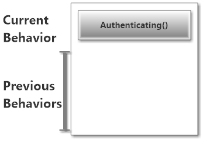
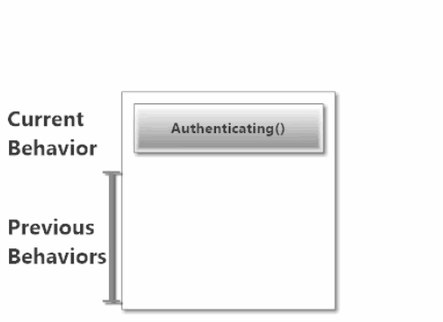
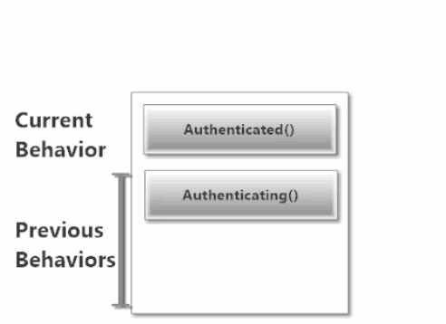
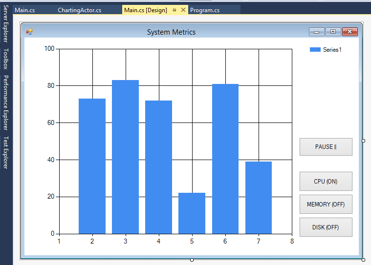
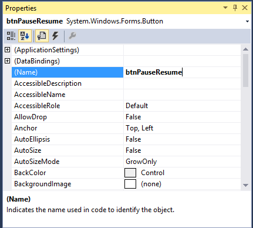
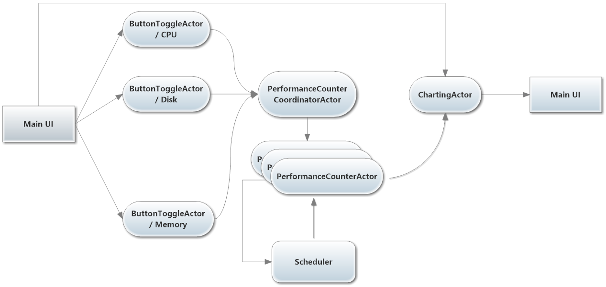

# Lesson 2.4: Switching Actor Behavior at Run-time with `BecomeStacked` and `UnbecomeStacked`

In this lesson we're going to learn about one of the really cool things actors can do: [change their behavior at run-time](https://getakka.net/articles/actors/receive-actor-api.html#becomeunbecome "Akka.NET - Actor behavior hotswap")!

## Key Concepts / Background
Let's start with a real-world scenario in which you'd want the ability to change an actor's behavior.

### Real-World Scenario: Authentication
Imagine you're building a simple chat system using Akka.NET actors, and here's what your `UserActor` looks like - this is the actor that is responsible for all communication to and from a specific human user.

```csharp
public class UserActor : ReceiveActor {
	private readonly string _userId;
	private readonly string _chatRoomId;

	public UserActor(string userId, string chatRoomId) {
		_userId = userId;
		_chatRoomId = chatRoomId;
		Receive<IncomingMessage>(inc => inc.ChatRoomId == _chatRoomId,
			inc => {
				// print message for user
			});
		Receive<OutgoingMessage>(inc => inc.ChatRoomId == _chatRoomId,
			inc => {
				// send message to chatroom
			});
	}
}
```

So we have basic chat working - yay! But&hellip; right now there's nothing to guarantee that this user is who they say they are. This system needs some authentication.

How could we rewrite this actor to handle these same types of chat messages differently when:

* The user is **authenticating**
* The user is **authenticated**, or
* The user **couldn't authenticate**?

Simple: we can use switchable actor behaviors to do this!

### What is switchable behavior?
One of the core attributes of an actor in the [Actor Model](https://en.wikipedia.org/wiki/Actor_model) is that an actor can change its behavior between messages that it processes.

This capability allows you to do all sorts of cool stuff, like build [Finite State Machines](http://en.wikipedia.org/wiki/Finite-state_machine) or change how your actors handle messages based on other messages they've received.

Switchable behavior is one of the most powerful and fundamental capabilities of any true actor system. It's one of the key features enabling actor reusability, and helping you to do a massive amount of work with a very small code footprint.

How does switchable behavior work?

#### The Behavior Stack
Akka.NET actors have the concept of a "behavior stack". Whichever method sits at the top of the behavior stack defines the actor's current behavior. Currently, that behavior is `Authenticating()`:



#### Use `Become` and `BecomeStacked` to adopt new behavior
Whenever we call [`BecomeStacked`](http://api.getakka.net/docs/stable/html/33B96712.htm "Akka.NET Stable API - BecomeStacked method"), we tell the `ReceiveActor` to push a new behavior onto the stack. This new behavior dictates which `Receive` methods will be used to process any messages delivered to an actor.

Here's what happens to the behavior stack when our example actor becomes `Authenticated` via `BecomeStacked`:



> NOTE: If you're following along using the eBook / .ePub, you won't see the animation. [Click here to see it](https://github.com/petabridge/akka-bootcamp/raw/master/src/Unit-2/lesson4/images/behaviorstack-become.gif).

> NOTE: [`Become`](http://api.getakka.net/docs/stable/html/1DBD4D33.htm "Akka.NET Stable API - Become method") will delete the old behavior off of the stack - so the stack will never have more than one behavior in it at a time.
>
> Use [`BecomeStacked`](http://api.getakka.net/docs/stable/html/33B96712.htm "Akka.NET Stable API Docs - BecomeStacked method") if you want to push behavior onto the stack, and [`UnbecomeStacked`](http://api.getakka.net/docs/stable/html/7D8311A9.htm "Akka.NET Stable API Docs - UnbecomeStacked method") if you want to revert to a previous behavior. Most users only ever need to use `Become`.


#### Use `UnbecomeStacked` to revert to old behavior
To make an actor revert to the previous behavior in the behavior stack, all we have to do is call `UnbecomeStacked`.

Whenever we call `UnbecomeStacked`, we pop our current behavior off of the stack and replace it with the previous behavior from before (again, this new behavior will dictate which `Receive` methods are used to handle incoming messages).

Here's what happens to the behavior stack when our example actor `UnbecomeStacked`s:


> NOTE: If you're following along using the eBook / .ePub, you won't see the animation. [Click here to see it](https://github.com/petabridge/akka-bootcamp/raw/master/src/Unit-2/lesson4/images/behaviorstack-unbecome.gif).


#### What is the API to change behaviors?
The API to change behaviors is very simple:

* `Become` - Replaces the current receive loop with the specified one. Eliminates the behavior stack.
* `BecomeStacked` - Adds the specified method to the top of the behavior stack, while maintaining the previous ones below it;
* `UnbecomeStacked` - Reverts to the previous receive method from the stack (only works with `BecomeStacked`).

The difference is that `BecomeStacked` preserves the old behavior, so you can just call `UnbecomeStacked` to go back to the previous behavior. The preference of one over the other depends on your needs. You can call `BecomeStacked` as many times as you need, and you can call `UnbecomeStacked` as many times as you called `BecomeStacked`. Additional calls to `UnbecomeStacked` won't do anything if the current behavior is the only behavior in the stack.


### Isn't it problematic for actors to change behaviors?
No, actually it's safe and is a feature that gives your `ActorSystem` a ton of flexibility and code reuse.

Here are some common questions about switchable behavior:

#### When is the new behavior applied?
We can safely switch actor message-processing behavior because [Akka.NET actors only process one message at a time](http://petabridge.com/blog/akkadotnet-async-actors-using-pipeto/). The new message processing behavior won't be applied until the next message arrives.

#### Isn't it bad that `Become` blows away the behavior stack?
No, not really. This is the way it's most commonly used, by far. Explicitly switching from one behavior to another is the most common approach used for switching behavior. Simple, explicit switches also make it much easier to read and reason about your code.

If you find you actually need to take advantage of the behavior stack—and a simple, explicit `Become(YourNewBehavior)` won't work for the situation—the behavior stack is available to you.

In this lesson, we use `BecomeStacked` and `UnbecomeStacked` to demonstrate them. Usually we just use `Become`.

#### How deep can the behavior stack go?
The stack can go *really* deep, but it's not unlimited.

Also, each time your actor restarts, the behavior stack is cleared and the actor starts from the initial behavior you've coded.

#### What happens if you call `UnbecomeStacked` and with nothing left in the behavior stack?
*Nothing* - `UnbecomeStacked` is a safe method and won't do anything if the current behavior is the only behavior in the stack.

### Back to the real-world example
Okay, now that you understand switchable behavior, let's return to our real-world scenario and see how it is used. Recall that we need to add authentication to our chat system actor.

So, how could we rewrite this actor to handle chat messages differently when:

* The user is **authenticating**
* The user is **authenticated**, or
* The user **couldn't authenticate**?

Here's one way we can implement switchable message behavior in our `UserActor` to handle basic authentication:

```csharp
public class UserActor : ReceiveActor {
	private readonly string _userId;
	private readonly string _chatRoomId;

	public UserActor(string userId, string chatRoomId) {
		_userId = userId;
		_chatRoomId = chatRoomId;

		// start with the Authenticating behavior
		Authenticating();
	}

	protected override void PreStart() {
		// start the authentication process for this user
		Context.ActorSelection("/user/authenticator/")
			.Tell(new AuthenticatePlease(_userId));
	}

	private void Authenticating() {
		Receive<AuthenticationSuccess>(auth => {
			Become(Authenticated); //switch behavior to Authenticated
		});
		Receive<AuthenticationFailure>(auth => {
			Become(Unauthenticated); //switch behavior to Unauthenticated
		});
		Receive<IncomingMessage>(inc => inc.ChatRoomId == _chatRoomId,
			inc => {
				// can't accept message yet - not auth'd
			});
		Receive<OutgoingMessage>(inc => inc.ChatRoomId == _chatRoomId,
			inc => {
				// can't send message yet - not auth'd
			});
	}

	private void Unauthenticated() {
		//switch to Authenticating
		Receive<RetryAuthentication>(retry => Become(Authenticating));
		Receive<IncomingMessage>(inc => inc.ChatRoomId == _chatRoomId,
			inc => {
				// have to reject message - auth failed
			});
		Receive<OutgoingMessage>(inc => inc.ChatRoomId == _chatRoomId,
			inc => {
				// have to reject message - auth failed
			});
	}

	private void Authenticated() {
		Receive<IncomingMessage>(inc => inc.ChatRoomId == _chatRoomId,
			inc => {
				// print message for user
			});
		Receive<OutgoingMessage>(inc => inc.ChatRoomId == _chatRoomId,
			inc => {
				// send message to chatroom
			});
	}
}
```

Whoa! What's all this stuff? Let's review it.

First, we took the `Receive<T>` handlers defined on our `ReceiveActor` and moved them into three separate methods. Each of these methods represents a state that will control how the actor processes messages:

* `Authenticating()`: this behavior is used to process messages when the user is attempting to authenticate (initial behavior).
* `Authenticated()`: this behavior is used to process messages when the authentication operation is successful; and,
* `Unauthenticated()`: this behavior is used to process messages when the authentication operation fails.

We called `Authenticating()` from the constructor, so our actor began in the `Authenticating()` state.

*This means that only the `Receive<T>` handlers defined in the `Authenticating()` method will be used to process messages (initially)*.

However, if we receive a message of type `AuthenticationSuccess` or `AuthenticationFailure`, we use the `Become` method ([docs](https://getakka.net/articles/actors/receive-actor-api.html#becomeunbecome "Akka.NET - ReceiveActor Become")) to switch behaviors to either `Authenticated` or `Unauthenticated`, respectively.

### Can I switch behaviors in an `UntypedActor`?
Yes, but the syntax is a little different inside an `UntypedActor`. To switch behaviors in an `UntypedActor`, you have to access `BecomeStacked` and `UnbecomeStacked` via the `ActorContext`, instead of calling them directly.

These are the API calls inside an `UntypedActor`:

* `Context.Become(Receive rec)` - changes behavior without preserving the previous behavior on the stack;
* `Context.BecomeStacked(Receive rec)` - pushes a new behavior on the stack or
* `Context.UnbecomeStacked()` - pops the current behavior and switches to the previous (if applicable.)

The first argument to `Context.Become` is a `Receive` delegate, which is really any method with the following signature:

```csharp
void MethodName(object someParameterName);
```

This delegate is just used to represent another method in the actor that receives a message and represents the new behavior state.

Here's an example (`OtherBehavior` is the `Receive` delegate):

```csharp
public class MyActor : UntypedActor {
	protected override void OnReceive(object message) {
		if(message is SwitchMe) {
			// preserve the previous behavior on the stack
			Context.BecomeStacked(OtherBehavior);
		}
	}

	// OtherBehavior is a Receive delegate
	private void OtherBehavior(object message) {
		if(message is SwitchMeBack) {
			// switch back to previous behavior on the stack
			Context.UnbecomeStacked();
		}
	}
}
```


Aside from those syntactical differences, behavior switching works exactly the same way across both `UntypedActor` and `ReceiveActor`.

Now, let's put behavior switching to work for us!

## Exercise
In this lesson we're going to add the ability to pause and resume live updates to the `ChartingActor` via switchable actor behaviors.

### Phase 1 - Add a New `Pause / Resume` Button to `Main.cs`
This is the last button you'll have to add, we promise.

Go to the **[Design]** view of `Main.cs` and add a new button with the following text: `PAUSE ||`



Got to the **Properties** window in Visual Studio and change the name of this button to `btnPauseResume`.



Double click on the `btnPauseResume` to add a click handler to `Main.cs`.

```csharp
private void btnPauseResume_Click(object sender, EventArgs e)
{

}
```

We'll fill this click handler in shortly.

### Phase 2 - Add Switchable Behavior to `ChartingActor`
We're going to add some dynamic behavior to the `ChartingActor` - but first we need to do a little cleanup.

First, add a `using` reference for the Windows Forms namespace at the top of `Actors/ChartingActor.cs`.

```csharp
// Actors/ChartingActor.cs

using System.Windows.Forms;
```

Next we need to declare a new message type inside the `Messages` region of `ChartingActor`.

```csharp
// Actors/ChartingActor.cs - add inside the Messages region
/// <summary>
/// Toggles the pausing between charts
/// </summary>
public class TogglePause { }
```

Next, add the following field declaration just above the `ChartingActor` constructor declarations:

```csharp
// Actors/ChartingActor.cs - just above ChartingActor's constructors

private readonly Button _pauseButton;
```

Move all of the `Receive<T>` declarations from `ChartingActor`'s main constructor into a new method called `Charting()`.

```csharp
// Actors/ChartingActor.cs - just after ChartingActor's constructors
private void Charting()
{
    Receive<InitializeChart>(ic => HandleInitialize(ic));
    Receive<AddSeries>(addSeries => HandleAddSeries(addSeries));
    Receive<RemoveSeries>(removeSeries => HandleRemoveSeries(removeSeries));
    Receive<Metric>(metric => HandleMetrics(metric));

	//new receive handler for the TogglePause message type
    Receive<TogglePause>(pause =>
    {
        SetPauseButtonText(true);
        BecomeStacked(Paused);
    });
}
```

Add a new method called `HandleMetricsPaused` to the `ChartingActor`'s `Individual Message Type Handlers` region.

```csharp
// Actors/ChartingActor.cs - inside Individual Message Type Handlers region
private void HandleMetricsPaused(Metric metric)
{
    if (!string.IsNullOrEmpty(metric.Series) 
        && _seriesIndex.ContainsKey(metric.Series))
    {
        var series = _seriesIndex[metric.Series];
        // set the Y value to zero when we're paused
        series.Points.AddXY(xPosCounter++, 0.0d);
        while (series.Points.Count > MaxPoints) series.Points.RemoveAt(0);
        SetChartBoundaries();
    }
}
```

Define a new method called `SetPauseButtonText` at the *very* bottom of the `ChartingActor` class:

```csharp
// Actors/ChartingActor.cs - add to the very bottom of the ChartingActor class
private void SetPauseButtonText(bool paused)
    {
        _pauseButton.Text = string.Format("{0}", !paused ? "PAUSE ||" : "RESUME ->");
    }
```

Add a new method called `Paused` just after the `Charting` method inside `ChartingActor`:

```csharp
// Actors/ChartingActor.cs - just after the Charting method
private void Paused()
{
    Receive<Metric>(metric => HandleMetricsPaused(metric));
    Receive<TogglePause>(pause =>
    {
        SetPauseButtonText(false);
        UnbecomeStacked();
    });
}
```

And finally, let's **replace both of `ChartingActor`'s constructors**:

```csharp
public ChartingActor(Chart chart, Button pauseButton) :
    this(chart, new Dictionary<string, Series>(), pauseButton)
{
}

public ChartingActor(Chart chart, Dictionary<string, Series> seriesIndex,
    Button pauseButton)
{
    _chart = chart;
    _seriesIndex = seriesIndex;
    _pauseButton = pauseButton;
    Charting();
}
```

### Phase 3 - Update the `Main_Load` and `Pause / Resume` Click Handler in Main.cs
Since we changed the constructor arguments for `ChartingActor` in Phase 2, we need to fix this inside our `Main_Load` event handler.

```csharp
// Main.cs - Main_Load event handler
_chartActor = Program.ChartActors.ActorOf(Props.Create(() => 
    new ChartingActor(sysChart, btnPauseResume)), "charting");
```

And finally, we need to update our `btnPauseResume` click event handler to have it tell the `ChartingActor` to pause or resume live updates:

```csharp
//Main.cs - btnPauseResume click handler
private void btnPauseResume_Click(object sender, EventArgs e)
{
    _chartActor.Tell(new ChartingActor.TogglePause());
}
```

### Once you're done
Build and run `SystemCharting.sln` and you should see the following:


> NOTE: If you're following along using the eBook / .ePub, you won't see the animation. [Click here to see it](https://github.com/petabridge/akka-bootcamp/raw/master/src/Unit-2/lesson4/images/dothis-successful-run4.gif).

Compare your code to the code in the [/Completed/ folder](Completed/) to compare your final output to what the instructors produced.

## Great job!
YEAAAAAAAAAAAAAH! We have a live updating chart that we can pause over time!

Here is a high-level overview of our working system at this point:



***But wait a minute!***

What happens if I toggle a chart on or off when the `ChartingActor` is in a paused state?


> NOTE: If you're following along using the eBook / .ePub, you won't see the animation. [Click here to see it](https://github.com/petabridge/akka-bootcamp/raw/master/src/Unit-2/lesson4/images/dothis-fail4.gif).

### DOH!!!!!! It doesn't work!

*This is exactly the problem we're going to solve in the next lesson*, using a message `Stash` to defer processing of messages until we're ready.

**Let's move onto [Lesson 5 - Using `Stash` to Defer Processing of Messages](../lesson5/README.md).**

## Any questions?

Come ask any questions you have, big or small, [in this ongoing Bootcamp chat with the Petabridge & Akka.NET teams](https://gitter.im/petabridge/akka-bootcamp).

### Problems with the code?
If there is a problem with the code running, or something else that needs to be fixed in this lesson, please [create an issue](https://github.com/petabridge/akka-bootcamp/issues) and we'll get right on it. This will benefit everyone going through Bootcamp.
