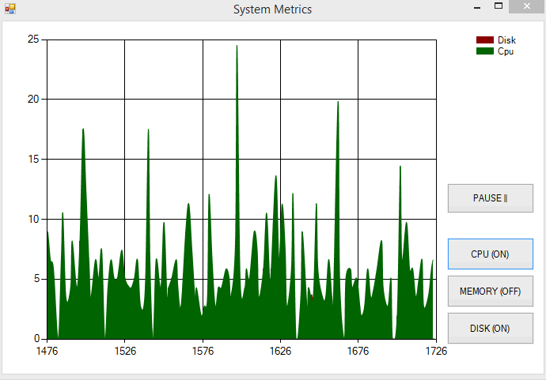
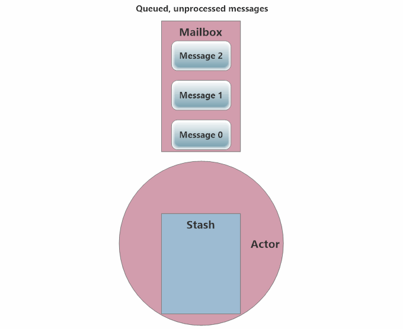
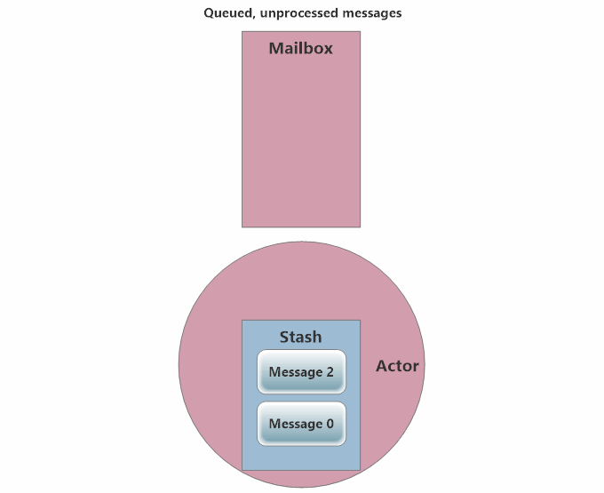
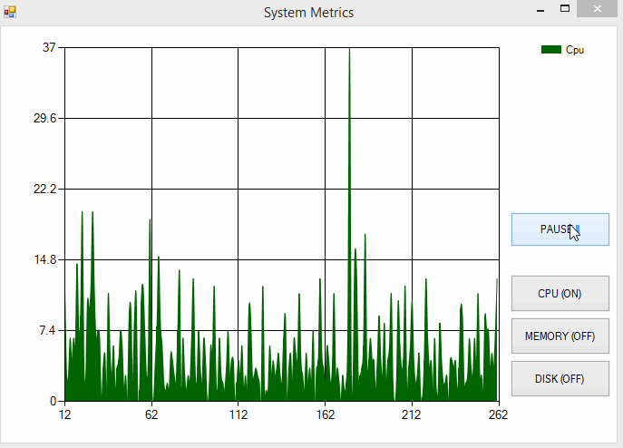

# Lesson 2.5: Using `Stash` to Defer Processing of Messages

At the end of [Lesson 4](../lesson4/README.md) we discovered a significant bug in how we implemented the **Pause / Resume** functionality on live charts, as you can see below:


> NOTE: If you're following along using the eBook / .ePub, you won't see the animation. [Click here to see it](https://github.com/petabridge/akka-bootcamp/raw/master/src/Unit-2/lesson4/images/dothis-fail4.gif).

The bug is that when our `ChartingActor` changes its behavior to `Paused`, it no longer processes the `AddSeries` and `RemoveSeries` messages generated whenever a toggle button is pressed for a particular performance counter.

In it's current form, it doesn't take much for the visual state of the buttons to get completely out of sync with the live chart. All you have to do is press a toggle button when the graph is paused and it's immediately out of sync.

So, how can we fix this?

The answer is to defer processing of `AddSeries` and `RemoveSeries` messages until the `ChartingActor` is back in its `Charting` behavior, at which time it can actually do something with those messages.

The mechanism for this is the [`Stash`](https://getakka.net/articles/actors/receive-actor-api.html#stash).

## Key Concepts / Background
One of the side effects of switchable behavior for actors is that some behaviors may not be able to process specific types of messages. For instance, let's consider the authentication example we used for behavior-switching in [Lesson 4](../lesson4/README.md).

### What is the `Stash`?
The `Stash` is a stack-like data structure implemented in your actor to defer messages for later processing.

### How to add a `Stash` to your actor
To add a `Stash` to an actor, all we need to do is decorate it with the [`IWithBoundedStash`](http://api.getakka.net/docs/stable/html/683AD26A.htm "Akka.NET Stable API Docs - IWithBoundedStash interface") or [`IWithUnboundedStash`](http://api.getakka.net/docs/stable/html/BB4565A9.htm "Akka.NET Stable API Docs - IWithUnboundedStash interface") interface, like so:

```csharp
public class UserActor : ReceiveActor, IWithUnboundedStash {
	private readonly string _userId;
	private readonly string _chatRoomId;

	// added along with the IWithUnboundedStash interface
	public IStash Stash {get;set;}

	// constructors, behaviors, etc...
}
```

#### When do we want a `BoundedStash` vs. an `UnboundedStash`
99% of the time you are going to want to use `UnboundedStash` - which allows your `Stash` to accept an unlimited number of messages. A `BoundedStash` should only be used when you want to set a maximum number of messages that can be stashed at any given time - your actor will crash whenever your `Stash` exceeds the limit of your `BoundedStash`.

#### Do we have to initialize the `Stash`?
But wait a minute, there's a new `Stash` property on the `UserActor` that includes a public getter and setter - does this mean that we have to initialize `Stash` ourselves? **NO!**

The `Stash` property is automatically populated by an Akka.NET feature known as the "Actor Construction Pipeline," which gets used every time an actor is created locally (the details are beyond the scope of this lesson.)

When the `ActorSystem` sees a `IWithBoundedStash` interface on an actor, it knows to automatically populate a `BoundedStash` inside its `Stash` property. Likewise, if it sees a `IWithUnboundedStash` interface, it knows to populate a `UnboundedStash` in that property instead.

### How to use the `Stash`
Now that we've added a `Stash` to `UserActor`, how do we actually use it to store messages for later processing, and release previously stored messages to be processed?

#### Stashing Messages
Inside your actor's `OnReceive` or `Receive<T>` handler, you can call `Stash.Stash()` to put the current message at the top of the `Stash`.

You only need to stash messages that you don't want to process now - in the below visualization, our actor happily processes Message 1 but stashes messages 2 and 0.

Note: calling `Stash()` automatically stashes the current message, so you don't pass the message to the `Stash.Stash()` call.

This is what that the full sequence of stashing a message looks like:


> NOTE: If you're following along using the eBook / .ePub, you won't see the animation. [Click here to see it](https://github.com/petabridge/akka-bootcamp/raw/master/src/Unit-2/lesson5/images/actors-stashing-messages.gif).

Great! Now that we know how to `Stash` a message for later processing, how do we get messages back out of the `Stash`?

#### Unstashing a Single Message
We call `Stash.Unstash()` to pop off the message at the top of the `Stash`.

**When you call `Stash.Unstash()`, the `Stash` will place this message *at the front of the actor's mailbox, ahead of other queued user messages*.**

##### The VIP line
Inside the mailbox, it's as if there are two separate queues for `user` messages to be processed by the actor: there's the normal message queue, and then there's the VIP line.

This VIP line is reserved for messages coming from the `Stash`, and any messages in the VIP line will jump ahead of messages in the normal queue and get processed by the actor first. (On that note, there's also a "super VIP" line for `system` message, which cuts ahead of all `user` messages. But that's out of the scope of this lesson.)

This is what the sequence of unstashing a message looks like:


> NOTE: If you're following along using the eBook / .ePub, you won't see the animation. [Click here to see it](https://github.com/petabridge/akka-bootcamp/raw/master/src/Unit-2/lesson5/images/actor-unstashing-single-message.gif).

#### Unstashing the Entire Stash at Once
If we need to unstash *everything* in our actor's `Stash` all at once, we can use the `Stash.UnstashAll()` method to push the entire contents of the `Stash` into the front of the mailbox.

Here's what calling `Stash.UnstashAll()` looks like:

> NOTE: If you're following along using the eBook / .ePub, you won't see the animation. [Click here to see it](https://github.com/petabridge/akka-bootcamp/raw/master/src/Unit-2/lesson5/images/actor-unstashing-all-messages.gif).

### Do messages stay in their original order when they come out of the `Stash`?
It depends on how you take them out of the `Stash`.

#### `Stash.UnstashAll()` preserves FIFO message order
When you make a call to `Stash.UnstashAll()`, the `Stash` will ensure that the original FIFO order of the messages in the `Stash` is preserved when they're appended to the front of your actor's mailbox. (As shown in the `Stash.UnstashAll()` animation.)

#### `Stash.Unstash()` can change the message order
If you call `Stash.Unstash()` repeatedly, you can change the original FIFO order of the messages.

Remember that VIP line inside the mailbox, where the `Stash` puts messages when they are unstashed?

Well, when you `Unstash()` a ***single*** message, it goes to the back of that VIP line. It's still ahead of normal `user` messages, but it is behind any other messages that were previously unstashed and are ahead of it in the VIP line.

There is a lot more that goes into *why* this can happen, but it's well beyond the scope of this lesson.

### Does a `Stash`ed message lose any data?
Absolutely not. When you `Stash` a message, you're technically stashing the message AND the message `Envelope`, which contains all the metadata for the message (its `Sender`, etc).

### What Happens to the Messages in an Actor's `Stash` During Restarts?
An excellent question! The `Stash` is part of your actor's ephemeral state. In the case of a restart, the stash will be destroyed and garbage collected. This is the opposite of the actor's mailbox, which persists its messages across restarts.

**However, you can preserve the contents of your `Stash` during restarts by calling `Stash.UnstashAll()` inside your actor's `PreRestart` lifecycle method**. This will move all the stashed messages into the actor mailbox, which persists through the restart:

```csharp
// move stashed messages to the mailbox so they persist through restart
protected override void PreRestart(Exception reason, object message){
	Stash.UnstashAll();
}
```

### Real-World Scenario: Authentication with Buffering of Messages
Now that you know what the `Stash` is and how it works, let's revisit the `UserActor` from our chat room example and solve the problem with throwing away messages before the user was  `Authenticated`.

This is the UserActor we designed in the Concepts area of lesson 4, with behavior switching for different states of authentication:

```csharp
public class UserActor : ReceiveActor {
    private readonly string _userId;
    private readonly string _chatRoomId;

    public UserActor(string userId, string chatRoomId) {
        _userId = userId;
        _chatRoomId = chatRoomId;

        // start with the Authenticating behavior
        Authenticating();
    }

    protected override void PreStart() {
        // start the authentication process for this user
        Context.ActorSelection("/user/authenticator/")
            .Tell(new AuthenticatePlease(_userId));
    }

    private void Authenticating() {
        Receive<AuthenticationSuccess>(auth => {
            Become(Authenticated); //switch behavior to Authenticated
        });
        Receive<AuthenticationFailure>(auth => {
            Become(Unauthenticated); //switch behavior to Unauthenticated
        });
        Receive<IncomingMessage>(inc => inc.ChatRoomId == _chatRoomId,
            inc => {
                // can't accept message yet - not auth'd
            });
        Receive<OutgoingMessage>(inc => inc.ChatRoomId == _chatRoomId,
            inc => {
                // can't send message yet - not auth'd
            });
    }

    private void Unauthenticated() {
        // switch to Authenticating
        Receive<RetryAuthentication>(retry => Become(Authenticating));
        Receive<IncomingMessage>(inc => inc.ChatRoomId == _chatRoomId,
            inc => {
                // have to reject message - auth failed
            });
        Receive<OutgoingMessage>(inc => inc.ChatRoomId == _chatRoomId,
            inc => {
                // have to reject message - auth failed
            });
    }

    private void Authenticated() {
        Receive<IncomingMessage>(inc => inc.ChatRoomId == _chatRoomId,
            inc => {
                // print message for user
            });
        Receive<OutgoingMessage>(inc => inc.ChatRoomId == _chatRoomId,
            inc => {
                // send message to chatroom
            });
    }
}
```

When we first saw that chat room `UserActor` example in lesson 4, we were focused on switching behaviors to enable authentication in the first place. But we ignored a major problem with the `UserActor`: during the `Authenticating` phase, we simply throw away any attempted `OutgoingMessage` and `IncomingMessage` instances.

We're losing messages to/from the user for no good reason, because we didn't know how to delay message processing. **Yuck!** Let's fix it.

The right way to deal these messages is to temporarily store them until the `UserActor` enters either the `Authenticated` or `Unauthenticated` state. At that time, the `UserActor` will be able to make an intelligent decision about what to do with messages to/from the user.

This is what it looks like once we update the `Authenticating` behavior of our `UserActor` to delay processing messages until it knows whether or not the user is authenticated:

```csharp
public class UserActor : ReceiveActor, IWithUnboundedStash {
	// constructors, fields, etc...

	private void Authenticating() {
		Receive<AuthenticationSuccess>(auth => {
			Become(Authenticated); // switch behavior to Authenticated
            // move all stashed messages to the mailbox for processing in new behavior
			Stash.UnstashAll();
		});
		Receive<AuthenticationFailure>(auth => {
			Become(Unauthenticated); // switch behavior to Unauthenticated
            // move all stashed messages to the mailbox for processing in new behavior
			Stash.UnstashAll();
		});
		Receive<IncomingMessage>(inc => inc.ChatRoomId == _chatRoomId,
			inc => {
				// save this message for later
				Stash.Stash();
			});
		Receive<OutgoingMessage>(inc => inc.ChatRoomId == _chatRoomId,
			inc => {
				// save this message for later
				Stash.Stash();
			});
	}

	// other UserActor behaviors...
}
```

Now any messages the `UserActor` receives while it's `Authenticating` will be available for processing when it switches behavior to `Authenticated` or `Unauthenticated`.

Excellent! Now that you understand the `Stash`, let's put it to work to fix our system graphs.

## Exercise
In this section, we're going to use an `UnboundedStash` to fix the **Pause / Resume** bug inside the `ChartingActor` that we noticed at the end of Lesson 4.

### Phase 1 - Have the `ChartingActor` Implement the `WithUnboundedStash` Interface
Inside `Actors/ChartingActor.cs`, update the `ChartingActor` class declaration and have it implement the `WithUnboundedStash` interface:

```csharp
// Actors/ChartingActor.cs
public class ChartingActor : ReceiveActor, IWithUnboundedStash
```

Also, implement the interface and have it add the following property somewhere inside `ChartingActor`:

```csharp
// Actors/ChartingActor.cs - inside ChartingActor class definition
public IStash Stash { get; set; }
```

### Phase 2 - Add `Stash` Method Calls to `Receive<T>` Handlers Inside `Paused()` Behavior
Go to the `Paused()` method declared inside `ChartingActor`.

Update it to `Stash()` the `AddSeries` and `RemoveSeries` messages:

```csharp
// Actors/ChartingActor.cs - inside ChartingActor class definition
private void Paused()
{
	// while paused, we need to stash AddSeries & RemoveSeries messages
    Receive<AddSeries>(addSeries => Stash.Stash());
    Receive<RemoveSeries>(removeSeries => Stash.Stash());
    Receive<Metric>(metric => HandleMetricsPaused(metric));
    Receive<TogglePause>(pause =>
    {
        SetPauseButtonText(false);
        UnbecomeStacked();

        // ChartingActor is leaving the Paused state, put messages back
        // into mailbox for processing under new behavior
        Stash.UnstashAll();
    });
}
```

That's it! The `ChartingActor` will now save any `AddSeries` or `RemoveSeries` messages and will replay them in the order they were received as soon as it switches from the `Paused()` state to the `Charting()` state.

The bug should now be fixed!

### Once you're done
Build and run `SystemCharting.sln` and you should see the following:


> NOTE: If you're following along using the eBook / .ePub, you won't see the animation. [Click here to see it](https://github.com/petabridge/akka-bootcamp/raw/master/src/Unit-2/lesson5/images/syncharting-complete-output.gif).

Compare your code to the code in the [/Completed/ folder](Completed/) to compare your final output to what the instructors produced.

## Great job!

### Wohoo! You did it! Unit 2 is complete! Now go enjoy a well-deserved break, and gear up for Unit 3!

**Ready for more? [Start Unit 3 now](../../Unit-3/README.md "Akka.NET Bootcamp Unit 3").**

## Any questions?

Come ask any questions you have, big or small, [in this ongoing Bootcamp chat with the Petabridge & Akka.NET teams](https://gitter.im/petabridge/akka-bootcamp).

### Problems with the code?
If there is a problem with the code running, or something else that needs to be fixed in this lesson, please [create an issue](https://github.com/petabridge/akka-bootcamp/issues) and we'll get right on it. This will benefit everyone going through Bootcamp.
