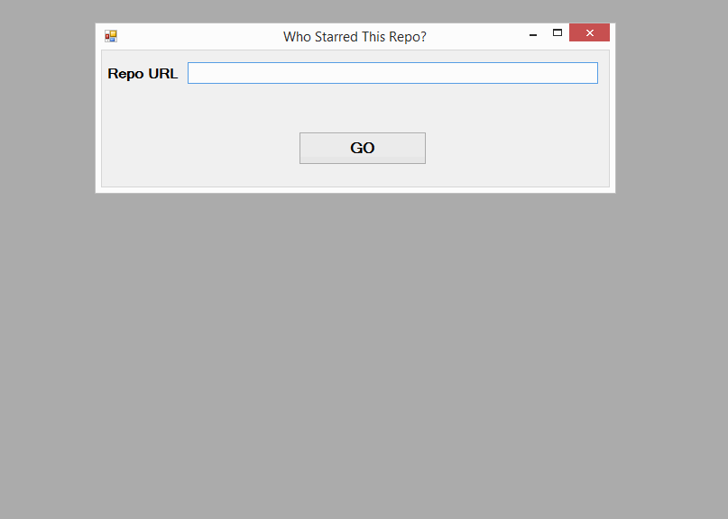
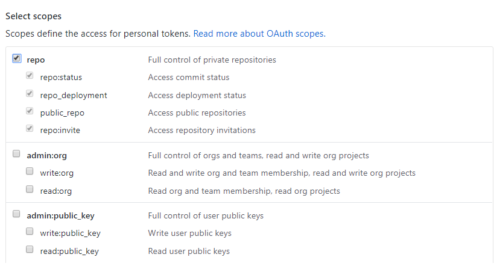
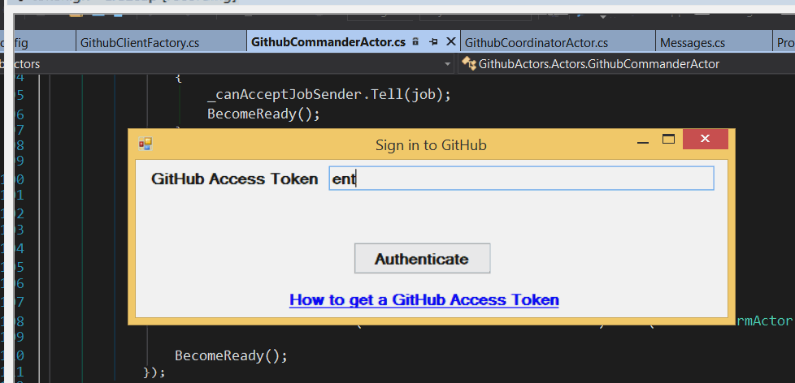

# Akka.NET Bootcamp - Unit 3: Advanced Akka.NET

In **[Unit 1](../Unit-1/README.md)**, we learned some of the fundamentals of Akka.NET and the actor model.

In **[Unit 2](../Unit-2/README.md)** we learned some of the more sophisticated concepts behind Akka.NET, such as pattern matching, basic Akka.NET configuration, scheduled messages, and more!

In Unit 3, we're going to learn how to leverage the [Task Parallel Library (TPL)](https://msdn.microsoft.com/en-us/library/dd537609.aspx) and Akka.NET routers to scale out actor systems for massive performance boosts via parallelism.

## Concepts you'll learn
Over the course of Unit 3, you're going to build a sophisticated GitHub scraper that can simultaneously retrieve data from multiple GitHub repos at once.

> NOTE: If you're following along using the eBook / .ePub, you won't see the animation. [Click here to see it](https://github.com/petabridge/akka-bootcamp/raw/master/src/Unit-3/lesson5/images/lesson5-live-run.gif).

This system will also be able to fetch information about the GitHubbers who have participated in those repos (e.g. starred or forked). By the end, we'll have a nicely scalable system for retrieving data from the GitHub API, capable of coordinating a huge amount of data retrieval in parallel (up to the [allowed rate limit of the API](https://developer.github.com/v3/rate_limit/), of course)!

In Unit 3 you will learn:

1. How to use `Group` routers to divide work among your actors
2. How to use `Pool` routers to automatically create and manage pools of actors
3. How to use HOCON to configure your routers
4. How to use `Ask` to wait inline for actors to respond to your messages
5. How to perform work asynchronously inside your actors using `PipeTo`

### Teaming up with Octokit, the official GitHub SDK for .NET
In this lesson we'll also be introducing you to [Octokit, the official GitHub SDK for .NET](http://octokit.github.io/) (and other languages!)

> **OCTOKIT NOTE:** If you're working behind a proxy server and have issues connecting to the Github API with Octokit, try adding this to your config file and see if it fixes the issue:
>
>  `<system.net><defaultProxy useDefaultCredentials="true" /></system.net>`

If you have any questions about Octokit or want to learn more about it, make sure you check out [Octokit.NET on GitHub](https://github.com/octokit/octokit.net)!

## Table of Contents

1. **[Lesson 1:  Using `Group` routers to divide work among your actors](lesson1/README.md)**
2. **[Lesson 2: Using `Pool` routers to automatically create and manage pools of actors](lesson2/README.md)**
3. **[Lesson 3: How to use HOCON to configure your routers](lesson3/README.md)**
4. **[Lesson 4: How to perform work asynchronously inside your actors using `PipeTo`](lesson4/README.md)**
5. **[Lesson 5: How to prevent deadlocks with `ReceiveTimeout`](lesson5/README.md)**

## Things you'll need
**You will need to make a GitHub OAuth access token for the API**.

This will be a throwaway token in your account only used for this app. [Follow the instructions here](https://help.github.com/articles/creating-an-access-token-for-command-line-use/) and write down your OAuth token. When you create your access token, you can select repo as your scope. This scope will be all you need for this project.  

When you run the samples and are actually pulling data from GitHub, you will get two popup windows:
1. The first popup window will ask you for your GitHub token. This is the read-only access token that you just created.
2. The second window is where you'll enter the URL of the actual repo that you want to fetch info for.

This is where you enter your access token when you run the code:

> NOTE: If you're following along using the eBook / .ePub, you won't see the animation. [Click here to see it](https://github.com/petabridge/akka-bootcamp/raw/master/src/Unit-3/lesson5/images/enter-access-token.gif).
> 
You will then get a second window, where you enter the URL of the repo you want to inspect:

> NOTE: If you're following along using the eBook / .ePub, you won't see the animation. [Click here to see it](https://github.com/petabridge/akka-bootcamp/raw/master/src/Unit-3/lesson5/images/lesson5-live-run.gif).

> N.B. When working with the Github API, choose a repository that has a smaller number of followers - you might run out of API tokens rather quickly otherwise. If you run out of API tokens, repeat the steps above to get another OAuth token.

## Get Started
To get started, [go to the /DoThis/ folder](DoThis/) and open `GithubActors.sln`.

And then go to [Lesson 1](lesson1/README.md).
