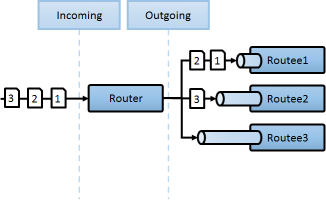
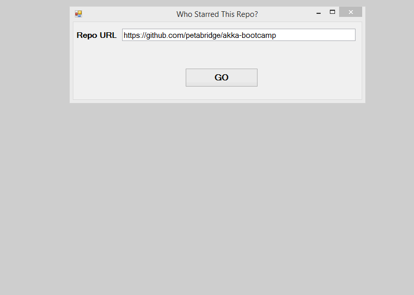
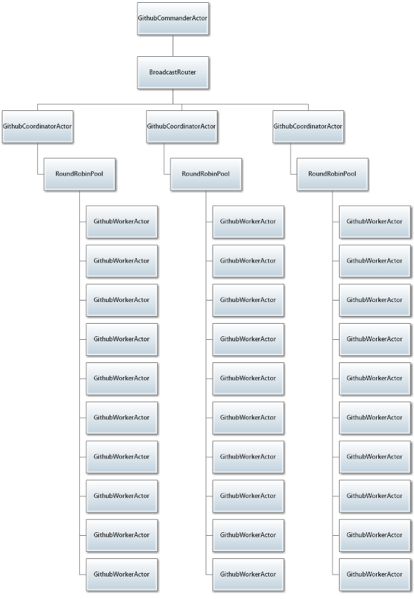

# Lesson 3.2: Using `Pool` routers to automatically create and manage pools of actors

In this lesson, we're going to build on the foundation we laid in the last lesson around routers and introduce you to a more powerful, flexible kind of router: the pool router.

## Key Concepts / Background
### What is a Pool router?
A "Pool" router is a `Router` that creates and manages its worker actors ("routees"). You provide a `NrOfInstances` to the router and the router will handle routee creation (and supervision) for you.

#### What's the difference between Group and Pool `Router`s?
*The key difference is that pool routers create and manage their routees, whereas group routers do not.*

Pool routers are safer to use than group routers. As touched on at the end of Lesson 3.1, group routers usually don't know when their routees are no longer available. This makes them less dependable and not ideal for common routing use.

This is because group routers are given the `ActorPath`s of their routees and in turn, communicate with their routees by sending messages to `ActorSelection`s. In contrast, because a pool router creates its routees, it is their parent, communicates directly with the `IActorRef` of a routee, and knows much more information about routees.

Additionally, pool routers can grow/shrink their routee pool whereas the routee pool for a group router is fixed once set. Also be aware that pool routers don't let you control the names of its routee children, so you have to talk to those routees via the router.

### When should I use Group routers vs Pool routers?
***You should use a pool router if you can.***

We recommend using a pool router unless you have a unique situation that falls into one of these categories:

1. You need your router to be able to send messages to a group of actors via wildcard `ActorSelection`.
2. For some reason, you need to route messages to actors that the router cannot be responsible for. For example, there could be a situation where you need to front some actors with a router, but it just doesn't make sense to have those routees as children of the router. Perhaps if other critical components in your system depend on these actors living at a certain location.
3. You need your router to be able to send messages to different types of actor routees. (Pool routers can only have one type of actor as their routees.)

Frankly, we haven't come across many good use cases that call for a group router. You'll probably know it when you see it.

***Our advice: stick with pool routers unless you have a very good reason to use a group router.***

### `RoutingStrategy`s
A pool router can use all of the routing strategies that a group router can use.

However, there are two `RoutingStrategy`s that **only** work with pool routers. The reason is that each of these strategies needs the level of routee control and information that only the pool router can offer, since it creates and supervises its routees.

Let's go through them.

#### `SmallestMailbox`
A `SmallestMailboxPoolRouter` will try to send the message to the routee with fewest messages in its mailbox.

The selection is done in this order:

1. Pick any idle routee (not currently processing a message) with an empty mailbox
1. Pick any routee with an empty mailbox
1. Pick the routee with the fewest pending messages in mailbox
1. Pick any remote routee, remote actors are consider lowest priority, since their mailbox size is unknown

There is no Group router version of the `SmallestMailbox` because the information needed to execute the strategy is only practically available to a parent and not via an `ActorPath`.

Here's what the `SmallestMailbox` looks like:



#### `ResizableRouter`
We like to think of this as the "auto-scaling router".

A `ResizablePoolRouter` detects pressure on routee mailboxes and figures out if it needs to expand or contract the size of the routee pool.

Essentially, a `ResizableRouter` defines thresholds on the average mailbox load of its routees. Above this threshold, the router will add routee(s) to the pool to lower average pressure below the threshold. Below a different threshold, the router will remove routee(s) and reduce the size of the worker pool.

### Special `Router` messages
You can send a pool router any of the special messages that you can send to a group router (`Broadcast`, `GetRoutees`, or `PoisonPill`). The function of these messages is the same across all routers.

### Supervision & Pool Routers
#### How does supervision work with Pool routers?
*A pool router supervises its routees.*

Recall that a pool router creates its routees as direct child actors of the router. This means that a pool router automatically supervises (and `DeathWatch`es) its routees.

Also recall that `Router`s are just a special type of actor. Since `Router`s are actors, they have a [`SupervisionStrategy`](https://github.com/petabridge/akka-bootcamp/tree/master/src/Unit-1/lesson4#supervision-directives) and can help their children (routees) recover from errors.

The supervision strategy of the router actor can be configured with the `supervisorStrategy` property of the Pool. If no configuration is provided, routers default to a strategy of “always escalate”. This means that errors are passed up to the router's supervisor for resolution.

In this case, the router's supervising actor will treat the error as an error with the router itself. Therefore, a stop/restart directive issued would cause the router itself to stop/restart. The router, in turn, will cause its child routees to stop/restart (but it will maintain the number of routees in the pool).

##### What this means in practice
*This is about default behavior in the case of an error.*

Here's what will happen, by default, if you haven't specified a `SupervisorStrategy` on the pool router:

1. A failure in a routee will bubble up to the parent of the router
2. The parent of the router will issue a `restart` directive to the router
3. The router will restart itself, and then restart its child routees

The reason is to make the default behavior such that adding `withRouter` to a child actor definition does not change the supervision strategy applied to the child. Of course, you can change this by specifying the strategy when defining the parent router.

## Exercise
The current state of our actor hierarchy looks like this:


In this exercise we're going to use a `RoundRobinPool` to throw additional `GithubWorkerActor` instances at our workloads, so we can increase the total throughput of the `GithubActors.sln` application.

This is how fast `GithubActors.sln` runs before we add our `Pool` router - take note:


> NOTE: If you're following along using the eBook / .ePub, you won't see the animation. [Click here to see it](https://github.com/petabridge/akka-bootcamp/raw/master/src/Unit-3/lesson1/images/lesson1-after.gif).

### Phase 1 - Modify `GithubCoordinatorActor.PreStart` to create `_githubWorker` as a router
This exercise consists of adding two lines of code.

First, open `Actors/GithubCoordinatorActor.cs` and add the following namespace import:

```csharp
// add to the top of Actors/GithubCoordinatorActor.cs
using Akka.Routing;
```

And then change the `GithubCoorindatorActor.PreStart` method from this:

```csharp
// original GithubCoordinatorActor.PreStart method from the start of the lesson
 protected override void PreStart()
{
    _githubWorker = Context.ActorOf(Props.Create(() =>
        new GithubWorkerActor(GithubClientFactory.GetClient)));
}
```

To this:

```csharp
// CHANGE GithubCoordinatorActor.PreStart to use this code instead
protected override void PreStart()
{
    _githubWorker = Context.ActorOf(Props.Create(() =>
        new GithubWorkerActor(GithubClientFactory.GetClient))
        .WithRouter(new RoundRobinPool(10)));
}
```

That's it!

### Once you're done
Build and run `GithubActors.sln`, and let's compare the performance of the app now that we're using 10 `GithubWorkerActor` instances per `GithubCoordinatorActor` instead of 1:


> NOTE: If you're following along using the eBook / .ePub, you won't see the animation. [Click here to see it](https://github.com/petabridge/akka-bootcamp/raw/master/src/Unit-3/lesson2/images/lesson2-after.gif).

**At the start of the lesson, it took us 16 seconds to download our first 4 users** for https://github.com/petabridge/akka-bootcamp. **At the end of the lesson it took us less than 4 seconds**. And it only took two lines of code to do it - that's how easy it is to parallelize work using actors.

Our final actor hierarchy at the end of the lesson looks like this:



Actors are cheap and easy to clone. Use them liberally with routers!

## Great job!
Now that we've seen how both `Group` and `Pool` routers work, it's easy for us to add them in areas where we can benefit from parallelism or need scale-out for additional jobs.

**Let's move onto [How to use HOCON to configure your routers](../lesson3/README.md).**

## Any questions?
Come ask any questions you have, big or small, [in this ongoing Bootcamp chat with the Petabridge & Akka.NET teams](https://gitter.im/petabridge/akka-bootcamp).

### Problems with the code?
If there is a problem with the code running, or something else that needs to be fixed in this lesson, please [create an issue](https://github.com/petabridge/akka-bootcamp/issues) and we'll get right on it. This will benefit everyone going through Bootcamp.
