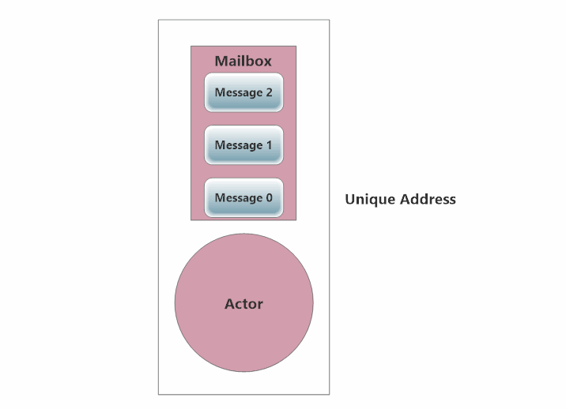
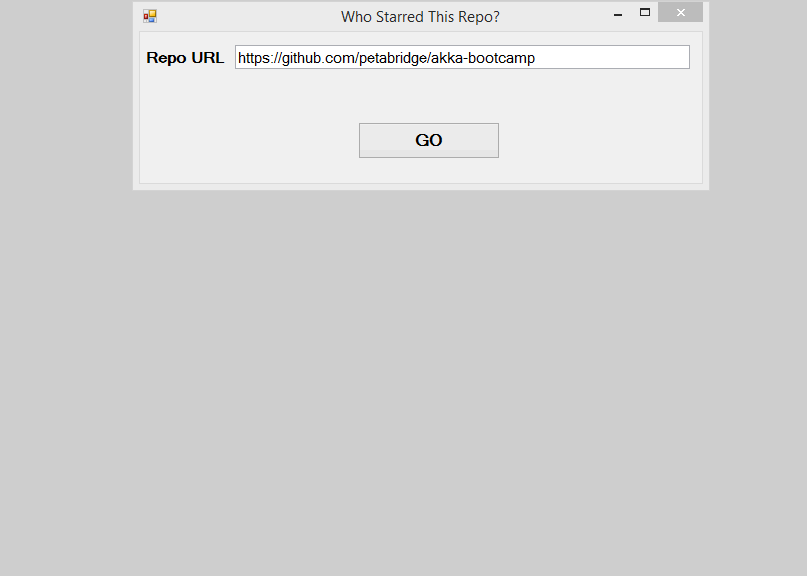

# Lesson 3.4: How to perform work asynchronously inside your actors using `PipeTo`

One of the first questions developers ask once they learn [how Akka.NET actors work](http://petabridge.com/blog/akkadotnet-what-is-an-actor/) is&hellip;

> "If actors can only process one message at a time, can I still use `async` methods or `Task<T>` objects inside my actors?"

*Yes!* You can still use asynchronous methods and `Task<T>` objects inside your actors - using the `PipeTo` pattern (instead of using `await`)!

This lesson will show you how.

## Key Concepts / Background
"But wait!", you say. "Aren't actors already asynchronous?"

Indeed they are, and you make an astute point! Due to the nature of passing immutable messages between actors, actors are inherently thread-safe and asynchronous (they don't block each other).

But what if you want to do some asynchronous work from within an actor itself, such as kick off a long-running HTTP request via a `Task`?

Most developers would default to using `await`, which has achieved demigod status since its release in 2012.

*And they would be making the wrong choice.*

Why? To answer that, we need to review how actors process messages.

### Actors process messages one at a time
Actors process the contents of their mailbox one message at a time. It looks like this:


> NOTE: If you're following along using the eBook / .ePub, you won't see the animation. [Click here to see it](https://github.com/petabridge/akka-bootcamp/raw/master/src/Unit-3/lesson4/images/how-akkadotnet-actors-receive-messages.gif).

Why is maintaining this behavior critical?

Recall that immutable messages themselves are inherently thread-safe, since a different thread can't modify something that is immutable.

***BUT: while the messages are inherently thread-safe, the message-processing code has no such guarantee!***

Processing one message at a time is critical because making sure an actor's message processing code (`OnReceive`) can only be run *one invocation at a time* is how Akka.NET enforces thread-safety for all of the code that executes inside an actor.

An immutable message is pushed from the mailbox into `OnReceive`. Once the call to `OnReceive` exits, the actor's mailbox pushes a new message into the actor's `OnReceive` method.

That being said, it's still possible to take advantage of `async` methods and methods that return `Task<T>` objects inside the `OnReceive` method - you just have to use the `PipeTo` extension method!

### Async message processing using `PipeTo`
The [`PipeTo` pattern](https://github.com/akkadotnet/akka.net/blob/dev/src/core/Akka/Actor/PipeToSupport.cs) is a simple [extension method](https://msdn.microsoft.com/en-us/library/bb383977.aspx) built into Akka.NET that you can append to any `Task<T>` object.

```csharp
public static Task PipeTo<T>(this Task<T> taskToPipe, 
  ICanTell recipient, IActorRef sender = null)
```

### `Task`s are just another source of messages
The goal behind `PipeTo` is to ***treat every async operation just like any other method that can produce a message for an actor's mailbox***.

THAT is the right way to think about actors and concurrent `Task<T>`s in Akka.NET. A `Task<T>` is not something you `await` on in Akka.NET. It's *just something else that produces a message* for an actor to process through its mailbox.

The `PipeTo` method takes an `ICanTell` object as a required argument, which tells the method where to pipe the results of an asynchronous `Task<T>`.

Here are all of the Akka.NET classes that you can use with `ICanTell`:

* `IActorRef` - a reference to an actor instance.
* `ActorSelection` - a selection of actors at a specified address. This is what gets returned whenever you look up an actor based on its path.

Most of the time, you're going to want to have your actors pipe the results of a task back to themselves. Here's an example of a real-world use case for `PipeTo`, drawn from our **[official Akka.NET PipeTo code sample](https://github.com/petabridge/akkadotnet-code-samples/tree/master/PipeTo "Petabridge Akka.NET PipeTo code sample")**.

```csharp
// time to kick off the feed parsing process, and send the results to this same actor
Receive<BeginProcessFeed>(feed =>
{
    SendMessage(string
      .Format("Downloading {0} for RSS/ATOM processing...", feed.FeedUri));
    _feedFactory.CreateFeedAsync(feed.FeedUri).PipeTo(Self);
});
```

[View the full source for this example.](https://github.com/petabridge/akkadotnet-code-samples/blob/master/PipeTo/src/PipeTo.App/Actors/FeedParserActor.cs#L70).

Whenever you kick off a `Task<T>` and use `PipeTo` to deliver the results to some `IActorRef` or `ActorSelection`, here's how your actor is really processing its mailbox.


> NOTE: If you're following along using the eBook / .ePub, you won't see the animation. [Click here to see it](https://github.com/petabridge/akka-bootcamp/raw/master/src/Unit-3/lesson4/images/how-akkadotnet-actors-receive-messages-async-pipeto.gif).

In this case we're using `PipeTo` to send the results back to itself, but you can just as easily send these results to different actor.

***The important thing to notice in this animation is that the actor continues processing other messages while the asynchronous operation is happening***.

That's why `PipeTo` is great for allowing your actors to parallelize long-running tasks, like HTTP requests.

### Composing `Task<T>` instances using `ContinueWith` and `PipeTo`
Have some post-processing you need to do on a `Task<T>` before the result gets piped into an actor's mailbox? No problem - you can still use `ContinueWith` and all of the other TPL design patterns you used in procedural C# programming.

Here's another example from our **[PipeTo code sample](https://github.com/petabridge/akkadotnet-code-samples/tree/master/PipeTo "Petabridge Akka.NET PipeTo code sample")**:

```csharp
// asynchronously download the image and pipe the results to ourself
_httpClient.GetAsync(imageUrl).ContinueWith(httpRequest =>
{
    var response = httpRequest.Result;

    // successful img download
    if (response.StatusCode == HttpStatusCode.OK)
    {
        var contentStream = response.Content.ReadAsStreamAsync();
        try
        {
            contentStream.Wait(TimeSpan.FromSeconds(1));
            return new ImageDownloadResult(image,
                response.StatusCode, contentStream.Result);
        }
        catch //timeout exceptions!
        {
            return new ImageDownloadResult(image, HttpStatusCode.PartialContent);
        }
    }

    return new ImageDownloadResult(image, response.StatusCode);
},
  TaskContinuationOptions.ExecuteSynchronously)
 .PipeTo(Self);
```

[View the full source for this example.](https://github.com/petabridge/akkadotnet-code-samples/blob/master/PipeTo/src/PipeTo.App/Actors/HttpDownloaderActor.cs#L98).

So in this case, we're downloading an image via a [HttpClient](https://msdn.microsoft.com/en-us/library/system.net.http.httpclient(v=vs.118).aspx) inside an Akka.NET actor, and we want to check the status code of the HTTP response before we use `PipeTo` to deliver a message back to this actor.

So we do the HTTP code handling inside a `ContinueWith` block and use that to return an `ImageDownloadResult` message that will be piped to the actor using the `PipeTo` block. Pretty easy!

#### Akka.NET supports `async` / `await` inside `ReceiveActor`

Per the [Akka.NET v1.0 release notes](https://github.com/akkadotnet/akka.net/releases/tag/v1.0), native support for `async` and `await` is now available inside `ReceiveActor`s.

```csharp
public class MyActor : ReceiveActor
{
       public MyActor()
       {
             ReceiveAsync<SomeMessage>(async some => {
                    //we can now safely use await inside this receive handler
                    await SomeAsyncIO(some.Data);
                    Sender.Tell(new EverythingIsAllOK());
             });
       }
}
```

There's some magic under the hood that takes care of this.

However, the `PipeTo` pattern is still the preferred way to perform async operations inside an actor, as it is more explicit and clearly states what is going on and `await` suspends the actors' mailbox between continuations in order to honor the actor's "one message at a time" guarantee.

### Do I need to worry about closing over (closures) my actor's internal state when using `PipeTo`?
**Yes**, you need to close over *any state whose value might change between messages* that you need to use inside your `ContinueWith` or `PipeTo` calls.

This usually means closing over the `Sender` property and any private state you've defined that is likely to change between messages.

For instance, the `Sender` property of your actor will definitely change between messages. You'll need to [use a C# closure](http://www.codethinked.com/c-closures-explained) for this property in order to guarantee that any asynchronous methods that depend on this property get the right value.

Doing a closure is as simple as stuffing the property into an instance variable (`var`) and using that instance variable in your `PipeTo` call, instead of the field or property defined on your actor.

Here's an example of closing over the `Sender` property:

```csharp
Receive<BeginProcessFeed>(feed =>
{
    // instance variable for closure
    // close over the current value of Sender, since it changes between
    // messages and accessing by property later would give different value
    var senderClosure = Sender;
    SendMessage(string
      .Format("Downloading {0} for RSS/ATOM processing...", feed.FeedUri));

    // send result of this async task back to the sender of the current message
    _feedFactory.CreateFeedAsync(feed.FeedUri).PipeTo(senderClosure);
});
```
> NOTE: Assuming you're piping the result of the `Task` back to the same actor, you don't need to close over `Self` or `Parent`. Those `IActorRef`s will be the same when the `Task` returns. You just need to close over the state that is going to change by the time the `Task` completes and executes its continuation delegate.

Now, let's get to work and use this powerful parallelism technique inside our actors!

## Exercise

Currently our `GithubWorkerActor` instances all block when they're waiting for responses back from the GitHub API, using the following code:

```csharp
 var getStarrer = _gitHubClient.Activity.Starring.GetAllForUser(starrer);

// ewww
getStarrer.Wait();
var starredRepos = getStarrer.Result;
Sender.Tell(new StarredReposForUser(starrer, starredRepos));
```

We're going to leverage the full power of the TPL and allow each of our `GithubWorkerActor` instances kick off multiple parallel Octokit queries at once, and then use `PipeTo` to asynchronously deliver the completed results back to our `GithubCoordinatorActor`.

Take note - this the current speed of our GitHub scraper at the end of lesson 2:


> NOTE: If you're following along using the eBook / .ePub, you won't see the animation. [Click here to see it](https://github.com/petabridge/akka-bootcamp/raw/master/src/Unit-3/lesson2/images/lesson2-after.gif).

### Phase 1 - Replace `GithubWorkerActor.InitialReceives`

Open up `Actors/GithubWorkerActor.cs`and replace the `InitialReceives` method with the following code:

```csharp
private void InitialReceives()
{
    // query an individual starrer
    Receive<RetryableQuery>(query => query.Query is QueryStarrer, query =>
    {
        // ReSharper disable once PossibleNullReferenceException
		// (we know from the previous IS statement that this is not null)
        var starrer = (query.Query as QueryStarrer).Login;

        // close over the Sender in an instance variable
        var sender = Sender;
        _gitHubClient.Activity.Starring.GetAllForUser(starrer)
          .ContinueWith<object>(tr =>
          {
              // query faulted
              if (tr.IsFaulted || tr.IsCanceled)
                  return query.NextTry();
              // query succeeded
              return new StarredReposForUser(starrer, tr.Result);
          }).PipeTo(sender);

    });

    // query all starrers for a repository
    Receive<RetryableQuery>(query => query.Query is QueryStarrers, query =>
    {
        // ReSharper disable once PossibleNullReferenceException
		// (we know from the previous IS statement that this is not null)
        var starrers = (query.Query as QueryStarrers).Key;


        // close over the Sender in an instance variable
        var sender = Sender;
        _gitHubClient.Activity.Starring.GetAllStargazers(starrers.Owner, starrers.Repo)
            .ContinueWith<object>(tr =>
            {
                // query faulted
                if (tr.IsFaulted || tr.IsCanceled)
                    return query.NextTry();
                return tr.Result.ToArray();
            }).PipeTo(sender);

    });
}
```

That's it!

### Once you're done

Build and run `GithubActors.sln` - the performance should be *really fast* now.


> NOTE: If you're following along using the eBook / .ePub, you won't see the animation. [Click here to see it](https://github.com/petabridge/akka-bootcamp/raw/master/src/Unit-3/lesson4/images/lesson4-after.gif).

**At the start of the lesson, it took us 4 seconds to download our first 4 users** for https://github.com/petabridge/akka-bootcamp. **At the end of the lesson we downloaded 22 users in 4 seconds**. All of this without adding any new actors or doing anything other than just letting the TPL work in concert via `PipeTo`.

> **NOTE:** The GitHub API appears to be *really* slow for a handful of users on every repository we've tested. We have no idea why.

## Great job!

Awesome - now you can use `Task<T>` instances in combination with your actors for maximum concurrency! Hooray!

**Now it's time to move onto the final lesson: [Lesson 5 - How to prevent deadlocks with `ReceiveTimeout`](../lesson5/README.md).**

## Further reading
See our [full Akka.NET `PipeTo` sample](https://github.com/petabridge/akkadotnet-code-samples/blob/master/PipeTo/).

## Any questions?
Come ask any questions you have, big or small, [in this ongoing Bootcamp chat with the Petabridge & Akka.NET teams](https://gitter.im/petabridge/akka-bootcamp).

### Problems with the code?
If there is a problem with the code running, or something else that needs to be fixed in this lesson, please [create an issue](https://github.com/petabridge/akka-bootcamp/issues) and we'll get right on it. This will benefit everyone going through Bootcamp.
