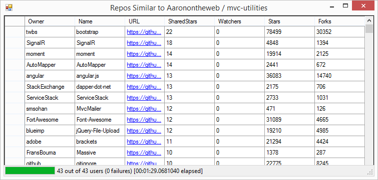

# Lesson 3.5: How to prevent deadlocks with `ReceiveTimeout`
Wow, look at you! Here we are on our last lesson of Bootcamp together. We want to say thank you for coming on this journey with us, and to give yourself a big pat on the back for your dedication to your craft.

In this lesson, we'll be going over how to handle timeouts within actors and prevent deadlocks, where one actor is waiting for another indefinitely.

This lesson will show you how to prevent deadlocks by using a `ReceiveTimeout`.

## Key Concepts / Background
### What is `ReceiveTimeout`?
`ReceiveTimeout` lets you specify what an actor should do when it hasn't received a message for a certain period of time. Once this timeout has been hit, the actor will send itself the `ReceiveTimeout` singleton as a message.

Once set up, the `ReceiveTimeout` stays in effect and will continue firing repeatedly every time the specified interval passes without the actor receiving a message.

### When do I use `ReceiveTimeout`?
You can use `ReceiveTimeout` whenever you want to take some action after a period of inactivity.

Here are some common cases where you may want to use a `ReceiveTimeout`:

- To shut an actor down after it goes a certain amount of time without receiving a message
- To confirm that other actors are doing work and sending in their status messages
- To prevent deadlocks where one actor thinks another is doing work

### How do I set up a `ReceiveTimeout`?
You call `Context.SetReceiveTimeout()` and pass it a `TimeSpan`. If that amount of time passes and the actor hasn't received a message, the actor will send itself the `ReceiveTimeout` singleton as a message, e.g.

```csharp
// send ourselves a ReceiveTimeout message if no message within 3 seconds
Context.SetReceiveTimeout(TimeSpan.FromSeconds(3));
```

Then, you just need to handle the `ReceiveTimeout` message and take whatever action is appropriate.

Let's assume you wanted to shut an actor down after a period of inactivity, and inform its parent. Here's one basic way you could do that:

```csharp
// have actor shut down after a long period of inactivity
Receive<ReceiveTimeout>(timeout =>
{
    // inform parent that shutting down
    Context.Parent.Tell(new ImShuttingDown());
    // shut self down
    Context.Stop(Self);
});
```

### How do I cancel a `ReceiveTimeout` that I've set?
You call `Context.SetReceiveTimeout()` and pass it `null`, e.g.

```csharp
// cancel ReceiveTimeout
Context.SetReceiveTimeout(null);
```

### Can I change the timeout value?
Yes, you can set the `ReceiveTimeout` after every message, or as often as you want. Setting a new timeout will cancel the previous timeout and schedule a new one.

### What's the smallest `ReceiveTimeout` interval I can specify?
1 millisecond is the minimum timeout interval.

### Does `ReceiveTimeout` work with all actor types?
Yes, you can use `ReceiveTimeout` with any actor type.

The only difference would be the syntax differences between how you match the message between a `ReceiveActor` and an `UntypedActor`.

### What if another message comes in right before I process the timeout?
`ReceiveTimeout` can create false positives. For example, it's possible for the timeout to occur and another message to arrive in the actors mailbox before the `ReceiveTimeout` message does. In this case, another message would get processed before the `ReceiveTimeout` message, making it invalid.

It is not *guaranteed* that upon reception of the `ReceiveTimeout` that there must have been an idle period beforehand as configured via this method.

This is an edge case, but there are ways to code around it.

## Exercise
We're going to use `ReceiveTimeout` to eliminate a potential deadlock that might occur inside the `GithubCommanderActor` - if one of the `GithubCoordinatorActor` it routes to suddenly dies before it has a chance to reply to a `CanAcceptJob` message, the `GithubCommanderActor` will be permanently stuck in its `Asking` state.

We can prevent this from happening using `ReceiveTimeout`!

### Phase 1 - Add a new private field to the `GithubCommanderActor`
We're going to hang onto the current job we're inquiring about as an instance variable inside the `GithubCommanderActor`, so open up `Actors/GithubCommanderActor.cs` and make the following changes:

```csharp
// add this field anywhere inside the GithubCommanderActor
private RepoKey _repoJob;
```

And modify the `GithubCommanderActor.Ready` method to look like this:

```csharp
// modify the GithubCommanderActor.Ready method to look like this
private void Ready()
{
    Receive<CanAcceptJob>(job =>
    {
        _coordinator.Tell(job);
        _repoJob = job.Repo;
        BecomeAsking();
    });
}
```

### Phase 2 - Wire up `ReceiveTimeout` inside `GithubCommanderActor`
We need to set a few calls to `Context.ReceiveTimeout` in order to get it to work properly with our `GithubCommanderActor` when we're inside the `Asking` state.

First, modify the `BecomeAsking` method on the `GithubCommanderActor` to look like this:

```csharp
// modify the `BecomeAsking` method on the `GithubCommanderActor` to look like this
private void BecomeAsking()
{
    _canAcceptJobSender = Sender;
    // block, but ask the router for the number of routees. Avoids magic numbers.
    pendingJobReplies = _coordinator.Ask<Routees>(new GetRoutees())
      .Result.Members.Count();
    Become(Asking);

    // send ourselves a ReceiveTimeout message if no message within 3 seconds
    Context.SetReceiveTimeout(TimeSpan.FromSeconds(3));
}
```

This means that once the `GithubCommanderActor` enters the `Asking` behavior, it will automatically send itself a `ReceiveTimeout` message if it hasn't received any other message for longer than three seconds.

Speaking of which, let's add a handler for the `ReceiveTimeout` message type inside the `Asking` method on `GithubCommanderActor`.

```
// add this inside the GithubCommanderActor.Asking method
// means at least one actor failed to respond
Receive<ReceiveTimeout>(timeout =>
{
    _canAcceptJobSender.Tell(new UnableToAcceptJob(_repoJob));
    BecomeReady();
});
```

We're going to treat every `ReceiveTimeout` as a "busy" signal from one of the `GithubCoordinatorActor` instances, so we'll send ourselves a `UnableToAcceptJob` message every time we receive a `ReceiveTimeout`.

Once the `GithubCommanderActor` has received all of the replies its expecting and it switches back to its `Ready` state, we need to cancel the `ReceiveTimeout`.

Modify the `GithubCommanderActor`'s `BecomeReady` method to look like the following:

```csharp
// modify the GithubCommanderActor.BecomeReady method to read like the following:
private void BecomeReady()
{
    Become(Ready);
    Stash.UnstashAll();

    // cancel ReceiveTimeout
    Context.SetReceiveTimeout(null);
}
```

And that's it!

### Once you're done
Build and run `GithubActors.sln`, and you should see the following output if you try querying the [Akka.NET GitHub Repository](https://github.com/akkadotnet/akka.net) (go give them a star while you're at it!)


> NOTE: If you're following along using the eBook / .ePub, you won't see the animation. [Click here to see it](https://github.com/petabridge/akka-bootcamp/raw/master/src/Unit-3/lesson5/images/lesson5-live-run.gif).

And here's what the final output looks like - sadly, for a different repo since hit the GitHub API rate limit with Akka.NET :(



## Great job!
Wow! You made it, awesome!

## Sharing is caring: [click here to Tweet about Bootcamp!](http://ctt.ec/L_Xe0) (you can edit first)

We want to help more people get this knowledge and learn to use Akka.NET. Direct them to the [Bootcamp information page](http://learnakka.net) or to this repo.

If we at Petabridge can be of any help to you whatsoever, [please reach out to us by email](mailto:hi@petabridge.com) or say hello <a href="https://twitter.com/petabridge">on Twitter</a>.

### Want to level up your company or team with Akka.NET?
[Please email us](mailto:hi@petabridge.com) to discuss your situation.

We work with companies all the time to **implement production systems and do advanced Akka.NET training** (Clustering, Remoting, Testing, DevOps, best practices, etc).

We'd love to help you, too.

Gratefully,
The Petabridge Team.

## Any questions?

Come ask any questions you have, big or small, [in this ongoing Bootcamp chat with the Petabridge & Akka.NET teams](https://gitter.im/petabridge/akka-bootcamp).

### Problems with the code?
If there is a problem with the code running, or something else that needs to be fixed in this lesson, please [create an issue](https://github.com/petabridge/akka-bootcamp/issues) and we'll get right on it. This will benefit everyone going through Bootcamp.

